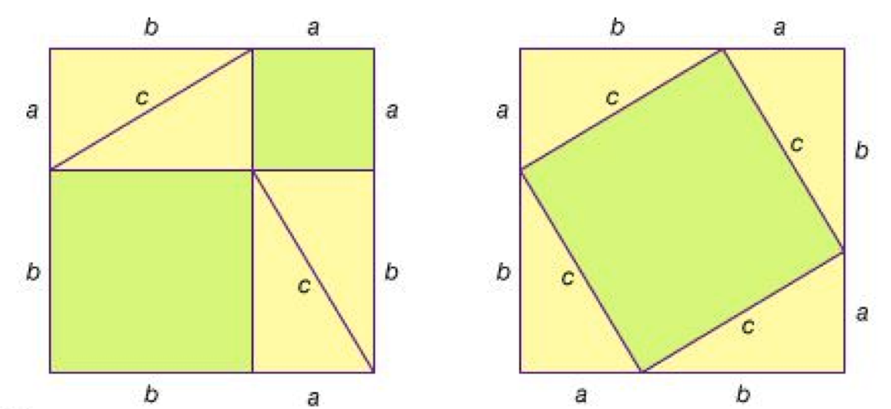
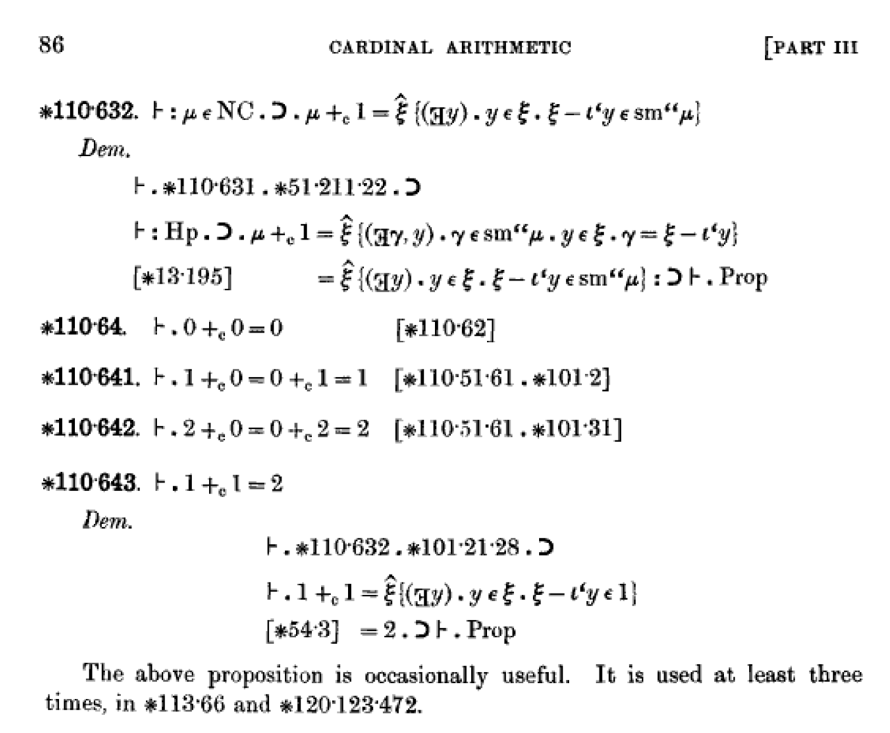
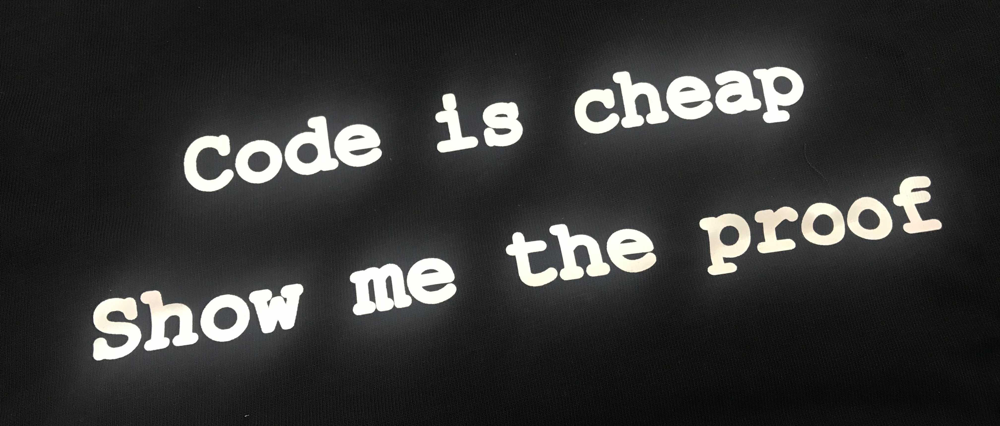
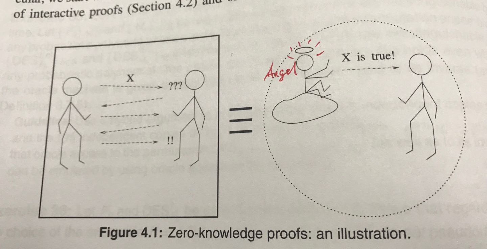
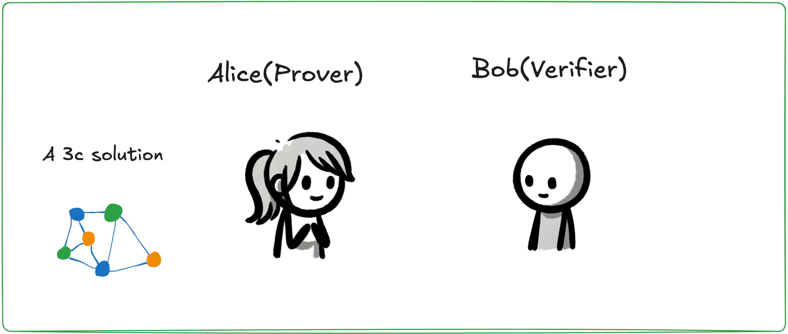
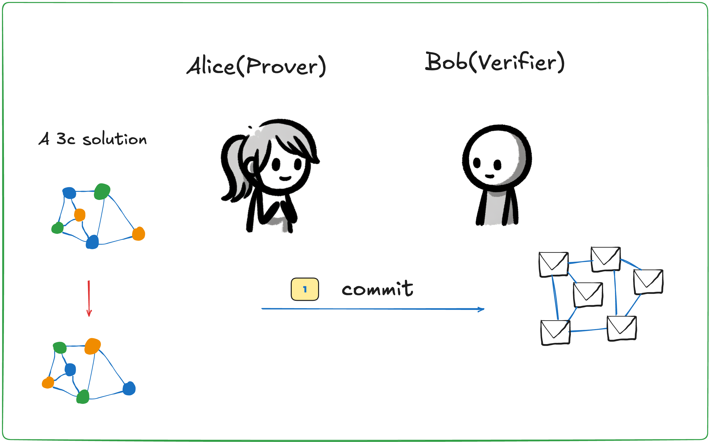
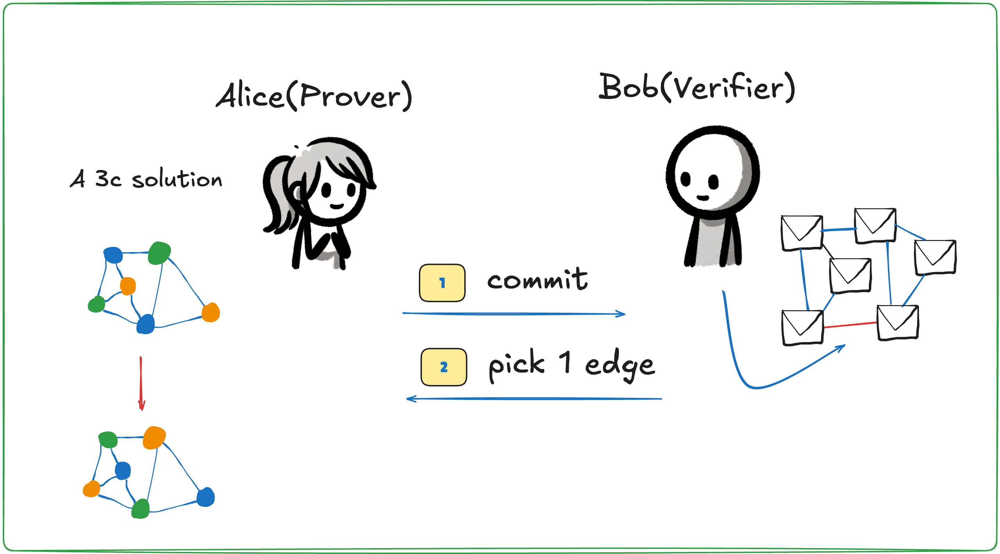
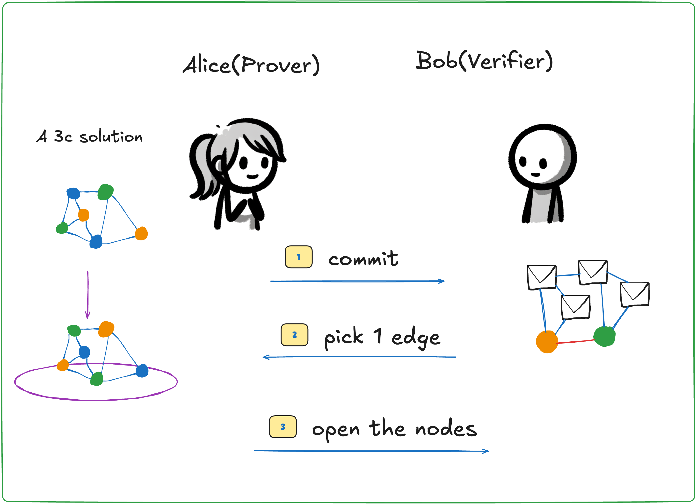
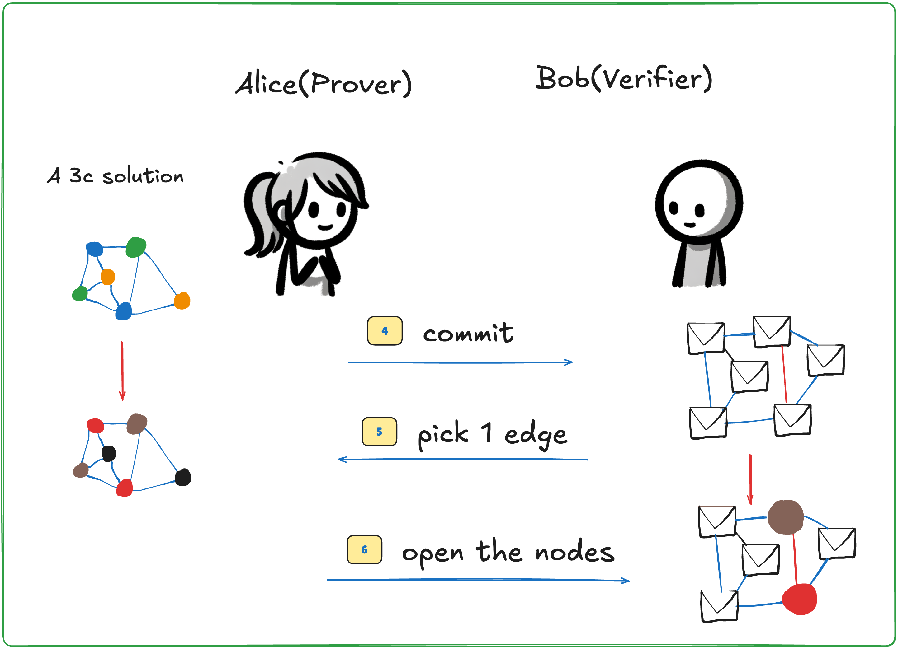
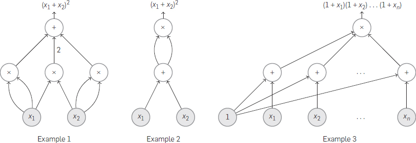

# An Introduction to "Zero Knowledge" and "Proofs"

*Exploring the Zero-Knowledge Proof Series (Part 1)*

[TOC]

## Introduction:

I believe that blockchain can hardly be called a "technology". It's more of a domain, encompassing a wide range of topics. Or, metaphysically speaking, blockchain is more like an organism, integrating various theoretical technologies.

Zero-knowledge proofs are a crucial technology for building trust and are an indispensable part of the blockchain ecosystem.

> Zero-knowledge proofs are key to bridging on-chain data with off-chain computation and are an important means of achieving on-chain data privacy protection.

**To explain "zero-knowledge proofs", we need to start by explaining "proofs", then what "knowledge" is, and finally what "zero knowledge" entails.**

Note: There may be inaccuracies or imprecise descriptions in the content; I kindly ask professionals to correct them.

This article will be updated and revised on [Github](https://github.com/sec-bit/learning-zkp/).

## The Past and Present of "Proofs"

**What is a proof?** Many people, like me, perhaps think of the various geometric shapes in high school exams — triangles proving similarity. When a teacher drew a magical auxiliary line, the proof process suddenly became clear, leading to regret that we didn’t think of it ourselves.

#### Ancient Greece: "Proof" == "Insight"

Mathematical proofs originated in ancient Greece. They invented (or discovered) axioms and logic, using proofs to convince others rather than relying on authority. This was complete "decentralization". Since ancient Greece, this methodology has influenced the entire course of human civilization.

The above image shows a clever proof of the "Pythagorean Theorem". Throughout history, there have been many ingenious proofs, magical ideas, and flashes of genius. Once a proposition is proven, even God can’t change it. Oh, right, there’s also the "God is not omnipotent" proof: God cannot create a stone so heavy that even He cannot lift it.

A mathematical proof often contains incredibly deep "insight". Many people have heard the story of "Fermat’s Last Theorem" [1], which took over 400 years to prove, from Fermat’s note "I have a truly marvelous demonstration of this proposition which this margin is too narrow to contain" to Wiles finally solving it, consuming the intelligence of many generations. More recent examples include the "Poincaré Conjecture", the somewhat older "Goldbach Conjecture", and the one I admire, Chinese scientist Yitang Zhang, who spent many years studying the insights of the "Goldston-Pintz-Yıldırım" and "Bombieri-Friedlander-Iwaniec" proofs and proved the "Bounded Gaps Between Primes" [2].

Since the 17th century, starting with Leibniz, people have dreamed of finding a mechanical means to automatically complete proofs, without relying on flashes of genius.

#### Early 20th Century: "Proof" == "Symbolic Reasoning"

By the end of the 19th century, thinkers like Cantor, Boole, Frege, Hilbert, Russell, Brouwer, and Gödel had defined formal logical systems. Proofs is reasoning processes written using the symbolic language of formal logic. Is logic itself reliable? Is it "consistent"? Can logical reasoning itself be proven? These questions led mathematicians, logicians, and computer scientists to invent (or discover) symbolic systems, syntax vs. semantics, soundness vs. completeness, recursion vs. infinity. (For more on this, see the book *Engines of Logic* [3].)

In 1910, Russell published the monumental *Principia Mathematica*. In the book, Russell and Whitehead tried to fully formalize mathematics. If this goal could be achieved, all mathematical results would be built on a solid foundation through proofs. Below is a page from *Principia Mathematica (Volume II)*:

Here `110.643` represents a proposition: "1 + 1 = 2", followed by the proof of this theorem. You might wonder, does 1 + 1 really need to be proven? Yes, in *Principia Mathematica*, numbers like 0, 1, 2, … are strictly defined, and operations like addition, multiplication, and equality must also be rigorously defined. Each step of reasoning must state its basis. What does proof mean? Proof can be incredibly tedious, but each step of reasoning is strictly correct. Many proofs in the book are mechanical, constructed according to axioms and inference rules. Finding proofs seemed like a task that could be handed to someone who would mindlessly search through axioms and inference rules.

It seemed that the dream of "automated theorem proving" was not far off. 

Unfortunately, in 1931, Gödel proved the "Incompleteness Theorem" [4], and in 1936, Turing proved the undecidability of the Halting Problem [5]. These results shattered the centuries-old dream. No matter how cleverly designed an axiom system is, it cannot capture all truths. Proofs are not only strict reasoning but also embody creative thinking that seems difficult to mechanize. A proof contains a great deal of "knowledge", and every breakthrough elevates our understanding to a new level. Whether it is "insight" or the "algorithm" constructed in the reasoning process, the content of a theorem’s proof often far exceeds the conclusion of the theorem itself.

#### 1960s: "Proof" == "Program"

Another half-century passed, and in the 1960s, logicians Haskell Curry and William Howard independently discovered many "magical correspondences" between "logical systems" and "computational systems—Lambda Calculus". This was later called the "Curry-Howard Correspondence". This discovery made people realize that "writing a program" and "writing a proof" are conceptually identical. Over the next 50 years, related theories and technologies developed, allowing proofs to no longer remain on paper but be expressed in programs. This is a fascinating isomorphism: the type of a program corresponds to the theorem being proven; loops correspond to induction; … (I recommend the book *Software Foundations* [6]). In the framework of intuitionism, proving something means constructing an algorithm, and constructing an algorithm is essentially writing code. (The reverse is also true: programmers aren’t writing code—they’re writing mathematical proofs! :P)

Today, in computer science, many theoretical proofs have transitioned from paper sketches to code. Popular "proof programming languages" include Coq, Isabelle, Agda, etc. By programming the construction of proofs, the correctness of the proofs can be mechanically verified by a computer, and many tedious, repetitive tasks can be assisted by programs. The grand edifice of mathematical theory is being gradually built, much like computer software. In December 1996, W. McCune used the automated theorem-proving tool EQP to prove the "Robbins Conjecture", a 63-year-old mathematical problem, and *The New York Times* published an article titled "Computer Math Proof Shows Reasoning Power" [7], once again exploring the possibility of machines replacing human creative thinking.

Using machines to assist can indeed help mathematicians reach more unknown realms, but "finding a proof" remains the most challenging task. "Verifying a proof", on the other hand, must be simple, mechanical, and finite. This is a natural "asymmetry".

#### 1980s: "Proof" == "Interaction"

By 1985, Steve Jobs had just left Apple, and Dr. Shafi Goldwasser, after graduating, joined MIT. She, along with Silvio Micali and Charles Rackoff, co-authored a classic paper that would make history in computer science: "The Knowledge Complexity of Interactive Proof Systems" [8].

They reinterpreted the term "proof" and proposed the concept of interactive proof systems: constructing two Turing machines to "interact" rather than "reason" to probabilistically prove whether a proposition holds. The concept of "proof" was once again expanded. 

Interactive proofs are expressed as "dialogue scripts" between two (or more) Turing machines, or was called "Transcript". One plays the role of the "prover", and the other the "verifier". **The prover proves that a proposition is true to the verifier while "revealing no additional knowledge".** This is called a "zero-knowledge proof".To emphasize again: proofs contain "knowledge", but the proof process can reveal "zero knowledge", while still keeping the verification process simple, mechanical, and finite. Does this sound a bit "counterintuitive"?

## Interactive Proofs

Alice: I want to prove to you that I have a solution to an equation, `w^3 - (w + 1)^2 + 7 = 0` (the solution is `w = 3`).

Bob: Sure, I’m listening.

Alice: But I won’t tell you what `w` is unless you’re willing to pay me.

Bob: Okay, but you need to prove that you have the solution first, and then I’ll pay you.

Alice: @#$%^& (Black Tech)

Bob: ?????? (Black Tech)

Alice: &*#$@! （Black Tech）

Bob: ??????（Black Tech）

...... （More Black Tech）

Alice: I’m done

Bob: Alright, you really do have the solution, but will you tell me if I pay you?

Alice: Stop talking, pay up!

The example above is an "interactive proof". Assuming Alice knows the solution to the equation `f(w) = 0`, how can she convince Bob that she knows `w`? During the "Black tech" phrase, Alice conveys a lot of information to Bob. The key question is: Can Bob infer the value of `w` from the information Alice provided, or at least deduce some clues about `w`? If Bob could do this, he might not need to pay Alice since he’d already have the valuable information.

Note that if the interaction between Alice and Bob is "zero-knowledge", Bob learns nothing about `w` beyond the fact that `w` satisfies `f(w) = 0`. This is crucial for protecting Alice’s interests. 

Let’s break down the term "zero-knowledge proof", which consists of three key parts:
+ `Zero`
+ `Knowledge`
+ `Proof`

You might already have a sense of what these mean, so let’s interpret them:

+ Zero: Alice reveals "zero" knowledge about `w`, meaning she doesn’t disclose any knowledge.+ Knowledge: This refers to `w`.
+ Knowledge: This refers to `w`.
+ Proof: This is the "black tech" part of the dialogue between Alice and Bob.

Alright, the proof, or the black tech part, hasn’t been explained yet. Don’t worry, I’ll explain it gradually.

## What is Zero-Knowledge Proof Good For?

When zero-knowledge proof technology is mentioned, many people think of anonymous coins like Monero or ZCash. Indeed, these coins have popularized zero-knowledge proofs. I first heard of zero-knowledge proofs through ZCash myself. But after delving deeper into the technology, I realized its power extends far beyond this.

> Zero-knowledge proof technology can solve the problem of data trust and computation trust!

Bob claims he has 100 dollars, Alan says he graduated from Peking University, and Eric says he’s having lunch with Buffett. Empty words are worth nothing. `Show me the proof`!

How does zero-knowledge proof solve the issue of data trust? In my previous article *zkPoD: Blockchain, Zero-Knowledge Proof, and Formal Verification for Fair Transactions Without Intermediaries* [9], I introduced the concept of "simulation":

> Zero-knowledge proof technology can simulate a third party to ensure that a statement is trustworthy.

In other words, when we receive encrypted data along with a zero-knowledge proof, this proof asserts that "statement X about the data is true". It’s as if an angel is whispering in our ear, "Statement X about the data is true"!

The statement `X` can be very flexible, and it can represent an `NP`-complete algorithm. In layman's terms, as long as we can write a program (a polynomial-time algorithm) to determine whether data satisfies statement `X`, the statement can be expressed using zero-knowledge proof. In simple terms, as long as the data judgment is objective, zero-knowledge proof is applicable.

Some uses of zero-knowledge proofs include:
+ **Data Privacy Protection**: In a data table, there might be certain information you don’t want to disclose. For instance, if I want to prove that I passed an exam but don’t want to reveal whether I scored 61 or 62, which could be embarrassing. Another example: I don’t have heart disease, and the insurance company needs to know that, but I don’t want them to access my entire medical history. With zero-knowledge proof, I can prove to the insurance company that I don’t have heart disease without revealing other private information. Similarly, a company might want to prove to a bank that it has a healthy business and repayment capacity without disclosing sensitive business secrets.
+ **Computation Compression and Blockchain Scaling**: Among various blockchain scaling techniques, Vitalik Buterin’s use of zkSNARK technology could potentially improve Ethereum’s performance by dozens of times. With computation proof, there’s no need to repeat the same computation multiple times. In traditional blockchain architectures, computations are repeated, such as signature verification, transaction validity checks, smart contract execution, etc. These processes can be compressed using zero-knowledge proof technology.
+ **End-to-End Communication Encryption**: Users can send messages to each other without worrying about the server having access to all message records. At the same time, messages can include zero-knowledge proofs to show the message’s origin and destination as required by the server.
+ **Identity Authentication**: A user can prove to a website that they own a private key or know a secret answer without revealing the key or the answer. The website can confirm the user’s identity by verifying the zero-knowledge proof.
+ **Decentralized Storage**: Servers can prove to users that their data is stored securely without revealing any of the data’s content.
+ **Credit Records**: Zero-knowledge proofs can be highly useful for credit records. Users can selectively reveal their credit score to another party while proving the authenticity of their credit record.
+ **Constructing Fair Online Digital Goods Trading Protocols** [9].
+ **More Examples**: Zero-knowledge proofs can be applied to any form of data sharing, data processing, and data transmission.

## Example: The Map 3-Coloring Problem

Now let’s discuss a classic problem, the map 3-coloring problem. How can we color a map using three colors so that no two adjacent regions have the same color? We can transform the "map 3-coloring problem" into a "vertex 3-coloring problem on a connected graph". Suppose each region has a capital (node), and adjacent nodes are connected. The map coloring problem becomes a vertex coloring problem on a connected graph.

Now let’s design an interactive protocol:

+ The "Prover" is Alice.
+ The "Verifier" is Bob.

Alice has a solution to the map coloring problem, as shown below. This graph has six vertices and nine edges.

Now Alice wants to prove to Bob that she has the solution but doesn’t want to reveal it. How can she do that?

Alice first performs a "transformation" on the colored graph, shuffling the colors. For example, she could change all the green vertices to orange, all the blue ones to green, and all the orange ones to blue. She then gets a new coloring solution, and at this point, she covers each vertex with a piece of paper and presents the graph to Bob.

In the image above, it’s now Bob’s turn to act. He randomly selects an edge — note that the selection is random, and Alice shouldn’t be able to predict it in advance.

Suppose Bob selects the bottom edge and informs Alice.

At this point, Alice uncovers the two vertices at the ends of the selected edge and lets Bob check. Bob finds out that the two vertices are of different colors, and thus concludes that the current check is isomorphic to the expected coloring. However, Bob has only seen a local part of the graph. Can he be convinced that the entire graph is correctly colored? You might think this is far from enough. Perhaps Alice just got lucky, and the other vertices could be randomly colored. No problem, Bob can ask Alice to do it again. See the image below.

Alice transforms the coloring again, changing blue to purple, green to brown, and orange to gray. Then she covers all the vertices with paper again. Bob picks another edge, perhaps a vertical one this time, and asks Alice to uncover it. If Bob once again finds that the two vertices at the ends of the selected edge have different colors, he might start to believe that Alice really has the solution. But two rounds still aren’t enough; Bob wants to try more rounds.

By repeating these three steps multiple times, the probability that Alice can cheat and successfully fool Bob decreases exponentially. If, after `n` rounds, Alice is cheating, the probability of her success is:
$$
Pr[(G, c)\ | \text{ThreeColor}(G, c) = 0] < (1 - \frac{1}{|E|})^n
$$

Where `|E|` is the number of edges in the graph. If `n` is large enough, the probability `Pr` becomes extraordinarily small — "negligible."

However, each time Bob only sees a local part of the coloring, which is the result after Alice’s transformation. No matter how many times Bob checks, he cannot piece together a complete 3-coloring solution. In this process, although Bob receives a lot of "information," he doesn’t gain any real "knowledge."

## Information vs. Knowledge

+ `Information`
+ `Knowledge`

In the interactive proof of the map 3-coloring problem, after many rounds of interaction, Bob receives a lot of information. However, this is akin to Alice giving Bob a series of random numbers — Bob hasn’t "learned" anything new. For example, if Alice tells Bob, "1 + 1 = 2", Bob receives this information, but he hasn’t gained any additional "knowledge" because this fact is common knowledge.

If Alice tells Bob that `2^2^41 - 1` is a prime number, this is "knowledge" because determining whether this number is prime requires considerable computational effort.

If Alice tells Bob that there are two vertices colored green, Bob gains valuable "knowledge" because, based on this information, he could use a Turing machine to solve the 3-coloring problem in less time. If Alice further reveals that the leftmost vertex is colored orange, this "information" doesn’t substantially help Bob solve the problem.

Let’s try to define this: if the "information" Bob gains during the interaction improves his ability to directly crack Alice’s secret, then we say Bob has "gained knowledge". This shows that the definition of knowledge relates to Bob’s computational ability. If the information doesn’t increase Bob’s computational ability, it cannot be called "knowledge". For example, during Alice and Bob’s interaction, if Alice flips a coin and tells Bob the result, from an informational standpoint, Bob receives "information", but he hasn’t gained any "knowledge" because he could just as easily flip a coin himself. 

Here is a quote from the book *Foundations of Cryptography: Basic Tools* [10]:
> 1. "Knowledge" is related to "computational difficulty," while "information" is not.
>
> 2. "Knowledge" is related to what is publicly known, whereas "information" pertains to what is partially public.

Note: Someone once asked me if the definition of information and knowledge relates to Kolmogorov complexity. According to Algorithmic Information Theory (AIT), the amount of information in a string can be measured by the length of the shortest program that generates the string. I’m not entirely sure about this, and I hope professionals can leave comments.

## Verifiable Computation and Circuit Satisfiability
After reading about the map 3-coloring problem, you might feel disconnected — this seems like an academic problem. How does it relate to real-life issues? The map 3-coloring problem is an NP-complete problem, a term from "Theory of Computation". Another NP-complete problem is the "circuit satisfiability problem". NP-complete problems are difficult to solve within polynomial time (i.e., "hard to solve"), but verifying the solution is possible within polynomial time (i.e., "easy to verify").

What is a circuit? Below are three different "arithmetic circuits":

You can see that each circuit is composed of many gates, including addition gates and multiplication gates. Each gate has several input pins and several output pins. Every gate performs an addition or multiplication operation. Don’t be fooled by the simplicity — the code we run (without infinite loops) can all be represented by arithmetic circuits.

What does this mean? Let’s combine "zero-knowledge proofs" with the "circuit satisfiability problem" to try solving the issue of data privacy protection.

Now consider the following scenario: Bob gives Alice a piece of code `P` and an input `x` and asks Alice to run it and return the result. This computation might require resources, so Bob outsources it to Alice. Alice runs the code and gets the result `y`. She then tells Bob the result. Here’s the problem:

> How can Bob trust that the result of running the code `P` on input `x` is indeed `y` without running the code himself?

Take a moment to think about this — give it five minutes...

(Five minutes later…)

One approach Alice could take is to record the entire computation process, capturing every detail of the CPU and memory state during execution. However, this is clearly impractical. Is there a more feasible solution?

The answer is that Bob can transform the program `P` into an equivalent arithmetic circuit and give it to Alice. Alice only needs to compute the circuit, and this process can either be recorded on video or written down if the circuit isn’t too large. Alice can input the value 6 into the circuit, then record the values on all the wires connected to the gates, ensuring that the circuit’s output wire equals `y`. Bob can then trust that Alice performed the computation. Alice needs to write down the input and output values for all the gates on a piece of paper and hand it to Bob. This paper serves as a proof of the computation.

Bob can verify the proof without redoing the computation simply by:

**Checking that each gate’s input and output satisfies an addition or multiplication equation**. For instance, gate 1 is an addition gate with inputs of 3 and 4 and an output of 7. Bob can easily check that the gate’s computation is correct. After verifying all the gates, Bob can be sure:

Alice indeed performed the computation without cheating.

The content on this paper is a "solution" that satisfies the arithmetic circuit `P`.

> The so-called circuit satisfiability problem refers to the existence of a solution that satisfies the circuit. If the solution’s output equals a specified value, it represents the computation process of the circuit.

For Alice, if Bob verifies in this way, she has no room to cheat. However, this method has a clear downside:
+ **Downside 1**: If the circuit is large, the proof will also be large, and Bob’s work to verify the proof will be extensive.
+ **Downside 2**: During verification, Bob learns all the internal details of the circuit’s computation, including the input.

#### Black Technology
Let’s modify the scenario a bit. Suppose Alice has a secret, such as her online banking password, and Bob wants to know if Alice’s password is 20 characters long. Alice thinks about it and decides that revealing the length of her password is okay. Bob then converts a program that calculates string length into a circuit `Q` and gives it to Alice. Alice computes her password’s length using circuit `Q` and provides Bob with the values on all the gates’ wires, along with the final result of 20.

Wai…t there’s a problem here! If Bob gets all the internal details of the circuit’s computation, wouldn’t he know the password? Yes, so Alice obviously can’t do that. What should Alice do?

There are many solutions. Blockchain enthusiasts are most familiar with zkSNARK [11], zkSTARK [12], Bulletproofs [13], and other lesser-known technologies. These can help Alice:

> Alice can prove to Bob in a zero-knowledge manner that she computed the circuit and used her secret input.

In other words, these "zero-knowledge circuit satisfiability proof protocols" provide Alice with a powerful tool to prove to Bob that her online banking password is 20 characters long, without revealing anything else. Beyond the online banking password, Alice could theoretically prove any characteristic of her private data to Bob without disclosing any other information.

> "Zero-knowledge circuit satisfiability proof protocols" provide a direct way to protect privacy and sensitive data.

In recent years, the development of zero-knowledge proof construction techniques has advanced rapidly, and they are being increasingly applied in blockchain technology. Some of the latest zero-knowledge proof technologies allow Bob to verify proofs in milliseconds, even on mobile devices. Some allow all the "audience" to help verify (non-interactive zero-knowledge proofs). Some technologies support extremely small proof sizes (as small as a few dozen bytes). Future articles will gradually introduce these developments.

## In Conclusion

Whether it’s a brilliant number theory theorem, the map 3-coloring problem, or the circuit satisfiability problem, what is the significance of proof? All proofs reflect the "asymmetry" between "proving" and "verifying". Proving can be an extraordinarily computationally or mentally intensive activity. Whether it’s Fermat’s Last Theorem, which took hundreds of years to prove, or Bitcoin’s proof of work (POW), proofs embody the energy consumed during the search for the proof. The proving process may be extraordinarily complex, sometimes requiring the emergence of geniuses. Verification, on the other hand, should be (or must be) a simple, mechanical activity that takes place within (polynomial) effective time and terminates. In some sense, this asymmetry reflects the true meaning of proof and the value of zero-knowledge proof.

> At a glance, "proof" is a product of "logic", but "logic" and "computation" are closely related. You may vaguely sense a connection between "proof" and "computation", as they permeate throughout: mechanical reasoning, proof expression, interactive computation. This is an interesting but larger philosophical question.

### References
+ [1] Singh, Simon, and Xue Mi. *Fermat’s Last Theorem: A Problem That Confounded the World’s Smartest Minds for 358 Years*. Shanghai Translation Publishing House, 1998.
+ [2] Alec Wilkinson. "The Pursuit of Beauty: Yitang Zhang Solves a Pure-Math Mystery." *The New Yorker*, Feb. 2015.+ [3] Davis, Martin, and Zhang Butian. *Engines of Logic*. Hunan Science and Technology Press, 2012.
+ [4] Smullyan, Raymond. *Gödel's Incompleteness Theorems*, Oxford University Press, 1991.
+ [5] Turing, Alan. "On Computable Numbers, with an Application to the Entscheidungsproblem." *Proceedings of the London Mathematical Society*, vol. 2, no. 1, 1937, pp. 230-265.
+ [6] Pierce, Benjamin C., et al. *Software Foundations*. Chinese translation: <https://github.com/Coq-zh/SF-zh>.
+ [7] Kolata, Gina. "Computer Math Proof Shows Reasoning Power." *Math Horizons* 4.3 (1997): 22-25.
+ [8] Goldwasser, Shafi, Silvio Micali, and Charles Rackoff. "The Knowledge Complexity of Interactive Proof Systems." *SIAM Journal on Computing* 18.1 (1989): 186-208.
+ [9] zkPoD: Blockchain, Zero-Knowledge Proof, and Formal Verification for Fair Transactions Without Intermediaries. SECBIT Labs, 2019.
+ [10] Goldreich, Oded. *Foundations of Cryptography: Basic Tools*. 2001.
+ [11] Gennaro, Rosario, et al. "Quadratic Span Programs and Succinct NIZKs Without PCPs." *Annual International Conference on the Theory and Applications of Cryptographic Techniques*. Springer Berlin, Heidelberg, 2013.
+ [12] Ben-Sasson, Eli, et al. "Scalable, Transparent, and Post-Quantum Secure Computational Integrity." *IACR Cryptology ePrint Archive* 2018 (2018): 46.
+ [13] Bünz, Benedikt, et al. "Bulletproofs: Short Proofs for Confidential Transactions and More." *2018 IEEE Symposium on Security and Privacy (SP)*. IEEE, 2018.