# Understanding "Simulation"

*Exploring the Zero-Knowledge Proof Series (Part 2)*

[TOC]

> "I know that I know nothing" — Socrates

Many people have heard of zero-knowledge proofs, but only a few have heard of **simulation**, which is the key to understanding zero-knowledge. 

In the first article *"An Introduction to Zero Knowledge and Proofs"* [1], we introduced a simple zero-knowledge interactive system: the map 3-coloring problem. But is this system truly zero-knowledge? Why should we believe this conclusion? Is there a proof? During Alice and Bob's conversation, if the system is not zero-knowledge, Alice could be at risk. As the designer of the interactive system ——"me", need to convince Alice that this conversation is indeed zero-knowledge.

From an intuitionist perspective, to prove that there is information leakage in an interactive system, you only need to point out which specific bit caused the leakage. However, to prove that there is no information leakage, you would need to go through every bit of the information flow and state that bits 1, 2, 3, 4, 5, and so on, have not leaked any information. Isn't that incredibly difficult, dear readers?

This article is a bit of a mental workout.

## Security Definition and Indistinguishability

First, the "zero-knowledge" aspect of an interactive system, or a conversation, needs to be proven. After all, modern cryptography is built upon strict formal systems. Before we can prove anything, we also need to clarify the **security assumptions**. For example, we might say that a system has extremely precise permission isolation, allowing each user to see only the information they are authorized to access. But this is based on the assumption that the administrator’s account hasn’t been compromised. Or, in mobile banking apps, the assumption is that transactions can only be completed via SMS authentication codes, which is based on the premise that your SIM card hasn’t been cloned. If we delve into every system that we consider secure, we find a multitude of seemingly less-than-solid security assumptions. Are private keys in Bitcoin secure? Bitcoin accounts also rely on several assumptions: your mnemonic phrase must remain secret, the encryption algorithm that stores the private key in your mobile wallet must be strong enough, the key derivation algorithm must be standard, and you must not forget your mnemonic phrase, and so on.

Talking about security without acknowledging the underlying assumptions is meaningless. **All security has preconditions.** Only after mathematical proof can we be certain that a particular **algorithm/system** is secure based on some **very clear** security assumptions.

Before the proof, however, we still need something: a **security definition**. In most people's minds, security is like a container into which anything can be placed. But it’s important to remind ourselves: when we talk about security, have we really thought about what security even means? How do we define security?

> "Security" requires a mathematically rigorous definition.

The great scientist Claude Shannon gave us a highly reliable definition of security from an information-theoretic perspective [2]:

> Perfect security: Suppose you are an attacker. The ciphertext gives you no valuable information, and the only way to crack it is through pure guessing.

Think about it, this is an interesting definition. If the ciphertext provides no information, that means you have gained no additional computational power to help you determine the plaintext in a shorter time.

But this definition is too perfect, to the point that few encryption algorithms can satisfy it. Later, Goldwasser and Micali, among others, wrote another seminal paper, *"Probabilistic Encryption"* [2].

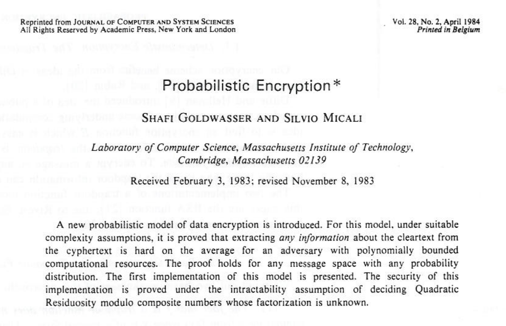

This paper introduced the concept of "semantic security", which loosen some of the requirements of perfect security:
> **Semantic security**: Suppose you are an attacker. You cannot compute any valuable information from the ciphertext within polynomial time. 

This seems much more reasonable.

The next question is, how do we understand the concept of "not being able to compute information"? This requires us to measure information. But what exactly is information? We introduce another concept "indistinguishability" to reformulate the security of encryption algorithms. 

Suppose you are an attacker, and I have an encryption algorithm:
1. You randomly generate two plaintexts of equal length, `m1` = "The sun sets behind the mountains, and the Yellow River flows into the sea", `m2` = "Blah blah blah blah blah, blah blah blah blah blah."
2. You give these two plaintexts, `m1` and `m2`, to me.
3. I randomly select one of the plaintexts, encrypt it without telling you which one, and produce a ciphertext `c`.
4. I present the ciphertext `c` to you and ask you to guess whether `c` was produced by encrypting the Tang poem or by encrypting the gibberish.
5. If, using a computer, you cannot crack `c` within polynomial time (i.e., you cannot distinguish the source of `c`), it indicates that the encryption algorithm is semantically secure. 

OK, with an understanding of "indistinguishability", let’s return to "zero-knowledge". How do we prove that an interactive system is zero-knowledge? First, we need to define the concept of zero-knowledge.

Note: Indistinguishability can be categorized probabilistically into "perfect indistinguishability", "statistical indistinguishability", and "computational indistinguishability". For now, we don’t need to distinguish between these concepts.

## Enter the Simulator
Let’s open our minds a bit and imagine two parallel universes: one called the "Ideal World" and the other called the "Real World". We, as individuals, can happily play in both parallel worlds, but ordinary people in these two worlds cannot perceive or communicate with each other. 

Suppose you are a highly skilled codebreaker, and you are not an ordinary person—you possess the ability to travel between parallel universes. Alice has the solution to a map 3-coloring problem, and your goal is to extract this solution by engaging in conversation with Alice. The conversation follows the protocol described in the previous article about the map 3-coloring problem.

Let’s stretch our imagination further. Alice only exists in the "Real World". In the "Ideal World", Alice has been replaced by an individual who looks and sounds exactly like her; we’ll call this doppelganger "Zlice". Next, we place you simultaneously in both worlds, but we won’t let you know which world you are currently in. Your two doppelgangers face someone who looks like Alice in both worlds.

To repeat: in the "Real World", you are conversing with a real and honest Alice; in the "Ideal World", you are conversing with Zlice (the fake Alice), who although physically identical to Alice, does not know the solution to the 3-coloring problem.

Now, your two doppelgangers in the two worlds engage in conversation with the real and fake Alices simultaneously. Something magical happens: in both worlds, your two doppelgangers are convinced by their counterparts. After `n` rounds of challenges, neither of them detects any cheating. In other words, you cannot distinguish whether you are in the Real World or the Ideal World, and you certainly can’t tell whether you are talking to Alice or Zlice. Moreover, if I, the observer, were placed in either world, I would be just like you —— unable to distinguish whether the "Alice" in front of me is real or fake.

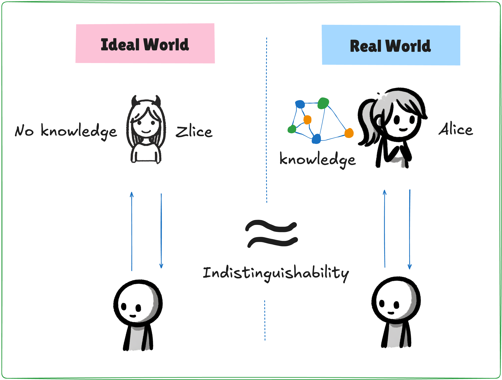

Here comes the mind-bending conclusion:

> Why is this interactive system "zero-knowledge"? Because Zlice possesses no knowledge, and Zlice is indistinguishable from Alice.

Let me explain it another way: because neither you nor I can distinguish which world we are in, and since the interaction in both worlds is almost indistinguishable, and one of the worlds contains no knowledge at all, we say that this interactive protocol —- the map 3-coloring problem is "zero-knowledge". 

There’s one more condition: the `Ideal World` must be algorithmically constructible. And, there exists a "god" who constructs this "Ideal World" through an algorithm, creating an algorithm we call Zlice. Zlice has no knowledge as input, i.e., zero knowledge; yet, beyond this, the Ideal World is exactly like the Real World.

Imagine this: if the real Alice were to leak information during the conversation, you would immediately be able to distinguish whether the person before you was the real Alice or Zlice. However, **Zlice cannot fake leaked information**. Therefore, we conclude:

> The real Alice did not leak any information.

This "god" is called a simulator, and the Zlice illusion you interact with in the Ideal World is also the simulator. Everything you perceive in the Ideal World is simulated by the simulator.

Now, with the concept of a "simulator", we have defined "zero-knowledge". 

Next, we will move on to proving zero-knowledge.

## Distinguishing the Two Worlds

*（Save World State as Snapshot X）*

The process of proving zero-knowledge is equivalent to constructing (or finding) a simulation algorithm that allows the simulator to simulate a "knowledge-free" Ideal World. If such an algorithm exists, and the two worlds are indistinguishable, the proof is complete.

Wait. Maybe you feel something is off. 

If such an algorithm exists and can fool me without any knowledge, what’s stopping the real Alice in the "Real World" from using the same algorithm to deceive me? Wouldn’t that mean I’m being deceived in both worlds? Doesn’t that render the interactive protocol meaningless?

Actually, there’s a key element here. Borrowing a scene from the movie *Inception*, there is something fundamentally different between the "Ideal World" and the "Real World". This element is crucial for distinguishing the two worlds, yet it must be imperceptible to us. It’s not the spinning top from the dream, but rather a kind of "superpower" possessed by the simulator.

For example, "the ability to rewind time".

(The image above is from *Groundhog Day*, where the protagonist wakes up every morning on February 2nd, reliving the same day over and over again.)

Wait. Weren’t we just talking about indistinguishability? Why are we now talking about distinguishing between two worlds? Isn’t that confusing? Don’t worry. The concept of indistinguishability applies to the perceptions of individuals within the Ideal World, while distinguishability applies to the "god" who exists outside of both worlds. 

Imagine there’s someone around us who possesses the ability to travel through time or reverse time by one year. To us mere mortals, this would be completely bewildering — we would have no way of perceiving it. So, if the simulator can rewind time in the Ideal World it has constructed, it can achieve some magical results, fooling you as the verifier and me as the observer. From your perspective, you understand that time can be rewound in the Ideal World, but obviously, in the Real World, the real Alice cannot possess such superpowers. While you and I cannot distinguish which world we are in, at least we know that in one of the worlds—the Real World — Alice can’t deceive us. However, we cannot pinpoint which world we are actually in.

At this point, the zero-knowledge nature of the interactive protocol has been proven. Have you understood the reasoning? Let me walk you through the proof process again:

First, zero-knowledge is about protecting Alice’s interests. Alice doesn’t want to reveal any additional information to Bob during the interaction. She doesn’t want Bob to know her secret `w`, and she certainly doesn’t want Bob to infer even the slightest bit of information from the interaction. How can this be guaranteed? This is where the simulator comes in. The simulator can simulate a "knowledge-free" Ideal World that looks exactly like the Real World. In this world, the simulator can easily fool any adversary, making it impossible for them to distinguish whether they are in the Real World or the Ideal World. Since the simulator doesn’t know the secret `w`, the Ideal World is zero-knowledge. And because the two worlds are indistinguishable, we can conclude that Alice’s interactive protocol is zero-knowledge. 

Let’s look at a concrete example from the previous article [1], the map 3-coloring problem.

## Zero-Knowledge Proof of the Map 3-Coloring Problem
 
 Recall the "map 3-coloring interactive system":
 
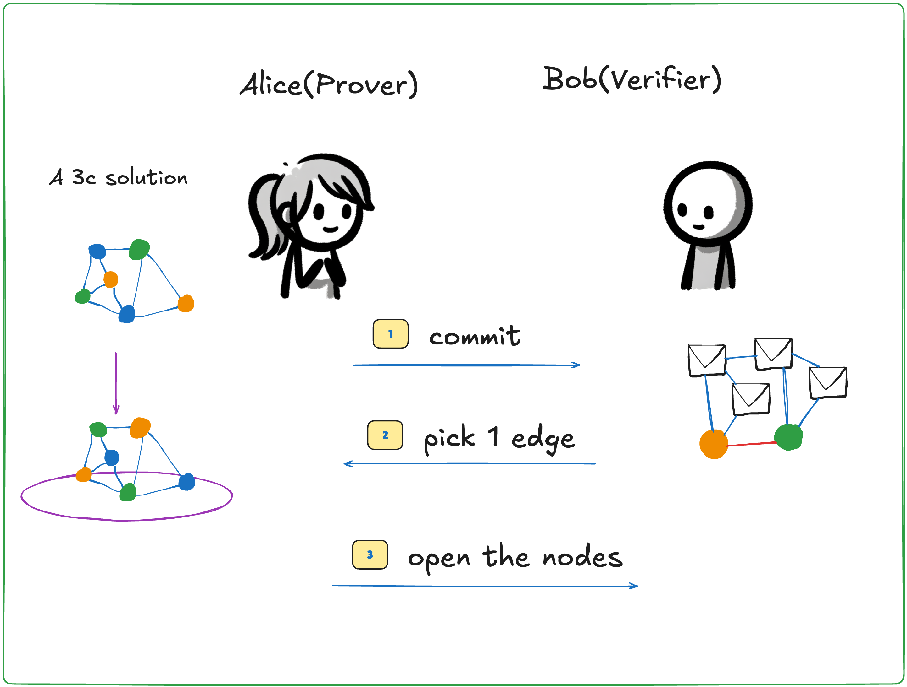

+ Step 1: Alice permutes the 3-coloring solution and covers all vertices with pieces of paper, then presents the graph to Bob.
+ Step 2: Bob randomly selects an edge.
+ Step 3: Alice uncovers the two vertices at the ends of the selected edge. Bob checks if the two vertices have different colors. If they do, the check passes. If they don’t, the check fails.
+ Return to step 1 and repeat for `n` rounds.

Let’s now prove that this interaction is zero-knowledge. For now, we’ll assume that Bob is honest. This will help us understand the proof process. Later, we’ll discuss how to prove zero-knowledge when Bob is dishonest.

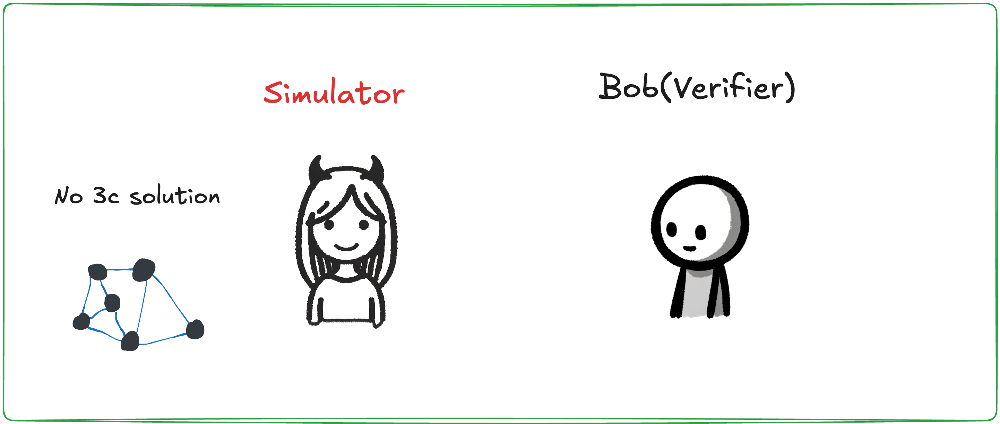

In the Ideal World, Bob is interacting with a simulator that simulates the entire world. Bob follows the interactive protocol of the 3-coloring problem. The simulator doesn’t know the 3-coloring solution, so it simply colors all the vertices gray.

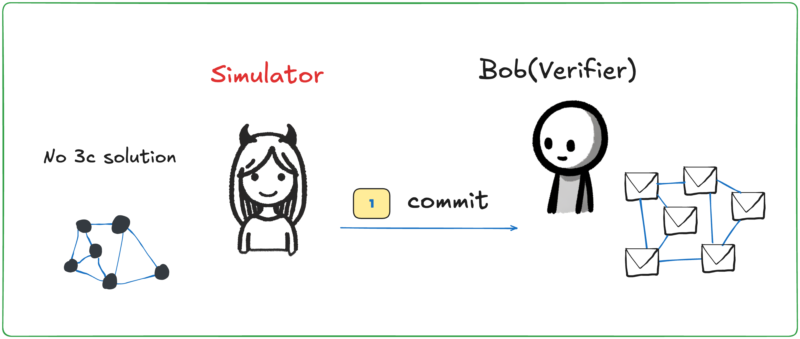

 First, the simulator mimics Alice by covering each vertex with a piece of paper. Then it presents the graph to Bob.

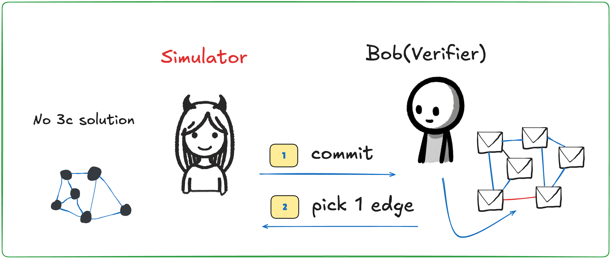

Bob randomly selects an edge and challenges the prover.

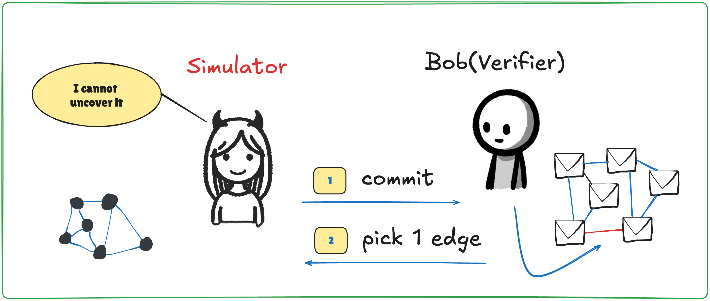

At this point, the simulator cannot uncover the paper because both ends of the selected edge are black.

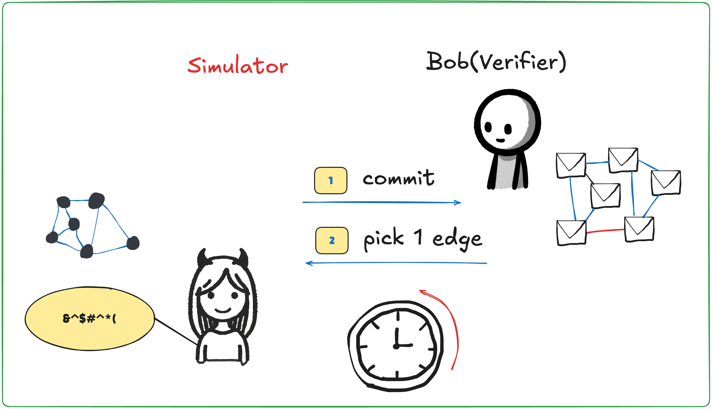

This is when the simulator uses its superpower: it rewinds time and returns to before the first step of the conversation.

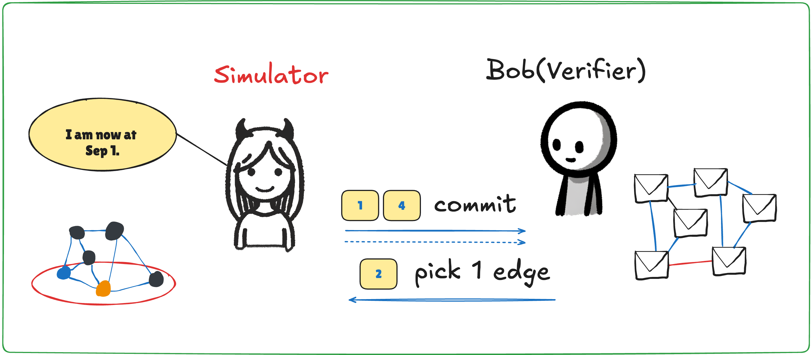

Now back at the first step, the simulator colors the two ends of the bottom edge with two distinct random colors and covers them with paper again before presenting the graph to Bob.

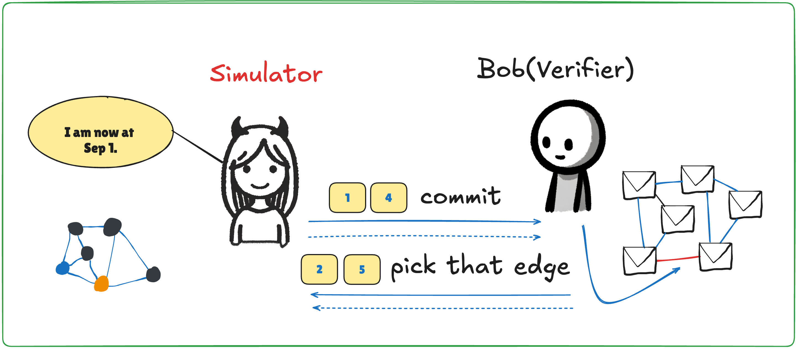

Bob, unaware that time has been rewound, honestly selects the same bottom edge.

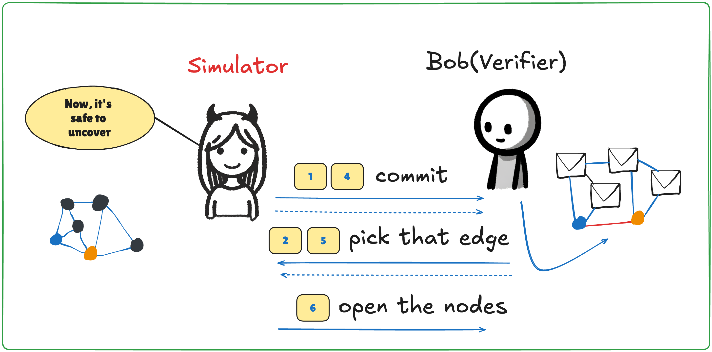

At this point, the simulator can confidently uncover the paper, letting Bob check. Bob is obviously fooled. The simulator repeats this process for each round, continuously using time rewinding to fool Bob.

Thus, in the Ideal World, the simulator has no knowledge of the 3-coloring solution, yet it is still able to fool Bob. The interaction process observed in the Ideal World is statistically indistinguishable from the interaction process in the Real World. **This demonstrates the existence of the simulator’s algorithm, effectively proving the zero-knowledge property of the interactive system**.

#### Dishonest Bob

In the proof above, we made a strong assumption that after each rewind, Bob would choose the same edge. But what if Bob chooses a different edge each time? That’s okay. After the simulator rewinds time for the first time, if Bob chooses a different edge, the simulator can reshuffle the colors and rewind time again. After several rewinds, Bob will have a high probability of eventually choosing the edge that the simulator recolored. Only then will the simulator proceed to the third step and uncover the paper.

## Simulation and Turing Machines

When we talk about superpowers, do you feel like this is all a bit unscientific? Yes, if we mindlessly use "superpowers" to explain everything, our logic would no longer be consistent. **In the Ideal World, the simulator is not an omnipotent god**. For example, the simulator cannot directly modify Bob’s internal state. It cannot, for instance, turn a failed verification into a success by brute force. If this were allowed, we could prove that any interactive system is zero-knowledge, which would lead to the absurd conclusion.

> The simulator is not an omnipotent god in the Ideal World.

So, what exactly can the simulator do? The simulator is essentially a Turing machine. The so-called "time rewind" or "video editing" superpowers are not mystical supernatural abilities but rather functions that a Turing machine can perform. People in computer science are likely familiar with virtualization software like VMWare. The simulator described in this article can be thought of as a **virtual machine** that creates a virtual environment, which we call the **Ideal World**. How do we explain "time rewind"? Have you ever used the snapshot feature in virtualization software? When using snapshots, the software can save the entire state of the virtual machine, and at any time, it can return to the saved snapshot to continue running.

Note: Time rewind is actually a basic operation in computer science. In programming language theory, there’s a concept called **Continuation**. Abstractly speaking, "Continuation" represents the calculation from the current moment to the future. Continuations are an explicit abstraction of control flow, and operations like `goto`, `call-with-current-continuation`, and even thread scheduling can be seen as operators that manipulate continuations. For example, using `call/cc` (call-with-current-continuation) can easily implement "backtracking" functionality. Saving a snapshot can be understood as saving the current continuation, and "going back to the past" is like applying this continuation.

Both Zlice and Bob, along with each of our observers, are executable programs. **These programs are copied into the virtual machine**. The conversation between Zlice and Bob is essentially communication between these two programs. The observer is a program hooked into the I/O of the Zlice and Bob processes. In the Ideal World of the map 3-coloring problem, honest Bob is essentially a process that calls the virtual machine’s random number generator, and this random number generator can be manipulated by Zlice. 
The **Real World** is the external environment where the virtual machine is running.

Are you starting to have some epiphanies? Let me emphasize again:

> The process of proving zero-knowledge is about finding an algorithm, or more simply, writing a piece of code that runs in an external computer system but implements the functionality of the virtual machine. In this virtual machine, there must be a Zlice without **knowledge** as input, capable of fooling Bob running in the virtual machine.

If you still don’t get it, please go back to the section *"Distinguishing the Two Worlds"*, and think again about simulation. :P *Load World State from Snapshot X*

## To Be Continued

This article introduced the key concept needed to understand zero-knowledge: simulation. Any zero-knowledge protocol can be understood by constructing an Ideal World. Readers encountering this concept for the first time may need to ponder it repeatedly.

> Two methodologies are crucial in computer science: abstraction and simulation.

Let’s recap the conversation between Bob in the Ideal World and the Real World during the map 3-coloring problem. While Bob cannot distinguish between the two worlds, one thing he can be sure of is that in the Real World, Alice does not have superpowers.

But here’s the problem: Alice’s lack of superpowers doesn’t directly prove that Alice truly has the solution. What if the interactive protocol doesn’t guarantee that Alice has knowledge? While zero-knowledge protects Alice’s interests, who guarantees Bob’s interests? This question will be addressed in the next article.

*Acknowledgments: This article was inspired by two blog posts published by cryptography professor Matthew Green in 2014 and 2017 [10-11].*

### References
+ [1] An Introduction to Zero Knowledge and Proofs*. SECBIT Labs. 2019.
+ [2] Shafi Goldwasser and Silvio Micali, *Probabilistic Encryption*, Special issue of Journal of Computer and Systems Sciences, Vol. 28, No. 2, pages 270-299, April 1984.
+ [3] Quisquater, J.J., et al., *How to Explain Zero-Knowledge Protocols to Your Children*, 1989, August. In *Conference on the Theory and Application of Cryptology*. Springer, New York, NY.
+ [4] Plato and Wu Xianshu, *The Republic*. Commercial Press, 1986.
+ [5] Goldwasser, Shafi, Silvio Micali, and Charles Rackoff. *The Knowledge Complexity of Interactive Proof Systems*. SIAM Journal on Computing 18.1 (1989): 186-208.
+ [6] Oded, Goldreich. *Foundations of Cryptography: Basic Tools*. (2001). 
+ [7] Rackoff, Charles, and Daniel R. Simon. *Non-interactive Zero-Knowledge Proof of Knowledge and Chosen Ciphertext Attack*. Annual International Cryptology Conference. Springer, Berlin, Heidelberg, 1991.
+ [8] Goldreich, Oded, Silvio Micali, and Avi Wigderson. *Proofs that Yield Nothing but Their Validity or All Languages in NP Have Zero-Knowledge Proof Systems*. Journal of the ACM (JACM) 38.3 (1991): 690-728.
+ [9] zkPoD: Blockchain, Zero-Knowledge Proofs, and Formal Verification for Fair Transactions Without Intermediaries. SECBIT Labs. 2019.
+ [10] Matthew Green. *Zero Knowledge Proofs: An Illustrated Primer*. 2014. https://blog.cryptographyengineering.com/2014/11/27/zero-knowledge-proofs-illustrated-primer/
+ [11] Matthew Green. *Zero Knowledge Proofs: An Illustrated Primer, Part 2*. 2017. https://blog.cryptographyengineering.com/2017/01/21/zero-knowledge-proofs-illustrated-primer-part-2/

