# Searching for "Knowledge"

*Exploring Zero-Knowledge Proofs Series (Part 3)*

[TOC]

> And what, Socrates, is the food of the soul? Surely, I said, knowledge is the food of the soul.  
> — Plato


**Introduction:** Certain theories are incredibly fascinating, and zero-knowledge proofs are one of them. After much exploration, I wanted to write something to discuss with everyone. This article is the third in the *Exploring Zero-Knowledge Proofs* series. 

This article will be updated and revised on [GitHub](https://github.com/sec-bit/learning-zkp/).


## "Zero-Knowledge" vs. "Soundness"


In many articles introducing zero-knowledge proofs, we often see three properties:

- Completeness
- Soundness
- Zero-Knowledge

However, few articles delve deeply into the profound meaning and insights behind these properties.

In *"[Part 2] Understanding Simulation"*, we introduced the concept of the "simulator". Many introductory articles avoid discussing "simulation", but simulation is the core of the core in security protocols because it is an essential tool for defining "security".

Typically, when we define security, we list certain security events and then explain: if a system is secure, these listed events will not occur.

> Rather than giving a list of the events that are *not allowed* to occur, it (the definition of zero-knowledge proof) gives a maximalist *simulation* condition.
>
> — Boaz Barak

Borrowing from cryptographer Boaz Barak, the definition of zero-knowledge proof does not enumerate an **event list of disallowed occurrences**, but instead provides a maximalist "simulation condition".

The "simulation condition" refers to the creation of an "ideal world" through simulation that is indistinguishable from the "real world". Since the ideal world contains no knowledge, we can conclude that the real world satisfies the condition of "zero-knowledge".

Let’s continue to analyze the three properties of an interactive system (security protocol): completeness, soundness, and zero-knowledge.

> **Soundness**: Alice cannot pass Bob’s verification without knowledge.  
> **Completeness**: Alice can pass Bob’s verification if she has knowledge.  
> **Zero-Knowledge**: Alice does not reveal any information about the knowledge during the interaction.

We can see a "symmetry" between soundness and completeness. Soundness guarantees that a malicious Alice will fail, while completeness ensures that an honest Alice will succeed.

Completeness is relatively easy to prove. If both Alice and Bob are honest, everyone is happy. This is like writing some codes, feeding it a test case, running it, passing it, and moving on.

Now, how do we define soundness? The contrapositive of soundness is: (in the real world) if Alice can pass Bob’s verification, then Alice must have knowledge. In other words, Alice knows that... secret!

The next question is, how do we prove that Alice knows the secret?

This seems difficult, doesn’t it? If we need to prove that a machine knows a secret, the simplest method would be to find this secret on the machine’s hard drive or memory. But this would expose the secret. What if the machine is a black box? Or if Alice is the black box? We don’t have the ability to read minds, so we can’t guess the secret in her mind.


### How Do We Define "To Know"?

Zero-knowledge ensures that the verifier Bob cannot extract any information related to the knowledge. The inability to extract knowledge does not mean that the knowledge doesn’t exist. Soundness guarantees the existence of the knowledge.

> Only with the assumption that knowledge exists does the guarantee of zero-knowledge make sense.

This article will explore **soundness** and **To Know**.

---

To further analyze "knowledge," let’s first introduce a simple and widely-used zero-knowledge proof system—the **Schnorr Protocol**. This protocol represents a large class of security protocols, called Σ-protocols, and the Schnorr protocol is also a core technology of the [zkPoD zero-knowledge data exchange protocol](https://github.com/sec-bit/zkPoD-node) [1].


# The Simple Schnorr Protocol

Alice has a secret number `a`, which we can think of as a "private key." This number is "mapped" to a point on an elliptic curve group, `a*G`, abbreviated as `aG`. We treat this point as the "public key."

* `sk = a`  
* `PK = aG`

Note the use of "mapping". Here, we briefly introduce the concept of **homomorphism**. Between the finite field of the elliptic curve group, there exists a homomorphic mapping. We denote the finite field as `Zq`, where the prime `q` represents the size of the finite field, meaning the set of integers from `0, 1, 2, …, q-1`. On an elliptic curve, a "cyclic group" can be generated using a base point `G`, marked as `0G, G, 2G, …, (q-1)G`, which is a set of curve points of size `q`. Any two curve points can undergo a "special binary operation", such as `G + G = 2G`, `2G + 3G = 5G`. This binary operation resembles "addition" and satisfies the commutative and associative properties. Therefore, we use the `+` symbol to represent it. The group is called a cyclic group because when the last element of the group `(q-1)G` is added to `G`, it wraps around to the first element `0G`.

For any integer `r` in the finite field, we can find a corresponding point in the cyclic group, `rG`, or express it using scalar multiplication as `r*G`. However, calculating the reverse is very difficult — this is a "cryptographic hard problem" known as the discrete logarithm problem [2].

In other words, given any point `R` on an elliptic curve cyclic group, determining which integer in the finite field corresponds to `R` is computationally difficult. If the finite field is large enough, say 256 bits, this reverse calculation is practically impossible.

The Schnorr protocol fully utilizes the one-way mapping between the finite field and the cyclic group to implement a simple zero-knowledge proof security protocol: Alice proves to Bob that she possesses the private key `sk` corresponding to the public key `PK`.

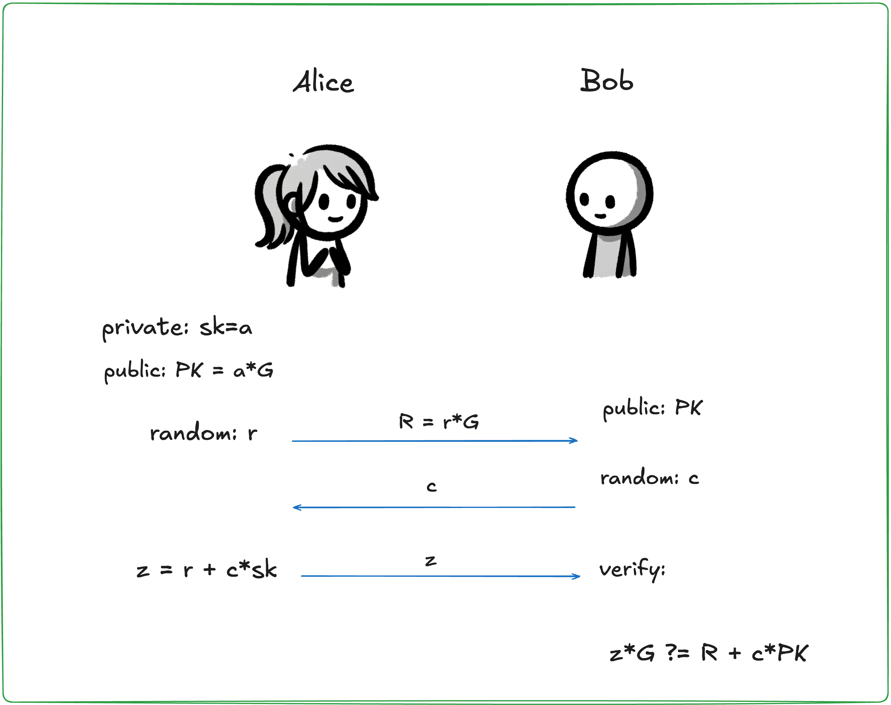

**Step 1**: To ensure zero-knowledge, Alice first generates a random number `r`. This random number is used to protect the private key from being extracted by Bob. The random number is also mapped to the elliptic curve group as `rG`.
**Step 2**: Bob provides a random number as a challenge, which we call `c`.
**Step 3**: Alice calculates `z = r + a * c` and sends `z` to Bob. Bob verifies the calculation using the following equation:

```z*G ?= R + c*PK = rG + c*(aG)```

As you can see, Bob "homomorphically" verifies the calculation of `z`. If the equation holds, it proves that Alice indeed has the private key `a`. But why is this the case? The calculation and verification of `z` are quite interesting, and there are a few key techniques:
1. Bob must provide a random challenge `c`, and Bob checks `z` homomorphically on the elliptic curve. If `r + a*x = r' + a'*x` holds for an unknown `c`, then by the **Schwartz-Zippel theorem** [3], it is highly probable that `r = r'` and `a = a'`. This random challenge `c` restricts `r` and `a`. Since Alice does not know `c` in advance, she has to use her private key `a` to calculate `z`. The key here is that `c` must be a random number.
2. Bob verifies the calculation on the elliptic curve group. Bob doesn’t know `r`, but he knows the point `R` on the curve. Similarly, Bob doesn’t know `a`, but he knows the point `PK = a*G` on the curve group. Through homomorphic mapping and the Schwartz-Zippel theorem, Bob can verify that Alice’s calculation of `z` is correct without revealing `r` or `a`.
3. Additionally, the random number `r` generated in the first step ensures the secrecy of `a`. When a secret is added to a random number from a uniform distribution, the sum also follows a uniform distribution.

## Proving Zero-Knowledge
Let’s now examine how the Schnorr protocol proves a weaker form of zero-knowledge — "SHVZK" (Special Honest Verifier Zero-Knowledge).

Note: We are proving only Special Honest Verifier Zero-Knowledge (SHVZK). SHVZK requires that Bob behaves according to the protocol, meaning he must take a fresh random number in Step 2 and use it immediately. General zero-knowledge does not place any requirements on Bob, so SHVZK is considered weaker. Although the Schnorr protocol cannot currently prove full zero-knowledge, adding a few protocol steps can achieve full zero-knowledge. For details, refer to [4]. We will revisit this topic when discussing the Fiat-Shamir transformation.

First, the "simulator" simulates an "ideal world," where Zlice (the fake Alice) interacts with Bob. Zlice does not have the knowledge `sk`, but Bob has the public key `PK`. In the diagram below, Bob needs to provide a random number `c` in Step 2 of the Schnorr protocol. However, Bob must "honestly" take a fresh random number from an external "random number conveyor belt," and each number must be generated by flipping `k` coins to produce a uniformly distributed random number within a range of `2^k`. Bob cannot use any other method to generate random numbers, which is why we require Bob to be honest.Let’s see how Zlice can fool Bob:


*Prologue: Note that Zlice does not have knowledge of `sk`. At this point, Bob’s random number conveyor belt has pre-placed some random numbers.

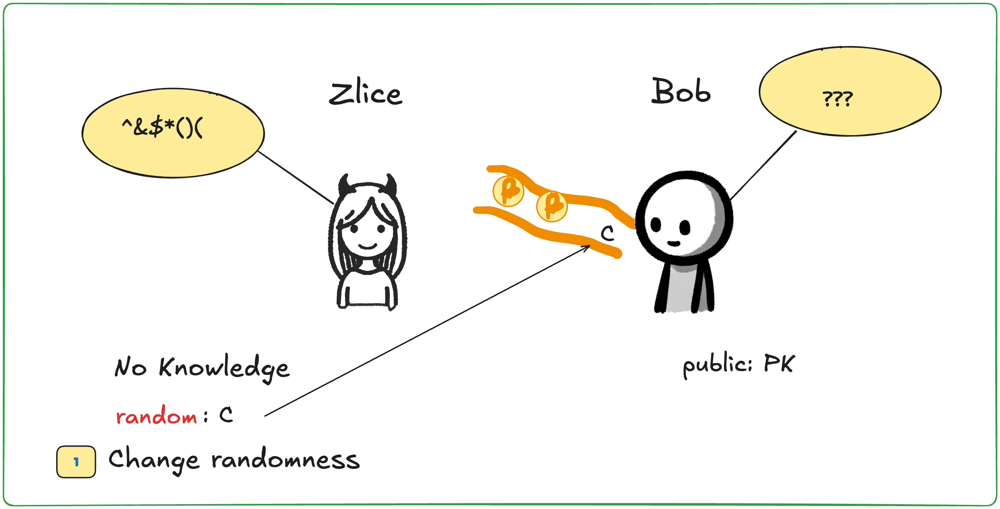

**Step 1**: Zlice generates a random number `c` and uses a new "superpower" to replace the first random number on Bob’s conveyor belt with `c`. Bob cannot detect this change.

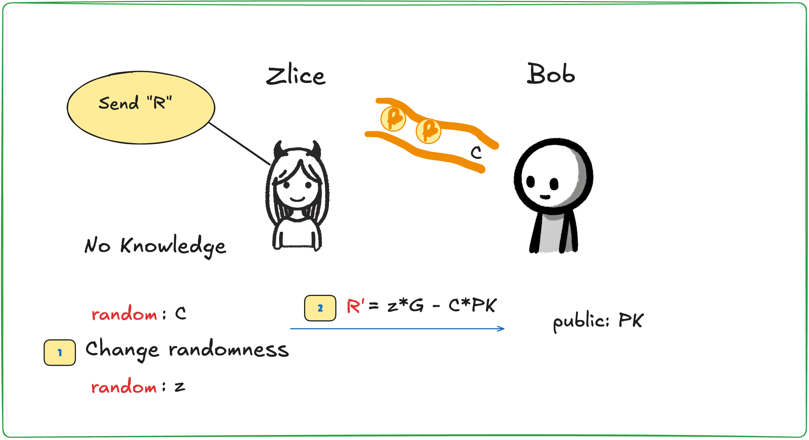

**Step 2**: Zlice generates another random number `z`, calculates `R' = z*G - c*PK`, and sends `R'` to Bob.

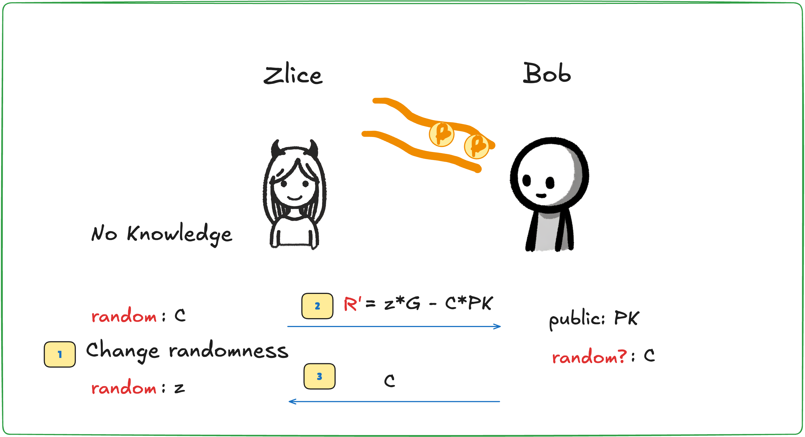


**Step 3**: Bob retrieves `c` from the random number conveyor belt and sends it to Zlice. This `c` is exactly the same as the one Zlice generated in Step 1.

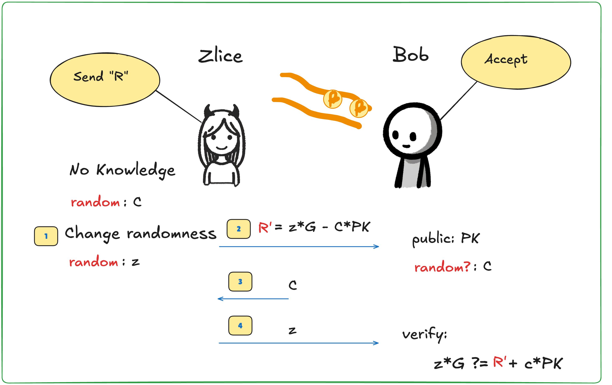

**Step 4**: Zlice sends the random number `z` to Bob. Bob verifies the calculation according to the Schnorr protocol, and you’ll find that the equation holds perfectly. 

Now compare the Schnorr protocol in the real world. In both worlds, Bob can verify the result.


But the differences are:
- In the **ideal world**, Zlice does not have `sk`, while in the **real world**, Alice does.
- In the **ideal world**, `z` is a random number unrelated to `sk`, while in the **real world**, `z` is calculated using `sk`.
- In the **ideal world**, Zlice uses her superpower to replace Bob’s random number, while in the **real world**, Alice cannot see or alter Bob’s random number.

Now, think about this: In the Schnorr protocol, can Bob send the challenge `c` before Alice sends `R = r*G`?

(Two minutes later...)


The answer is **no**.

If Alice knew the random number in advance, she could deceive Bob by doing what the simulator Zlice does.

## Meeting the Simulator Again
In fact, soundness and zero-knowledge also exhibit a kind of symmetry in another dimension. Soundness guarantees that a malicious Alice will fail, while zero-knowledge ensures that a malicious Bob (trying to steal knowledge) will not succeed. Interestingly, this symmetry manifests in the simulated "ideal world".

Let’s analyze the definition of soundness: Alice’s lack of knowledge **leads to** Bob’s verification failure. The contrapositive is: Bob’s successful verification **leads to** Alice having knowledge.

**Once again, we turn to the simulator**, asking it to verify Alice’s knowledge in the magical "ideal world". Imagine two parallel universes: one called the **ideal world** and the other the **real world**. The interesting thing about the ideal world is that it’s simulated by the simulator, and NPCs (non-player characters) with superpowers can be placed in it. This time, Alice’s two counterparts are placed in both the ideal world and the real world.

Suppose you are playing the role of Bob. You want to know if the Alice in front of you is "sound". So, you are placed in the ideal world, where an NPC with superpowers helps you extract Alice’s knowledge.

W...hat? Didn’t we just prove that the protocol is zero-knowledge? Zero-knowledge means Bob cannot extract any fragments of knowledge. There is one point need to be strengthened: zero-knowledge applies to the real world* We are now discussing the magical ideal world.

To repeat, in the ideal world, you can use an NPC with superpowers to extract Alice’s knowledge, ensuring that Alice cannot cheat in the real world. Imagine a cheating Alice who has no knowledge — she would never be able to provide anything for the NPC to extract in the ideal world. 

However, in the real world, you cannot rely on the NPC and thus cannot see Alice’s knowledge. This does not conflict with the zero-knowledge property. Since the events in the two worlds are indistinguishable, we can conclude that in the real world, Alice must possess knowledge.

To summarize: How do we prove that Alice cannot cheat in an interactive conversation? We define a "simulation algorithm" that simulates an ideal world, where a special role called the "Extractor" (the NPC we referred before) can use its superpower to extract Alice’s knowledge without her noticing.

Note: The superpower is essential! As explained in *"[Part 2] Understanding Simulation"*, if the simulator could cheat without a superpower, it would prove the **unsoundness** of protocol. Similarly, if the **extractor** could extract knowledge without a superpower, it would prove the protocol is not zero-knowledge. 

Lastly, what is the superpower? That depends on the specific proof in the interactive system. Let’s now apply this to the Schnorr protocol.


## Proof of Knowledge
Let’s prove the **soundness** of the Schnorr protocol and see how the superpowered NPC can extract Alice’s private key in the ideal world. The superpower here is "time rewinding".


**Step 1**: Alice chooses a random number `r`, computes `R = r*G`, and sends `R` to the extractor.

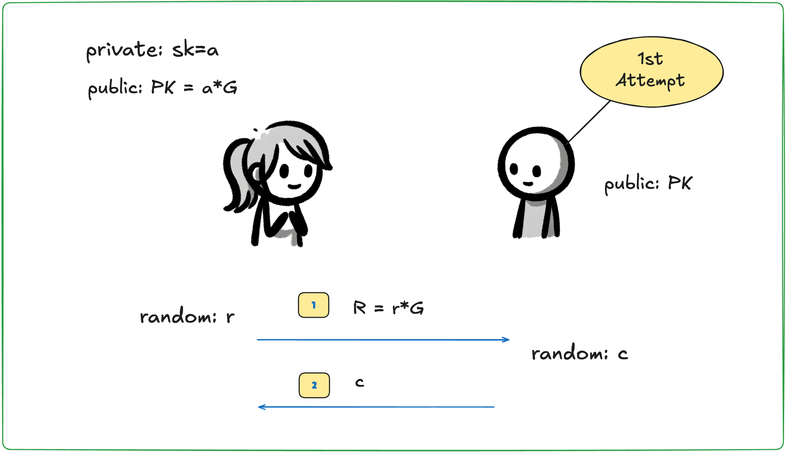

**Step 2**: The extractor chooses a random challenge `c` and sends it to Alice.

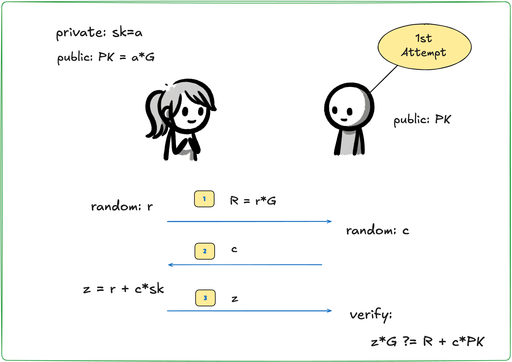

**Step 3**: Alice computes and responds with `z`. The extractor verifies if `z` is correct.

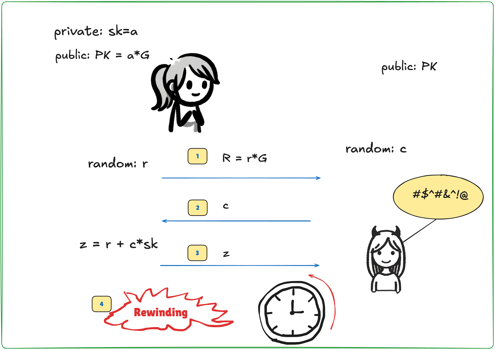

**Step 4**: After verifying that `z` is correct, the extractor uses its superpower to rewind time back to before Step 2.

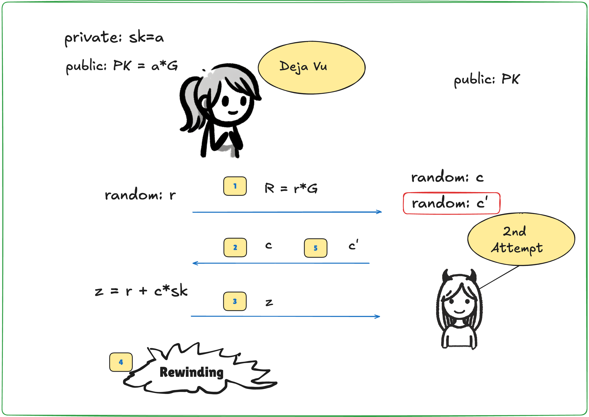

**Step 5**: The extractor sends a different random challenge `c'` to Alice. Alice, unaware of the time rewind, proceeds with the protocol as usual.

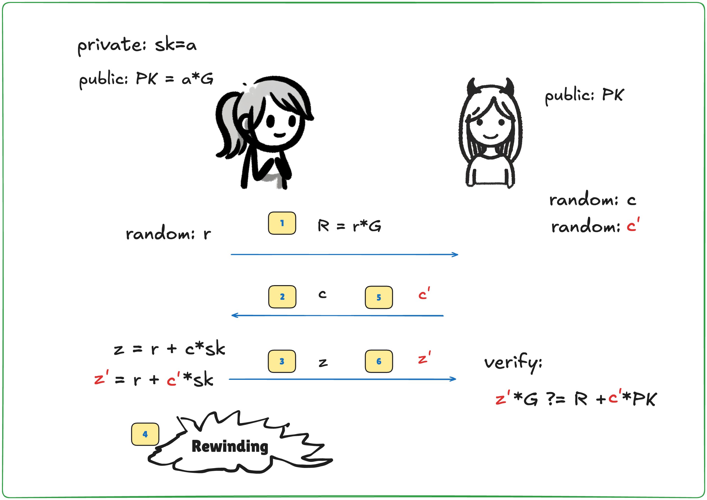

**Step 6**: Alice calculates `z'` and sends it to the extractor.

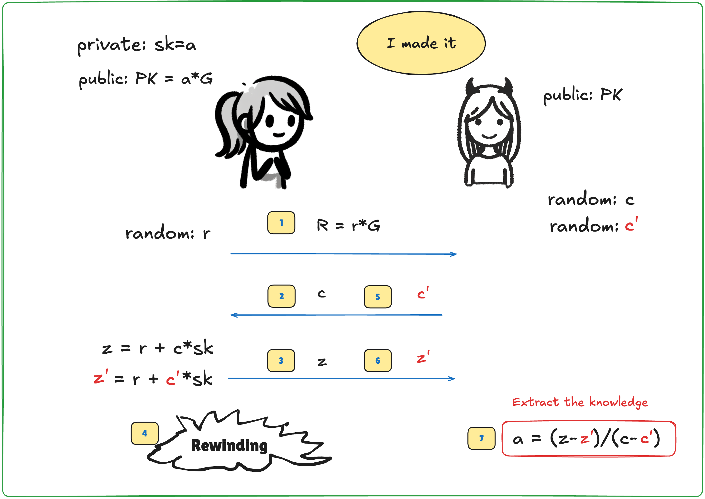

**Step 7**: With both `z` and `z'`, the extractor can now calculate Alice’s private key `a`, achieving **knowledge extraction**.

At this point, **soundness** is essentially proven. Can you start to see the **symmetry** between soundness and zero-knowledge? 

To summarize: The **extractor** in the ideal world uses its time-rewinding superpower to extract Alice’s knowledge. This ensures that an Alice without knowledge cannot fool the extractor, thereby proving **soundness**.

Note: Not all soundness requires the existence of an extractor algorithm. Protocols that prove soundness using an extractor are known as **Proof of Knowledge** systems.

## Understanding ECDSA Signature Attacks
The ECDSA signature scheme, commonly found in blockchain systems, is also a basic zero-knowledge proof system. The Elliptic Curve Digital Signature Algorithm (ECDSA) is very similar to the Schnorr protocol. The Schnorr signature scheme was published in 1991 in the *Journal of Cryptology* [5]. In 1991, as NIST was selecting a digital signature algorithm, the elegant Schnorr signature scheme was unfortunately patented, so NIST proposed a different signature scheme, DSA (Digital Signature Algorithm). When support for elliptic curves was added, it became known as ECDSA. When Satoshi Nakamoto designed Bitcoin, "they" chose ECDSA as the signature algorithm but opted for the secp256-k1 curve instead of the NIST-recommended secp256-r1. There were rumors that NIST might have tampered with the elliptic curve parameters, allowing certain agencies to solve the discrete logarithm problem and gain superpowers in the **real world**. Some speculate that Satoshi Nakamoto was aware of this possibility and deliberately chose the secp256-k1 curve, which is supposedly less secure.

Let’s dissect the ECDSA signature process and define a similar authentication scheme using an interactive method, as shown in the diagram:

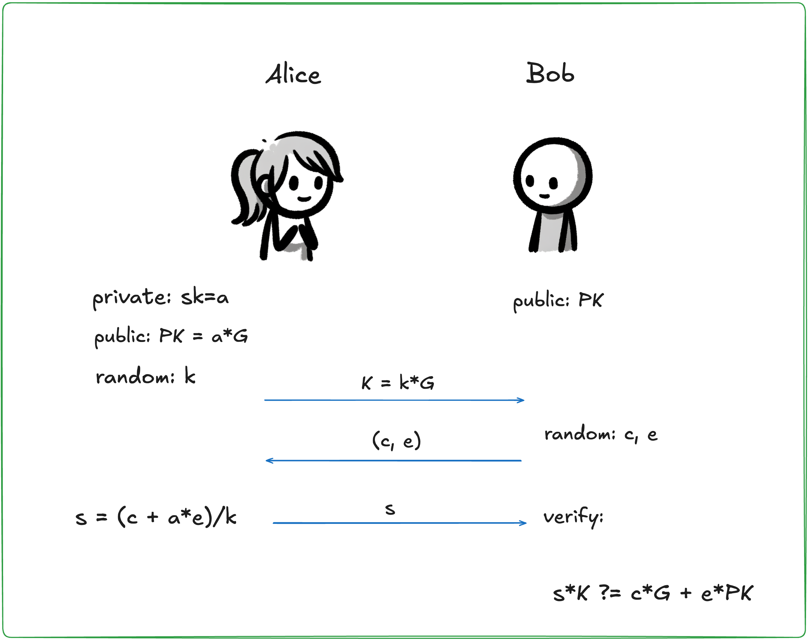

**Step 1**: Alice selects a random number `k`, maps it to the elliptic curve to get the point `K`, and sends it to Bob.
**Step 2**: Bob generates two random numbers, `c` and `e`, and sends them to Alice.
**Step 3**: Alice calculates `s` and sends it to Bob, who verifies if `s` was calculated correctly.

Note for readers familiar with the ECDSA signature scheme: The random number `c` corresponds to the hash of the message `Hash(m)`, and `e` is derived from a conversion function `F(K)`. The function `F(.)` takes the x-coordinate of the elliptic curve point modulo `q` [6].

A common saying is that ECDSA has a severe security vulnerability: if the same random number is used in two signatures, the signer’s private key will be exposed. The Schnorr signature scheme has the same problem.

When Sony engineers called the ECDSA library function, they mistakenly passed a constant instead of a random number. Cryptography-savvy hackers discovered this serious backdoor. In January 2011, the legendary hacker George Hotz (Geohot) publicly released Sony PS3’s master private key, meaning that any user could easily gain root access to the console. Naturally, Sony was furious... (You can search online for the rest of the story.)

If Alice used the same `K` in two interactions, Bob could send two different challenge numbers, `c` and `c'`, to obtain `s` and `s'`, and use the following equation to derive Alice’s private key `a`:

```k = (c - c')/(s - s')a = (k * s - c)/e```

How should we interpret this "security backdoor"? Think about it: this security backdoor is almost identical to the extractor algorithm in the soundness proof of the Schnorr protocol! This is precisely the extractor algorithm in the proof of soundness for ECDSA. The only difference is that in the soundness proof, the extractor needs to use its time-rewinding superpower to make Alice use the same random number `k` twice.

However, in the Sony PS3 system, the random number was hardcoded by an engineer, effectively giving hackers the "superpower" in the real world. In other words, hackers could implement the extractor without needing time-rewinding.

A reminder: It’s not just about using the same random number. The random number must also have cryptographic strength.

Imagine if the random number `r` were generated by a linear congruential pseudo-random number generator. Even if `r` changes over time, it still wouldn’t prevent **knowledge extraction**. Suppose the linear congruential algorithm is `r2 = d*r1 + e (mod m)`. Returning to Step 3 of the Schnorr protocol:

```1: z1 = r1 + c1*a2: z2 = r2 + c2*a```

If an attacker forces Alice to sign twice consecutively, substituting `r2` into `r1`, we end up with two linear equations in two unknowns `(r1, a)`. Since `z1, z2, c1, c2, d, e` are known to the attacker, the system of equations can be solved using elementary algebra.

Note: This is not a "design flaw" in the Schnorr protocol (or ECDSA). On the contrary, this is a "clever design feature" that guarantees the protocol’s soundness. Similar techniques frequently appear in cryptographic protocols, achieving "elegant simplicity". However, if users are unaware of the protocol’s inner workings, especially the distinction between the ideal world and the real world, they may inadvertently introduce various "security vulnerabilities".

As a reliable developer capable of writing secure software, what should we know? Thoroughly understanding the design mechanisms of security protocols is ideal, but in most cases, this is very time-consuming. Generally, treating cryptographic tools as "black boxes" might not be enough. It’s better to also understand:

1. What is the "security definition"?
2. What are the "security assumptions"?
3. What are the "superpowers" in the "ideal world"?


## To Be Continued
Designing a cryptographic protocol is like walking a tightrope. If you want to achieve both "zero-knowledge" and "soundness", you need to balance randomness in the protocol with ensuring that knowledge participates in the interaction. If the protocol is not designed correctly or not implemented properly, the system’s security will collapse. For example, it might break zero-knowledge, causing knowledge to leak unintentionally, or it might break soundness, allowing anyone to forge proofs. And this type of security failure is far more severe than traditional code-level vulnerabilities and much harder to detect. Strict mathematical proof seems indispensable.

Is our world really a simulation by some "Trisolaran civilization"? We can’t rule out this possibility. Perhaps we need to seriously reconsider our obsessions. But so what? At least our "thoughts" are real.

> If you would be a real seeker after truth, it is necessary that at least once in your life you doubt, as far as possible, all things.  — Descartes

> *Acknowledgments: Special thanks to Shengchao Ding, Jie Zhang, Yu Chen, and the SECBIT Labs (p0n1, even, aphasiayc, Vawheter, yghu, mr) for their suggestions and corrections.*


### References
+ [1] zkPoD: Blockchain, Zero-Knowledge Proofs, and Formal Verification for Fair Transactions. Anbi Lab. 2019.  
+ [2] Hoffstein, Jeffrey, Jill Pipher, Joseph H. Silverman, and Joseph H. Silverman. *An Introduction to Mathematical Cryptography*. Springer, 2008.  
+ [3] Schwartz–Zippel Lemma. Wikipedia. https://en.wikipedia.org/wiki/Schwartz%E2%80%93Zippel_lemma  
+ [4] Damgård, Ivan. "On Σ-protocols." *Lecture Notes, University of Aarhus, Department for Computer Science* (2002).  
+ [5] Schnorr, Claus-Peter. "Efficient signature generation by smart cards." *Journal of Cryptology* 4.3 (1991): 161-174.  
+ [6] Brown, Daniel RL. "Generic groups, collision resistance, and ECDSA." *Designs, Codes and Cryptography* 35.1 (2005): 119-152.  
+ [7] Descartes, René. *Meditations on First Philosophy*. Translated by Xu Tao. Kyushu Publishing House, 2008.  
+ [8] Bostrom, Nick. "Are we living in a computer simulation?" *The Philosophical Quarterly* 53.211 (2003): 243-255.  
+ [9] Nick Statt. "Comma.ai founder George Hotz wants to free humanity from the AI simulation". Mar 9, 2019. https://www.theverge.com/2019/3/9/18258030/george-hotz-ai-simulation-jailbreaking-reality-sxsw-2019  
+ [10] doing@Zhihu. "If the world is virtual, what are some examples that would prove it?" 2017. https://www.zhihu.com/question/34642204/answer/156671701