# 寻找「知识」

*探索零知识证明系列（三）*

导言：有些理论非常有趣，零知识证明便是其中之一，摸索了许久，想写点什么，与大家一起讨论。本文是『探索零知识证明』系列的第三篇。全文约 8,000 字，少量数学公式。

[（一）初始「零知识」与「证明」](https://github.com/sec-bit/learning-zkp/blob/master/zkp-intro/1/zkp-back.md)

[（二）理解「模拟」](https://github.com/sec-bit/learning-zkp/blob/master/zkp-intro/2/zkp-simu.md)


> And what, Socrates, is the food of the soul? Surely, I said, knowledge is the food of the soul.  苏格拉底，什么是灵魂的食物？我说过，当然是知识。 
> —— 柏拉图

## 「零知识」vs. 「可靠性」

我们在许多介绍零知识证明的文章中都能看到这样三个性质：

- Completeness —— 完备性
- Soundness —— 可靠性
- Zero-Knowledge —— 零知识

但是少有文章深入解释这个特性背后的深意和洞见。

在『[系列（二）理解「模拟」](https://github.com/sec-bit/learning-zkp/blob/master/zkp-intro/2/zkp-simu.md)』一文中，我们介绍了「模拟器」这个概念。许多介绍文章也避而不谈「模拟」，但「模拟」可以说是安全协议中核心的核心，因为它是定义「安全性」的重要武器。

通常，我们定义安全会采用这样一种方式，首先列出一些安全事件，然后说明：如果一个系统安全，那么列出来的安全事件都不会发生。

> Rather than giving a list of the events that are *not allowed* to occur, it (the definition of zero-knowledge proof) gives a maximalist *simulation* condition.
>
> — Boaz Barak

借用密码学家 Boaz Barak 的话，翻译一下，「零知识证明」并不是通过给出一个**不允许发生的事件列表**来定义，而是直接给出了一个最极致的「模拟条件」。

所谓「模拟条件」是指，通过「模拟」方法来实现一个「理想世界」，使之与「现实世界」不可区分；而由于在理想世界中不存在知识，所以可以推导出结论：现实世界满足「零知识」。

我们继续分析下一个交互系统（安全协议）的三个性质：「完备性」、「可靠性」与「零知识」。

> 可靠性（Soundness）：Alice 在没有知识的情况下不能通过 Bob 的验证。

> 完备性（Completeness）：Alice 在有知识的情况下可以通过 Bob 的验证。

> 零知识（Zero-knowledge）：Alice 在交互的过程中不会泄露关于知识的任何信息。

我们可以看出来「可靠性」和「完备性」有一种「对称性」。可靠性保证了恶意的 Alice 一定失败，而完备性保证了诚实的 Alice 一定成功。

「完备性」比较容易证明，只要 Alice 诚实，Bob 也诚实，那么皆大欢喜。这好比，写好一段代码，喂了一个测试用例，跑完通过收工。

我们来想想「可靠性」应该如何定义？这个可靠性的逆否命题是：（在现实世界中）如果 Alice 能通过 Bob 的验证，那么 Alice 一定有知识。或者说：Alice 知道那……个「秘密」！

下面的问题是如何证明 Alice 知道一个「秘密」？

这好像也很难，对不对？假如我们需要证明一台机器知道一个「秘密」，最简单的办法就是我们在机器的硬盘里，或者内存中找到这个「秘密」，但是这样暴露了秘密。如果这台机器是黑盒子呢？或者是 Alice 呢？我们没有读心术，猜不到她心里的那个秘密。

如何定义「To Know」？

「零知识」保证了 验证者 Bob 没有（计算）能力来把和「知识」有关的信息「抽取」出来。不能抽取的「知识」不代表不存在。「可靠性」保证了知识的「存在性」。

>  只有「知识」在存在的前提下，保证「零知识」才有意义

本文将探讨「可靠性」和「To Know」。

---

为了进一步分析「知识」，接下来首先介绍一个非常简洁，用途广泛的零知识证明系统 —— Schnorr 协议。这个协议代表了一大类的安全协议，所谓的 Σ-协议，而且 Schnorr 协议扩展也是 [零知识数据交换协议 zkPoD](https://github.com/sec-bit/zkPoD-node) [1] 的核心技术之一。

# 简洁的 Schnorr 协议

Alice 拥有一个秘密数字，`a`，我们可以把这个数字想象成「私钥」，然后把它「映射」到椭圆曲线群上的一个点 `a*G`，简写为 `aG`。这个点我们把它当做「公钥」。

* `sk = a`

* `PK = aG`

请注意「映射」这个词，我们这里先简要介绍「同态」这个概念。椭圆曲线群有限域之间存在着一种同态映射关系。有限域，我们用 `Zq`这个符号表示，其中素数 `q`是指有限域的大小，它是指从 `0, 1, 2, …, q-1` 这样一个整数集合。而在一条椭圆曲线上，我们通过一个基点，`G`，可以产生一个「循环群」，标记为 `0G, G, 2G, …, (q-1)G`，正好是数量为 `q`个 曲线点的集合。任意两个曲线点正好可以进行一种「特殊的二元运算」，`G + G = 2G`，`2G + 3G = 5G`，看起来这个二元运算好像和「加法」类似，满足交换律和结合律。于是我们就用 `+`这个符号来表示。之所以把这个群称为循环群，因为把群的最后一个元素 `(q-1)G`，再加上一个 `G`就回卷到群的第一个元素 `0G`。

给任意一个有限域上的整数 `r`，我们就可以在循环群中找到一个对应的点 `rG`，或者用一个标量乘法来表示 `r*G`。但是反过来计算是很「困难」的，这是一个「密码学难题」—— 被称为离散对数难题[2]。

也就是说，如果任意给一个椭圆曲线循环群上的点 `R`，那么到底是有限域中的哪一个整数对应 `R`，这个计算是很难的，如果有限域足够大，比如说 256bit 这么大，我们姑且可以认为这个反向计算是不可能做到的。

Schnorr 协议充分利用了有限域和循环群之间单向映射，实现了最简单的零知识证明安全协议：Alice 向 Bob 证明她拥有 `PK` 对应的私钥 `sk`。

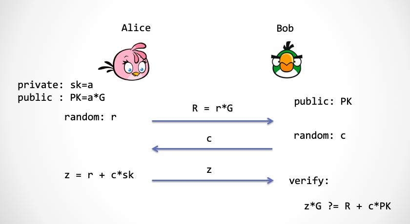

第一步：为了保证零知识，Alice 需要先产生一个随机数，`r`，这个随机数的用途是用来保护私钥无法被 Bob 抽取出来。这个随机数也需要映射到椭圆曲线群上，`rG`。

第二步：Bob 要提供一个随机数进行挑战，我们把它称为 `c`。

第三步：Alice 根据挑战数计算 `z = r + a * c`，同时把 `z`发给 Bob，Bob通过下面的式子进行检验：

```
z*G ?= R + c*PK = rG + c*(aG)
```

大家可以看到 Bob  在第三步「同态地」检验 `z` 的计算过程。如果这个式子成立，那么就能证明 Alice 确实有私钥 `a`。可是，这是为什么呢？

`z` 的计算和验证过程很有趣，有几个关键技巧：

1. 首先 Bob 必须给出一个「随机」挑战数，然后 Bob 在椭圆曲线上同态地检查 `z` 。如果我们把挑战数 `c` 看成是一个未知数，那么 `r+a*c=z` 可以看成是一个一元一次方程，其中 `r` 与 `a` 是方程系数。请注意在 `c` 未知的前提下，如果 `r + a*x = r' + a'*x` 要成立，那么根据 Schwatz-Zippel 定理[3]，极大概率上 `r=r'`，`a=a'` 都成立。也就是说， Alice 在 `c` 未知的前提下，想找到另一对不同的 `r'`,`a'` 来计算 `z` 骗过 Bob 是几乎不可能的。这个随机挑战数 `c` 实现了`r` 和 `a` 的限制。虽然 Bob 随机选了一个数，但是由于 Alice 事先不知道，所以 Alice 不得不使用私钥 `a` 来计算 `z`。这里的关键： `c` 必须是个随机数。
2. Bob 验证是在椭圆曲线群上完成。Bob 不知道`r`，但是他知道 `r` 映射到曲线上的点`R`；Bob 也不知道 `a`，但是他知道 `a` 映射到曲线群上的点 `PK`，即 `a*G`。通过同态映射与Schwatz-Zippel 定理，Bob 可以校验 `z` 的计算过程是否正确，从而知道 Alice 确实是通过 `r` 和 `a` 计算得出的 `z`，但是又不暴露 `r` 与 `a` 的值。 
3. 还有，在协议第一步中产生的随机数 `r` 保证了 `a` 的保密性。因为任何一个秘密当和一个符合「一致性分布」的随机数相加之后的和仍然符合「一致性分布」。

## 证明零知识 

我们这里看一下 Schnorr 协议如何证明一个弱一些的「零知识」性质——「SHVZK」：

注：这里我们证明的仅仅是 Special Honest Verifier Zero-Knowledge（SHVZK）。SHVZK 要求协议中的 Bob 的行为不能不按常理出牌，比如他必须按协议约定，在第二步时，去传送带上取一个新鲜的随机数，并且立即使用。而通常意义上的「零知识」是不会对 Bob 做任何要求，所以我们说这里是一个弱一些的性质。虽然目前 Schnorr 协议不能证明完全的「零知识」，但经过添加一些协议步骤，就可以达到完全零知识的目的，细节这里不展开，有兴趣的读者请参考文献[4]。以后我们在讨论 Fiat-Shamir 变换时，还会再次讨论这个问题。

首先「模拟器」模拟一个「理想世界」，在理想世界中模拟出一个 Zlice 和 Bob 对话，Zlice 没有 Schnorr 协议中的知识，`sk`，而 Bob 是有公钥 `PK`的。请大家看下图，Bob 需要在 Schnorr 协议中的第二步出示一个随机数 `c`，这里有个额外的要求， 就是 Bob 只能「诚实地」从一个外部「随机数传送带」上拿一个随机数，每一个随机数都必须是事先抛k次「硬币」产生的一个 `2^k` 范围内的一次性分布随机数。Bob 不能采用任何别的方式产生随机数，这就是为何我们要求 Bob 是诚实的。

下面演示 Zlice 如何骗过 Bob：

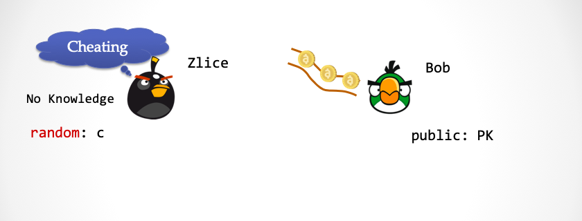

序幕：请注意 Zlice 没有关于`sk`的知识，这时 Bob 的随机数传送带上已经预先放置了一些随机数。

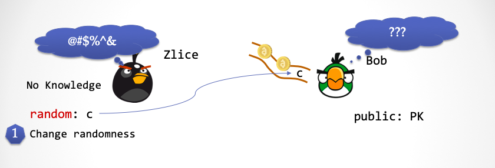


第一步：Zlice 产生一个一致性分布的随机数`c`，并且利用一个新的「超能力」，将刚刚产生的随机数 `c` 替换掉 Bob 的随机数传送带上第一个随机数。这时候，Bob 无法察觉。

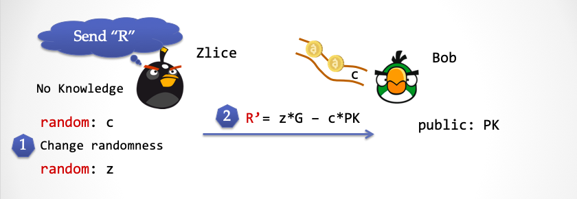

第二步：Zlice 再次产生一个随机数 `z`，然后计算 `R'=z*G - c*PK`，并将 `R'`发送给 Bob。

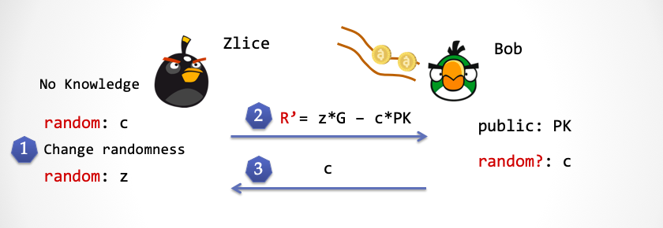

第三步：这时候Bob 会从随机数传送带上取得 `c`，并且将 `c` 发送给 Zlice。请注意这个`c` 正好就是第一步中 Zlice 产生的 `c`。

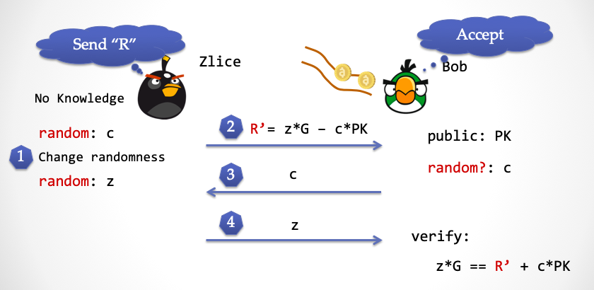

第四步：Zlice 将第三步产生的随机数 `z` 发送给 Bob，Bob 按照 Schnorr 协议的验证公式进行验证，大家可以检查下，这个公式完美成立。

大家可以再对比下「现实世界」的 Schnorr 协议，在两个世界中，Bob 都能通过验证。


但区别是：

- 在「理想世界中」，Zlice 没有 `sk`；而在「现实世界中」，Alice 有 `sk`
- 在「理想世界中」，`z` 是一个随机数，没有涉及 `sk`；而在「现实世界中」，`z` 的计算过程里面包含 `sk`
- 在「理想世界中」，Zlice 使用了超能力，替换了 Bob 的随机数；而在「现实世界中」，Alice 看不到 Bob 的随机数传送带，也无法更改传送带上的数字

这里请大家思考下：Schnorr 协议中，Bob 在第二步发挑战数能不能和第一步对调顺序？也就是说 Bob 能不能先发挑战数，然后 Alice 再发送 `R = r*G`。

（两分钟后……）

答案是不能。

如果 Alice 能提前知道随机数，那么 （现实世界中的）Alice 就可以按照模拟器 Zlice 做法来欺骗 Bob。

## 再遇模拟器

其实，「可靠性」和「零知识」这两个性质在另一个维度上也是存在着一种对称性。可靠性保证了恶意的 Alice 一定失败，零知识保证了恶意的 Bob （窃取知识）一定不会成功。有趣地是，这种对称性将体现在模拟出来的「理想世界」中。

我们分析下可靠性这个定义：Alice 没有知识 **导致** Bob 验证失败。它的逆否命题为：Bob 验证成功 **导致** Alice 一定有知识。

**我们再次求助模拟器**，让他在可以发挥超能力的「理想世界」中，去检验 Alice 的知识。

再次，请大家设想在平行宇宙中，有两个世界，一个是叫做「理想世界」，另一个叫做「现实世界」。理想世界有趣的地方在于它是被「模拟器」模拟出来的，同时模拟器可以在理想世界中放入带有超能力的 NPC。这次把 Alice 的两个分身同时放入「理想世界」与「现实世界」。

假设「你」扮演 Bob 的角色，你想知道和你对话的 Alice 是否真的是「可靠的」。 于是把你放入「理想世界」，借助一个具有超能力的 NPC，你可以把对面的 Alice 的知识「抽取」出来。

W...hat？我们不是刚刚证明过：协议是零知识的吗？零知识就意味着 Bob 抽取不出任何的「知识」碎片。这里敲黑板，「零知识」是对于「现实世界」而言的。我们现在正在讨论的是神奇的「理想世界」。

重复一遍，在「理想世界」中，你可以借助一个有超能力的 NPC 来抽取 Alice 的知识，从而可以保证「现实世界」中的 Alice 无法作弊。可以想象一下，一个作弊的 Alice，她肯定没有知识，没有知识也就不可能在「理想世界」中让 NPC 抽取到任何东西。

然而在「现实世界」中，你无法借助 NPC，当然也就看不到 Alice 的知识，也就不会和「零知识」性质冲突。因为两个世界发生的事件是「不可区分」的，我们可以得到这样的结论：在「现实世界」中，Alice 一定是存在知识的。

整理一下思路：如何证明在一个交互会话中 Alice 不能作弊呢？我们需要为这个交互会话定义一个「模拟算法」，该算法可以模拟出一个「理想世界」，其中有一个特殊的角色叫做「抽取器」(Extractor)，也就是我们前面说的 NPC，它能够通过「超能力」来「抽取」Alice 的知识，但是让对方「无所察觉」。

注意，超能力是必不可少的！这一点在『[系列（二）理解「模拟」](https://github.com/sec-bit/learning-zkp/blob/master/zkp-intro/2/zkp-simu.md)』有解释，如果模拟器在没有超能力的情况下具备作弊能力，那相当于证明了协议「不可靠」（Unsoudness）。同样地，如果「抽取器」在没有超能力的情况下具备抽取信息能力，那相当于证明了协议不零知（Not-zero-knowledge）。

最后一点，超能力是什么？这个要取决于具体的交互系统的证明，我们接下来就先拿我们刚刚讲过的Schnorr 协议切入。

## Proof of Knowledge ：「知识证明」

我们来证明一下 Schnorr 协议的「可靠性」，看看这个超能力 NPC 如何在「理想世界」中把 Alice 私钥抽取出来。而这个「超能力」，仍然是「时间倒流」。

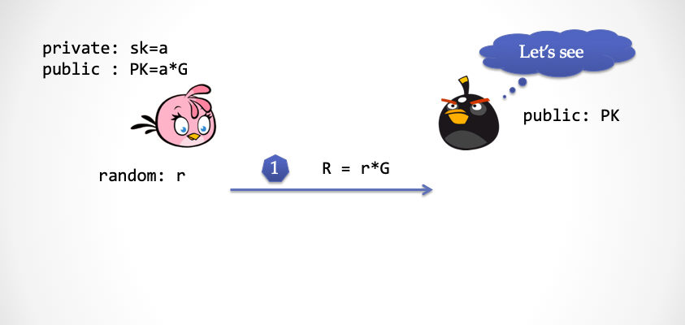

第一步：Alice 选择一个随机数 `r`，并且计算 `R=r*G`，并将 `R` 发给「抽取器」 

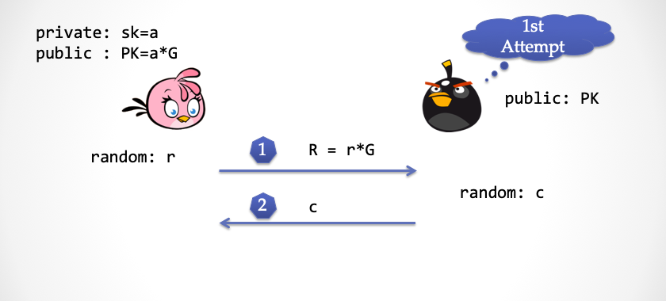

第二步：抽取器也选择一个随机的挑战数`c`，并且发给 Alice

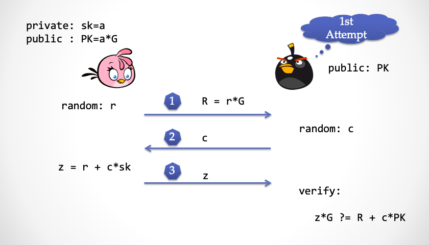


第三步：Alice 计算并且回应 `z`，然后抽取器检查 `z`是否正确

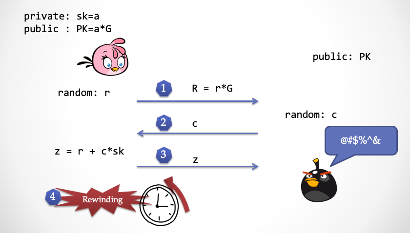

第四步：抽取器发现  `z` 没有问题之后，发动超能力，将时间倒回第二步之前

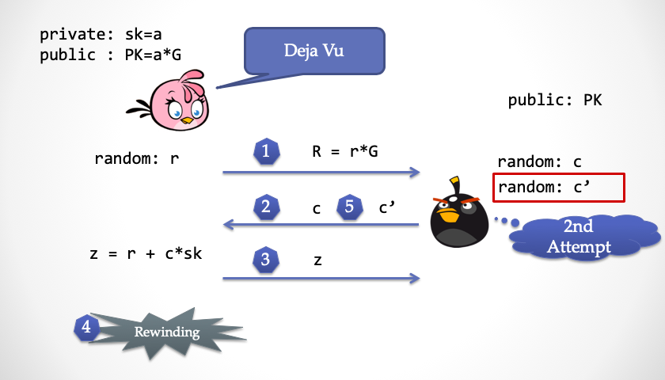

第五步：抽取器再次发送一个不同的随机挑战数 `c'`给 Alice，这时候 Alice 回到第二步，会有一种似曾相识的感觉，但是无法感知到时间倒回这个事实

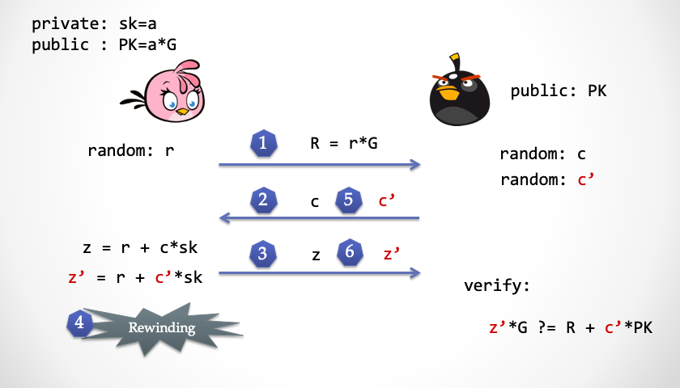

第六步：Alice 再次计算了 `z'`，然后发给抽取器检查

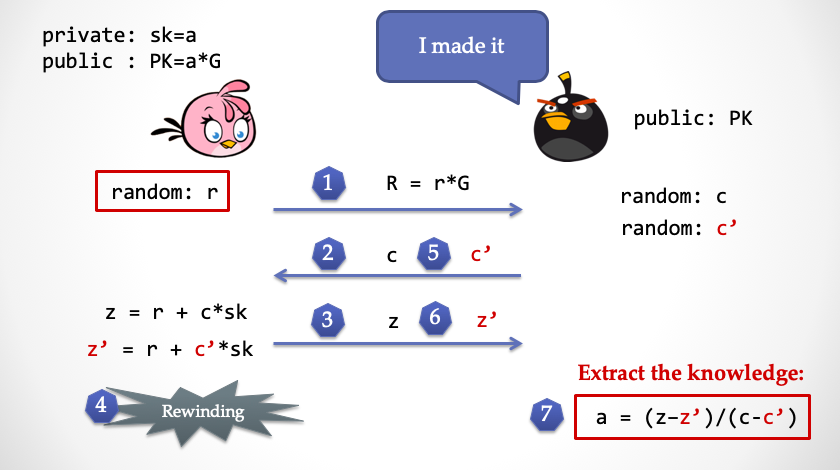

第七步：这时候抽取器有了`z`和`z'`，就可以直接推算出 Alice 所拥有的私钥 `a`，达成「知识抽取」

到这里，「可靠性」就基本证明完了。大家是不是对可靠性和零知性的「对称性」有点感觉了？

总结一下：「抽取器」在「理想世界」中，通过时间倒流的超能力，把 Alice 的「知识」完整地「抽取」出来，这就保证了一个没有知识的 Alice 是无法让抽取器达成目标，从而证明了「可靠性」。

注：并不是所有的可靠性都必须要求存在抽取器算法。采用抽取器来证明可靠性的证明系统被称为「Proof of Knowledge」。


## 解读 ECDSA 签名攻击

在区块链系统中到处可见的ECDSA 签名方案**也是**一个朴素的零知识证明系统。椭圆曲线数字签名方案 ECDSA 与 Schnorr 协议非常接近，基于 Schnorr 协议的签名方案发表在 1991年的『密码学杂志』[5]上。1991年，正值美国国家标准局（NIST）选择数字签名算法，优雅的 Schnorr 签名方案居然被申请了专利，因此 NIST 提出了另一套签名方案 DSA（Digital Signature Algorithm），随后这个方案支持了椭圆曲线，于是被称为 ECDSA。中本聪在构思比特币时，选择了 ECDSA 作为签名算法，但是曲线并没有选择 NIST 标准推荐的椭圆曲线 —— secp256-r1，而是 secp256-k1。因为江湖传言，NIST 可能在椭圆曲线参数选择上做了手脚，导致某些机构可以用不为人知的办法求解离散对数难题，从而有能力在「现实世界」中具备超能力。有不少人在怀疑，也许当年中本聪在设计比特币时，也有这种考虑，故意选择了 secp256-k1 这样一条貌似安全性稍弱的曲线。

我们拆解下 ECDSA 签名，用交互的方式定义一个类似 ECDSA 的认证方案，交互见下图。

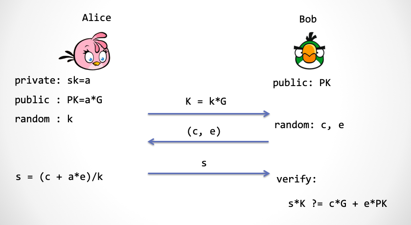

第一步：Alice 仍然是选择一个随机数 `k`，并将 `k` 映射到椭圆曲线上，得到点 `K` ，然后发送给 Bob 

第二步：Bob 需要产生两个随机数，`c` 和 `e`，然后交给 Alice 

第三步：Alice 计算 `s`，并且发送给 Bob，他来验证 `s` 的计算过程是否正确

注：对熟悉 ECDSA 签名方案的读者，这里略作解释，Bob 产生的 `c` 对应被签消息的 Hash 值 `Hash(m)`，而 `e` 则是由一个转换函数 `F(K)`来产生。其中 `F(.)` 是取椭圆曲线上的点的 x 坐标经过 `(mod q)` 得到[6]。

江湖上流传着一个说法：ECDSA 签名方案有个严重的安全隐患，如果在两次签名中使用了同一个随机数，那么签名者的私钥将会暴露出来。其实 Schnorr 签名方案也有同样的问题。

当年 Sony  PlayStation 3 的工程师在调用 ECDSA 库函数时，本来应该输入随机数的参数位置上，却传入了一个常数。熟悉密码学的黑客们发现了这个严重的后门。2011年1月，神奇小子 Geohot 公开发布了 Sony PS3 的主私钥，这意味着任何用户都可以轻松拿到游戏机的 root 权限。Sony 随后大为光火…… （后续故事大家可以上网搜）

如果 Alice 在两次交互过程中使用了同一个 `K`，那么 Bob 可以通过发送两个不同的 `c` 和 `c'` 来得到 `s` 和 `s'`，然后通过下面的公式算出私钥 `a`：

```
k = (c - c')/(s - s')
a = (k * s - c)/e
```

那么我们应该怎么来看这个「安全后门」呢？大家想想看，这个安全后门和我们前面证明过的 Schnorr 协议的可靠性证明几乎一模一样！这个算法正是 ECDSA 认证协议的「可靠性」证明中的「抽取器」算法。只不过在可靠性证明中，为了让 Alice 使用同一个随机数 `k` 来认证两次，「抽取器」需要利用「时间倒流」的超能力。

但是在 Sony PS3 系统中，随机数被不明所以的工程师写成了一个固定不变的值，这样相当于直接赋予了黑客「超能力」，而这是在「现实世界」中。或者说，黑客在不需要「时间倒流」的情况下就能实现「抽取器」。

提醒下，不仅仅是随机数不能重复的问题。而是随机数必须是具有密码学安全强度的随机数。

设想下，如果随机数 `r` 是通过一个利用「线性同余」原理的伪随机数生成器产生，虽然 `r`的值一直在变化，但是仍然不能阻止「知识抽取」。假设线性同余算法为 `r2= d*r1 + e (mod m)`，还回到 Schnorr 协议的第三步：

```
1: z1 = r1 + c1*a
2: z2 = r2 + c2*a
```
如果攻击者让 Alice 连续做两次签名，那么将 `r2` 代入  `r1` 之后，就出现了两个线性方程求解两个未知数 `(r1, a)` 的情况，`z1, z2, c1, c2, d, e` 对于 攻击者是已知的，这个方程组只用初中数学知识就可以求解。

请注意，这并不是 Schnorr 协议（或 ECDSA 协议）的「设计缺陷」，恰恰相反，这是 Schnorr 协议设计比较精巧的地方，它**从原理上保证了协议的可靠性**。类似技巧在密码学协议中频繁出现，达到一目了然的「简洁」。但是也不得不说，如果不清楚协议的内在机制，尤其是区分不清楚「理想世界」与「现实世界」，使用者很容易引入各种花式的「安全漏洞」。

作为一个能写出可靠软件的靠谱码农，我们需要了解哪些？彻底理解安全协议的设计机制当然是最好的，但是绝大多数情况下是非常耗费精力的。一般来说，我们把各种密码学工具当做「黑盒」来用，可能是不够的，我们最好还能了解下：

1. 「安全定义」是什么？
2. 「安全假设」到底是什么？
3. 「理想世界」中的「超能力」到底是什么？

## 脑洞：我们生活在模拟世界中吗

第一次读懂「模拟器」时，我第一时间想到的是电影『黑客帝国』。我们生活所在「现实世界」也许是某一个模拟器模拟出来的「理想世界」，我们所看到、听到的以及感知到的一切都是被「模拟」出来的。在「现实世界」里，我们活在一个母体中。然而我们并不能意识到这一点。


早在春秋战国时期，庄子也在思考类似的问题：

> 昔者庄周梦为胡蝶，栩栩然胡蝶也，自喻适志与，不知周也。俄然觉，则蘧蘧然周也。不知周之梦为胡蝶与，胡蝶之梦为周与？周与胡蝶，则必有分矣。此之谓物化。——《庄子·齐物论》

通俗地解释下：庄子有一天睡着了，梦见自己变成了一只蝴蝶，翩翩起舞，醒来之后发现自己还是庄子，在梦中，蝴蝶并不知道自己是庄子。于是庄子沉思到底是他梦中变成了蝴蝶，还是蝴蝶梦中变成了庄子呢？如果梦境足够真实，……

「缸中之脑」是美国哲学家 Gilbert Harman 提出的这样一个想法：一个人的大脑可以被放入一个容器里面，然后插上电线，通过模拟各种电信号输入，使得大脑以为自己活在真实世界中。

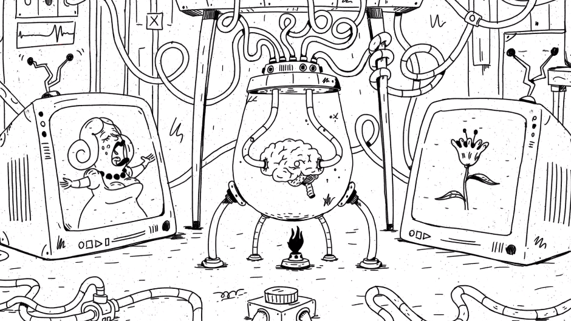

这个想法源自哲学家笛卡尔的《第一哲学沉思集》[7]，在书中他论证我们应该怀疑一切，需要逐一检验所有人类的知识，数学，几何，以及感知到的世界。然而他发现除了「我思故我在」之外，所有的知识都可能不靠谱，因为我们的大脑很可能被一个具有「超能力」的 Evil Demon 所欺骗。

2003 年牛津大学的哲学教授 Nick Bostrom 郑重其事地写了一篇论文『我们生活在计算机模拟世界中吗？』[8]。认为以下三个事实中，至少有一个成立：

1. 人类文明彻底灭绝。
2. 人类文明已经到达可以完全模拟现实世界的科技水平，但是处于某种原因，没有一个人愿意去创造出一个新的模拟世界，充当上帝的角色。
3. 我们现在的人类文明就生活在一个模拟世界中。

硅谷企业家 Elon Musk 在一次公开采访中，谈到「我们生活在基础现实世界」的概率只有「十亿分之一」。也就是说，他认为我们生活在一个电脑游戏（模拟世界）中，在模拟世界之外，有一个程序员，他开发并操纵了这个世界，我们每个人都是一个游戏角色（ NPC）。

在玩腻越狱 iPhone 和自动驾驶之后，神奇小子 Geohot 在今年三月份的「西南偏南」大会上做了一个题为「Jailbreaking the Simulation」的演讲[9]。他认为，我们被生活在一个模拟世界中，所谓的上帝就是外部世界里活蹦乱跳的码农们，他们编程创造了我们的「现实世界」，当然，他们可能启动了不止一个世界副本。然而，他们可能也生活在一个外层「模拟世界」中。

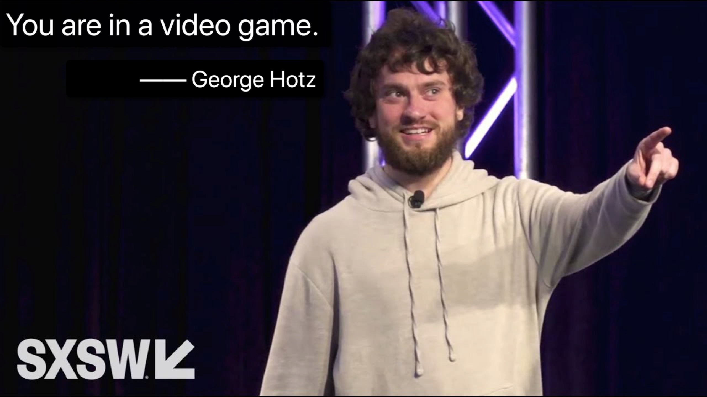

如果我们确实生活在模拟世界中，或许我们可以在地球的某个地方找到一个后门——「Simulation Trapdoor」，从而获得「模拟器」的超能力，抽取出不可思议的「秘密知识」。

如果我们的世界的确是被程序模拟出来的，这个程序也许会有 Bug，如果有 Bug 存在，说不定我们可以利用这个 Bug 进行越狱，跳出「理想世界」，到达外面一层的世界中，与可爱的码农上帝聊一聊。

这是在开玩笑吗？下面摘自自知乎的一个段子[10]：

+ 问题：「如果世界是虚拟的，有哪些实例可以证明？」。
+ 回答：

>1. 为什么宏观上丰富多彩，但是微观的基本粒子却都是一模一样的？这正和图片富多彩，但是像素是一模一样的一回事
>2. 为什么光速有上限？因为机器的运行速度有限
>3. 为什么会有普朗克常量？因为机器的数据精度有限
>4. 为什么微观粒子都是几率云？这是为了避免系统陷入循环而增加的随机扰动
>5. 为什么有泡利不相容原理？看来系统采用的数据组织是多维数组
>6. 为什么量子计算机运行速度那么快，一瞬间可以尝试所有可能？因为这个本质上是调用了宿主机的接口
>7. 为什么会有量子纠缠？这实际上是引用同一个对象的两个指针
>8. 为什么会有观察者效应？这显然是lazy updating
>9. 为什么时间有开端？系统有启动时间

## 未完待续

设计一个密码学协议就好像在走钢丝，如果你想同时做到「零知识」和「可靠性」就意味着既要让协议内容充分随机，又要保证「知识」能够参与协议的交互。如果协议没有正确设计，亦或没有正确工程实现，都将导致系统安全性坍塌。比如可能破坏了零知性，导致「知识」在不经意间泄露；或者也许破坏了可靠性，导致任何人都能伪造证明。而且这种安全性，远比传统的代码底层机制漏洞来得更加严重，并且更难被发现。严格数学论证，这似乎是必不可少的。

我们的世界真的是某个「三体文明」模拟出来的吗？不能排除这个可能性，或许，我们需要认真地重新审视自己的各种执念。不过那又怎么样呢？至少自己的「思想」是真实的。

> If you would be a real seeker after truth, it is necessary that at least once in your life you doubt, as far as possible, all things.  如果你是一个真正的真理探求者，在你人生中至少要有一次，尽可能地质疑所有的事情。
>     —— 笛卡尔


*致谢：特别感谢 Shengchao Ding, Jie Zhang，Yu Chen 以及安比实验室小伙伴们(p0n1, even, aphasiayc, Vawheter, yghu, mr)的建议和指正。*

### 参考文献

+ [1] zkPoD: 区块链，零知识证明与形式化验证，实现无中介、零信任的公平交易. 安比实验室. 2019.
+ [2] Hoffstein, Jeffrey, Jill Pipher, Joseph H. Silverman, and Joseph H. Silverman. An introduction to mathematical cryptography. Vol. 1. New York: springer, 2008.
+ [3] Schwartz–Zippel Lemma. Wikipedia.  https://en.wikipedia.org/wiki/Schwartz%E2%80%93Zippel_lemma
+ [4] Damgård, Ivan. "On Σ-protocols." *Lecture Notes, University of Aarhus, Department for Computer Science* (2002).
+ [5] Schnorr, Claus-Peter. "Efficient signature generation by smart cards." *Journal of cryptology* 4.3 (1991): 161-174.
+ [6] Brown, Daniel RL. "Generic groups, collision resistance, and ECDSA." *Designs, Codes and Cryptography* 35.1 (2005): 119-152.
+ [7] 笛卡儿, 徐陶. 第一哲学沉思集. 九州出版社; 2008.
+ [8] Bostrom, Nick. "Are we living in a computer simulation?." The Philosophical Quarterly 53.211 (2003): 243-255.
+ [9] Nick Statt. "Comma.ai founder George Hotz wants to free humanity from the AI simulation". Mar 9, 2019. https://www.theverge.com/2019/3/9/18258030/george-hotz-ai-simulation-jailbreaking-reality-sxsw-2019
+ [10] doing@知乎. "如果世界是虚拟的，有哪些实例可以证明？". 2017. https://www.zhihu.com/question/34642204/answer/156671701
