# 随机「挑战」

*探索零知识证明系列（四）*

> “Challenges are at times an indication of Lord's trust in you.”   挑战，有时是上天信任你的一种表现。― **D. Todd Christofferson**

本文继续长篇大论零知识证明背后的机制原理，希望帮助大家理解这一类「现代密码学工具」的大致轮廓。本文约8000字，少量数学公式。

本文将在 [Github](https://github.com/sec-bit/learning-zkp/) 进行更新与修正。

[系列一：初识「零知识」与「证明」](https://github.com/sec-bit/learning-zkp/blob/master/zkp-intro/1/zkp-back.md)

[系列二：理解「模拟」](https://github.com/sec-bit/learning-zkp/blob/master/zkp-intro/2/zkp-simu.md)

[系列三：寻找「知识」](https://github.com/sec-bit/learning-zkp/blob/master/zkp-intro/3/zkp-pok.md)

## 交互与挑战

我们之前介绍的零知识证明系统都是「交互式」的，需要验证者 Bob 在交互中提供一个或若干个「随机数」来挑战，比如「地图三染色问题」（参看『系列二』）中，验证者 Bob 需要「不断地」随机挑选一条边来挑战 Alice 的答案，直到 Bob 满意为止，而 Alice 的作弊概率会「指数级」地衰减。而让 Bob 相信证明的「基础」取决于 Bob 所挑选的随机数是不是足够随机。如果 Alice 能够提前预测到 Bob 的随机数，灾难就会发生，现实世界就会退化成「理想世界」，而 Alice 就可以立即升级成「模拟器」，通过超能力来愚弄 Bob。

而『系列三』中，我们分析了 Schnorr 协议，协议中虽然验证者 Bob 只需要挑选一个随机数 `c` 来挑战 Alice ，让她计算一个值 `z`，但 Bob 绝对不能让 Alice 有能力来预测到 `c` 的任何知识，否则，Alice 也会变身成模拟器。

随机数的重要性不言而喻：

> 通过随机数挑战是交互式零知识证明的「信任根基」。

但，「交互过程」会限制应用场景。如果能将交互式零知识证明变成「非交互」？这会非常非常激动人心。所谓的非交互可以看成是只有「一轮」的证明过程，即Alice 直接发一个证明给 Bob 进行验证。

非交互式零知识证明，英文是 `Non-Interactive Zero Knowledge`，简称 NIZK。它意味整个证明被编码为一个「字符串」，它可以写到一张纸上，通过邮件、聊天工具等各种方式随意发送给任何验证者，字符串甚至可以放在 Github 上随时供大家下载验证。

在区块链世界，「NIZK」可以作为共识协议的一部分。因为一个交易**需要多个矿工进行校验**。设想下，如果交易的发送者和每个矿工都要交互一下，让矿工进行挑战，那么共识过程将奇慢无比。而非交互式零知识证明则**可以直接广播给所有的矿工节点**，让他们自行验证。

可能有朋友会问：只让一个矿工挑战不就够了吗？把矿工和交易发送者的交互脚本编码成证明，然后广播给其他矿工，然后其他矿工就直接相信这个挑战过程是可信的，不也可以吗？但是，很显然，这里需要相信第一个交互矿工作为可信第三方，第三方？似乎不是一个好主意……

而非交互式零知识证明，以下我们直接说「NIZK」，似乎就很理想了，没有第三方赚差价。

## 「非交互」带来的困惑

非交互式零知识证明，NIZK，如果存在，那么它要比交互式证明强大得多。

+ 交互式证明，只能取信于一个验证者；而 NIZK 可以取信于多个验证者，以至所有人。
+ 交互式证明，只能在交互的那个时刻有效；而 NIZK 将始终有效。

>  NIZK 不仅可以跨越空间，还能跨越时间

听上去很美，不是吗？But, ……

重复下上节的一个结论：

> 通过随机数挑战是交互式零知识证明的「信任根基」。

可是如果 NIZK 失去了挑战过程，有什么后果？

我们已经回忆过「零知识」性质的证明（参考『系列二』），证明过程需要构造一个模拟器（算法），它也和验证者（Bob）在理想世界中进行交互，而验证者 Bob 没有能力区分出来对方是否是真的 Alice 还是一个模拟器。

如果现在考虑下 NIZK 中的 **非交互式**，假如「我」向「你」出示一张纸，上面写着一个「真」证明 `X` ，又假如「你」在看过这张纸之后确实相信我了；又因为协议是「零知识」，那么如果把「我」换成一个模拟器，模拟器也能「伪造」一个假证明 `Y`，能够也让「你」相信。

好了，问题来了：

+ 你如何区分 `X` 和 `Y` ，孰真孰假？当然你无法区分，因为协议是零知识的，你必须不能区分
+ 我可以同样可以把 `Y` 出示给你看，那岂不是「我」就可以欺骗你了吗？

是不是不和谐了？请大家在此处思考两分钟。

(两分钟后……)

因为 NIZK 没有了交互，也就没了挑战过程，所有的证明过程都有 Alice 来计算书写，理论上 Alice 确实是想写什么就写什么，没人拦得住，比如 Alice 就写「理想世界」的 假证明 `Y`。

想必深刻理解模拟器的朋友，在这里会发现一个关键点：模拟器必须**只能**在「理想世界」中构造`Y`，也就是说，`Y` 这么邪恶的东西只能存在于「理想世界」，不能到「现实世界」祸害人间。

继续思考……

还有一个更深层次的问题，请大家回忆下「地图三染色问题」，之所以模拟器不能在「现实世界」中为非作歹，核心原因是，他在理想世界中有「时间倒流」的超能力，而在「现实世界」中不存在这种黑魔法。现实世界的「不存在性」是关键。

而且，NIZK 中**没有交互**，于是导致了一个严重的后果，模拟器没有办法使用「时间倒流」这个超能力，当然似乎也就不能区分证明者在两个世界中的行为。

换句话说，如果我们面对任何一个 NIZK 系统，似乎「模拟器」就很难高高在上了，它好像只能飘落人间，成为一个普普通通的凡人。如果，我说如果，按此推论，假设模拟器不再具备超能力，那就意味着 Alice 和模拟器没有区别，Alice 也可以成为一个模拟器，再继续推论，Alice 就可以在「现实世界」中任意欺骗 Bob，那么这个证明系统就不再有价值，因为它失去了「可靠性」。结论：任何的 NIZK 都不可靠。

这一定是哪里出了问题……

上面我们在分析的过程中，提到了交互挑战的缺失。确实，如果 Bob 不参与 Alice 产生证明的过程，证明所包含的每一个 bit 都由 Alice 提供，似乎「证明」本身不存在任何让 Bob 信任的「根基」。这个从「直觉」上似乎说不通。

那是不是说，没有 Bob 的参与就「彻底」没办法建立「信任根基」了呢？信任的根基还可以从哪里来呢？

答案是「第三方」！

Wait ……，协议交互不是只有两方吗？ Alice 和 Bob，哪来第三方？

需要用特殊的方式引入第三方，而且方法不止一种，我们先研究第一种。

（泪目：不是说的好好的，咱们不引入第三方吗？）

## 回顾 Schnorr 协议

我们再看一下老朋友——Schnorr 协议，它是一个三步协议：第一步，Alice 发送一个承诺，然后第二步 Bob 发送随机数挑战，第三步，Alice 回应挑战。


我们来看，如何把一个三步的 Schnorr 协议变成一步。

看一下 Schnorr 协议的第二步，Bob 需要给出一个随机的挑战数 `c`，这里我们可以让 Alice 用下面这个式子来计算这个挑战数，从而达到去除协议第二步的目的。

```
c = Hash(PK, R)
```

其中 `R` 是 Alice 发给 Bob 的椭圆曲线点，`PK` 是公钥。大家可以好好看看这个利用 Hash 算法计算 `c` 的式子。这个式子达到了两个目的：

1. Alice 在产生承诺 `R` 之前，没有办法预测 `c`，即使 `c` 最终变相是 Alice 挑选的
2. `c` 通过 Hash 函数计算，会均匀分布在一个整数域内，而且可以作为一个随机数（*注：请大家暂且这么理解，我们在后文再深入讨论*）

请注意：Alice 绝不能在产生 `R` 之前预测到 `c`，不然， Alice 就等于变相具有了「时间倒流」的超能力，从而能任意愚弄 Bob。

而一个密码学安全 Hash 函数是「单向」的，比如 SHA256，SHA3，blake2 等等。这样一来，虽然 `c` 是 Alice 计算的，但是 Alice 并没有能力实现通过挑选 `c` 来作弊。因为只要 Alice 一产生 `R`， `c` 就相当于固定下来了。我们假设 Alice 这个凡人在「现实世界」中是没有反向计算 Hash 的能力的。

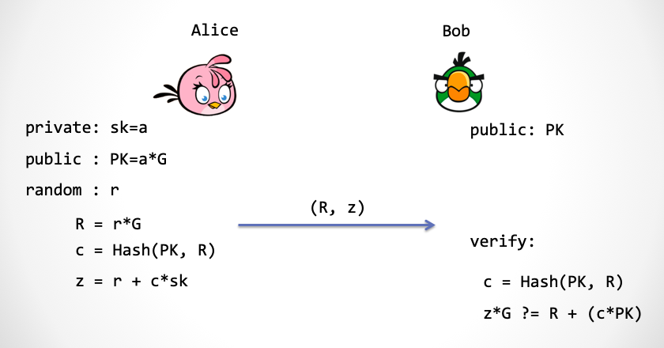

看上图，我们利用 Hash 函数，把三步 Schnorr 协议合并为了一步。Alice 可以直接发送：`(R, c, z)`。又因为 Bob 拥有 `PK`，于是 Bob 可以自行计算出 `c`，于是 Alice 可以只发送 `(R, z)` 即可。

我们把上面这个方案稍微变下形，就得到了「数字签名」方案。所谓的数字签名，就是「我」向「你」出示一个字符串，比如「白日依山尽，黄河入海流」，然后为了证明这句诗是我出示的，我需要签署某样东西。这个东西能证明我的身份和这句诗进行了关联。

## 从 NIZK 角度看数字签名

不严格地说，数字签名方案相当于在证明（1）我拥有私钥，并且（2）私钥和消息进行了关联计算。

我首先要证明我的身份，那么这个简单，这正是 Schnorr 协议的功能，能够向对方证明「我拥有私钥」这个陈述。并且这个证明过程是零知识的：不泄露关于「私钥」的任何知识。

那么如何和这句唐诗关联呢？我们修改下计算 `c` 的过程：

```
m = "白日依山尽，黄河入海流"
c = Hash(m, R)
```

这里正是利用了我们前面讲过的 Hash 函数的单向性，保证了攻击者不能随意伪造签名。

*注：这里严格点讲，为了保证数字签名的不可伪造性，需要证明 Schnorr 协议满足「Simulation Soundness」这个更强的性质。这点请参考文献[5]*

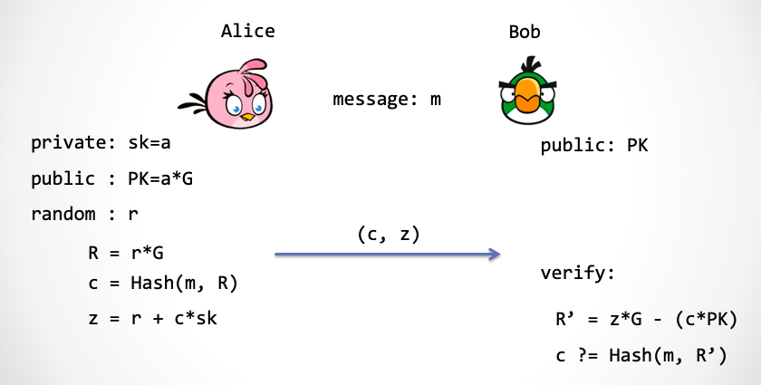

上图就是大家所熟知的数字签名方案 —— Schnorr 签名方案[1]。在这里还有一个优化，Alice 发给 Bob 的内容不是 `(R, z)` 而是 `(c, z)`，这是因为 `R` 可以通过 `c`, `z` 计算出来。

*注：为什么说这是一个「优化」呢？目前针对椭圆曲线的攻击方法有 Shanks 算法、Lambda 算法 还有 Pollard's rho 算法， 请大家记住他们的算法复杂度大约都是 $O(\sqrt{n})$[6]，`n` 是有限域大小的位数。假设我们采用了非常接近 `2^256` 的有限域，也就是说 `z` 是 256bit，那么椭圆曲线群的大小也差不多要接近 256bit，这样一来，把 `2^256` 开平方根后就是 `2^128`，所以说 256bit 椭圆曲线群的安全性只有 128bit。那么，挑战数  `c` 也只需要 128bit 就足够了。这样 Alice 发送 `c` 要比发送 `R` 要更节省空间，而后者至少需要 256bit。`c` 和 `z`两个数值加起来总共 384bit。相比现在流行的 ECDSA 签名方案来说，可以节省`1/4` 的宝贵空间。现在比特币开发团队已经准备将 ECDSA 签名方案改为一种类 Schnorr 协议的签名方案——muSig[2]，可以实现更灵活地支持多签和聚合。*

而采用 Hash 函数的方法来把一个交互式的证明系统变成非交互式的方法被称为 Fiat-Shamir 变换[3]，它由密码学老前辈 Amos Fiat 和 Adi Shamir 两人在 1986 年提出。

## 重建信任 —— 随机预言精灵

前文提到，失去了挑战，似乎失去了证明的「信任根基」。而在 Schnorr 签名方案中，Hash 函数担负起了「挑战者」的角色，这个角色有一个非常学术的名字：「随机预言机」（Random Oracle）。

可是这里为何用 Hash？实际上当 Alice 要产生公共随机数时，需要一个叫做「随机预言机」的玩意儿，这是什么？

开脑洞时间到！

我们设想在「现实世界」中，天上有一位「精灵」，他手持一个双栏表格，左边一栏为字符串，右边一栏为数字。任何人，包括你我，包括 Alice 和 Bob，都可以发字符串给「精灵」。

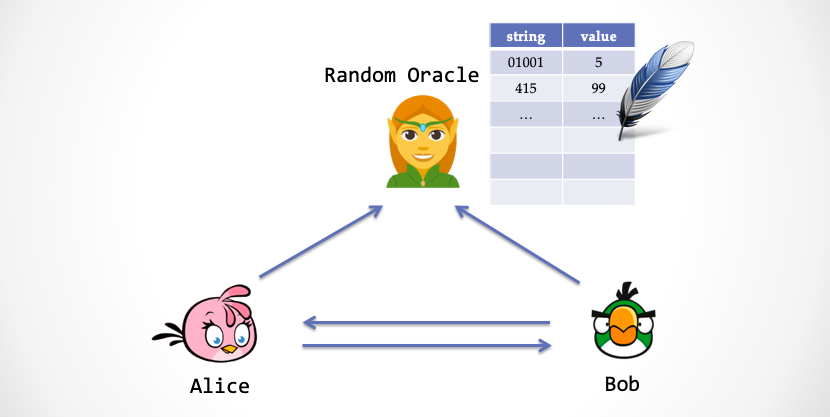

精灵在拿到字符串之后，会查表的左边栏，看看表格里有没有这个字符串，下面分两种情况：

+ 情况一：如果左边栏找不到字符串，那么精灵会产生一个「真随机数」，然后把字符串与随机数写入到表格中，然后把随机数返回地面上的凡人。
+ 情况二：如果左边栏有这个字符串记录，那么精灵会将右边栏里面的数字直接返回给地面。

大家会发现这个精灵的行为其实很像一个随机数发生器，但是又很不一样，不一样的地方在于当我们发送相同的字符串时，他会返回相同的数。这个精灵就是传说中的「随机预言机」。

而在合并 Schnorr 协议过程中，其实我们需要的是一个这样的随机预言精灵，而不是一个 Hash 函数。两者有什么不同的地方？区别就是：

- 随机预言机每次对于新字符串返回的是一个具有一致性分布的「真」随机数
- Hash 函数计算的结果并不是一个真正具有一致性分布的随机数

那么为什么前面用的是 Hash 函数呢？这是因为在现实世界中，**真正的随机预言机不存在！**为什么呢？ 事实上，一个 Hash 函数不可能产生真的随机数，因为 Hash 函数是一个「确定性」算法，除了参数以外，再没有其它随机量被引入。

而一个具有密码学安全强度的 Hash 函数「似乎」可以充当一个「伪」随机预言机。那么合并后的安全协议需要额外增加一个很强的安全假设，这就是：

> 假设：一个密码学安全的 Hash 函数可以近似地模拟传说中的「随机预言机」

因为这个假设无法被证明，所以我们只能信任这个假设，或者说当做一个公理来用。插一句， Hash 函数的广义抗碰撞性质决定了它的输出可以模拟随机数，同时在很多情况下（并非所有），对 Hash 函数实施攻击难度很高，于是许多的密码学家都在大胆使用。

不使用这个假设的安全模型叫做「标准模型」，而使用这个假设的安全模型当然不能叫「非标准模型」，它有个好听的专有名词，叫做「随机预言模型」。

世界上有两种不同类型的人，喜欢甜豆花的，不喜欢甜豆花的。同样，世界上的密码学家分为两种，喜欢随机预言模型的，和不喜欢随机预言模型的[6]。

## 构造根基 —— 被绑架的精灵

Schnorr 协议经过 Fiat-Shamir  变换之后，就具有 NIZK 性质。这不同于我们证明过的 SHVZK，SHVZK 要求验证者诚实，而 NIZK 则不再对验证者有任何不现实的要求，因为验证者不参与交互，所谓要求诚实的验证者这个问题就不复存在。

*注：如果验证者 Bob 不诚实会怎样？那么 Bob 有可能抽取出 Alice 的知识。但是对于三步 Schnorr 协议而言，它是否满足「零知识」，目前还处于未知状态。我们在系列三中只证明了它满足一个比较弱的性质：SHVZK*。

但是，当 Schnorr 协议摇身一变，变成非交互零知识证明系统之后，就真正的「零知识」了。

然而，可能你的问题也来了，这个论断听起来似乎有道理，请问能证明吗？

时间到了，“翠花，上模拟器”

怎么用模拟器大法来构造一个「理想世界」呢？大家可以想一下，我们之前使用过「时间倒流」，还有修改「随机数传送带」超能力来让「模拟器」来作弊。可是没有交互了，这就意味着：「时间倒流」超能力不能用；Bob 的随机数传送带也不存在了，「篡改传送带」这个超能力也不能用！

> 但模拟器总要具备某种「超能力」，从而能够构建信任的「根基」

（如果模拟器在没有超能力的情况下具备作弊能力，那相当于证明了协议的不可靠性）。

可能大家现在已经猜出来了，模拟器要在「随机预言机」上动手脚。

先考虑下构造一个「理想世界」来证明「零知识」。在理想世界中，模拟器「绑架」了负责提供预言的「精灵」，当 Bob 向精灵索要一个随机数的时候，精灵并没有给一个真随机数，而是给 Zlice（模拟器假扮的 Alice）提前准备好的一个数（也符合一致性分布，保证不可区分性），「精灵」无可奈何地返回 Bob 一个看起来随机，但实际上有后门的数字。**所谓后门，就是这个数字是 Zlice 自己提前选择好的**。

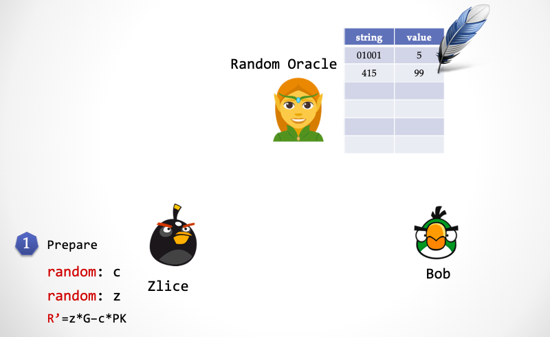

+ 第一步：Zlice 随机选择 `z`，随机选择`c`，计算 `R'=z*G - c*PK` 。

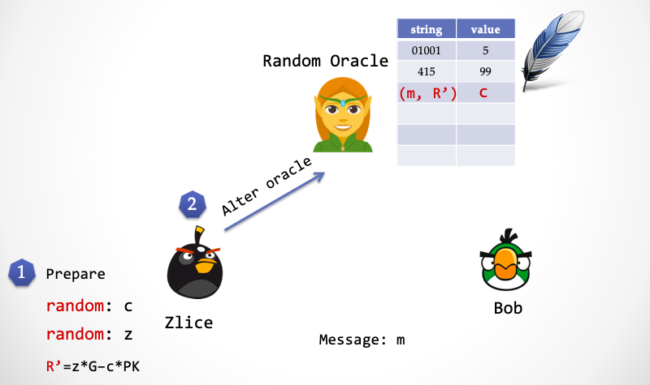

+ 第二步：Zlice 将 `c` 与 `(m, R')` 写入精灵的表格。

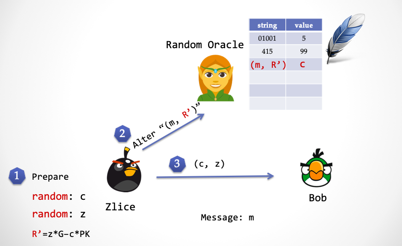

+ 第三步：Zlice 将签名 `(c, z)` 发送给 Bob。

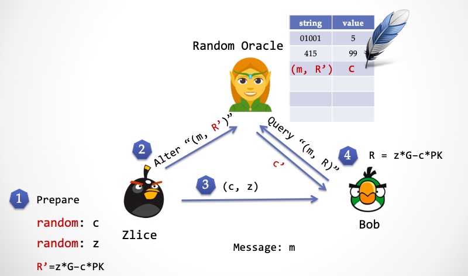

+ 第四步：Bob 计算 `R=z*G - c*PK`，并向精灵发送 `(m, R)`，精灵返回 `c’`。请注意，这里 Bob 计算出来的 `R` 和 Zlice 计算出来的 `R'` 是相等。

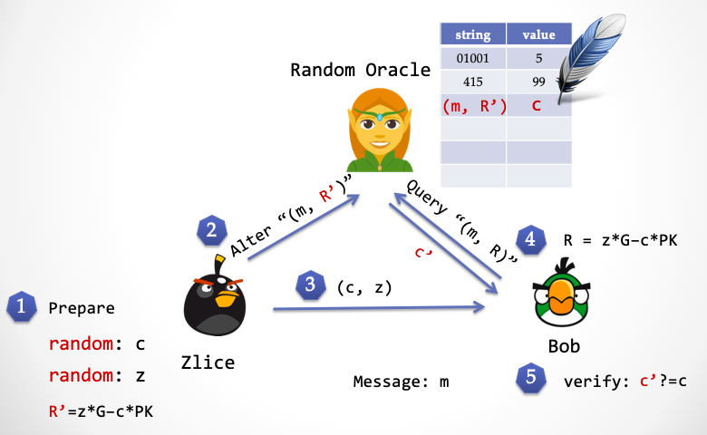

+ 第五步：Bob 验证 `c ?= c'`，看看精灵传回来的随机数和对方发过来的随机数是否相等。如果相等，则验证签名通过；否则，则验证失败。

通过绑架「精灵」，Zlice 同样可以提前预知随机数，这和时间倒流能达到同样的效果。

我们已经证明了模拟器 Zlice 的「存在性」，于是我们上面已经证明了 NIZK。

接下来我们证明这个这个协议的「可靠性」。设想在另一个「理想世界」中，一个叫做「抽取器」的玩意儿，也同样绑架了精灵。当无辜 Alice 的向「精灵」索要一个随机数时，「精灵」返回了一个 `c1`，「抽取器」从精灵的表格中偷窥到了`c1`，当 Alice 计算出来 `z1` 之后，然后这时候「抽取器」仍然可以发动「时间倒流」超能力，让 Alice 倒退到第二步，再次向「精灵」要一个随机数，Alice 发送的字符串显然和第一次发送的字符串是相同的，`(R, m)`。按道理，因为 `(R, m)` 已经写在精灵表格的「左栏」里，所以一个诚实的「精灵」应该返回 `c1`。但是，「抽取器」绑架了精灵，他把表格中对应 `(R, m)` 这一行的「右栏」改成了一个不同的数 `c2`。当 Alice 计算出另一个 `z2` 之后，抽取器就完成了任务，通过下面的方程计算出 Alice 的私钥 `sk`：

```
sk = (z1 - z2)/(c1 - c2)
```

## Fiat-Shamir 变换 —— 从 Public-Coin 到 NIZK

不仅仅对于 Schnorr 协议，对于任意的 「Public-Coin 协议」，都可以用 Fiat-Shamir 变换来把整个协议「压缩」成一步交互，也就是一个非交互式的证明系统，这个变换技巧来自于 Amos Fiat 与 Adi Shamir 两人的论文『How to Prove Yourself: Practical Solutions to Identification and Signature Problems.』，发表在 1986 年的 Crypto 会议上。

重复一遍，在 Public-coin 协议中，验证者 Bob 只做一类事情，就是产生一个随机数，然后挑战 Alice 。通过 Fiat-Shamir 变换，可以把 Bob 每一次的「挑战行为」用一次「随机预言」来代替。

而在具体实现中，随机预言需要用一个具有密码学安全强度的 Hash 函数（不能随便选，一定要采用密码学安全的 Hash），而 Hash 函数的参数应该是之前所有的上下文输入。下面是一个示例图，大家可以迅速理解这个 Fiat-Shamir 变换的做法。

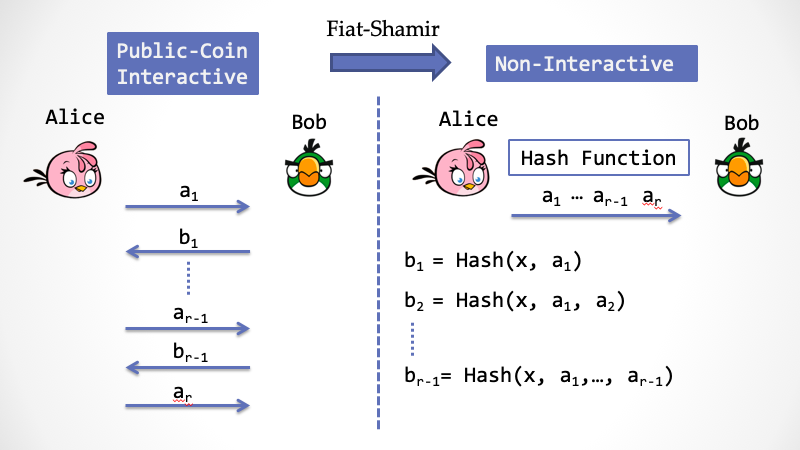

前面提到，在非交互式证明系统中，需要引入一个第三方来构建信任的「根基」，使得 Bob 可以完全相信由 Alice 所构造的证明。在这里，第三方就是那个「精灵」，用学术黑话就是「随机预言」（Random Oracle）。这个精灵并不是一个真实存在的第三方，而是一个虚拟的第三方，它同时存在于「现实世界」与「理想世界」。在「现实世界」中，精灵是一个负责任的安静美男子，而在「理想世界」中，它会被「模拟器」绑架。

Public-Coin 协议还有一个好听的名字， 「Arthur-Merlin 游戏」 ……


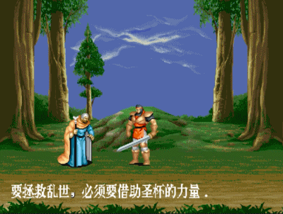

看上图，左边的“白袍”就是 Merlin（魔法师梅林），中间拿剑的帅哥就是 King Arthur（亚瑟王），两个角色来源于中世纪欧洲传说——亚瑟王的圆桌骑士。

Arthur 是一个不耐烦的国王，他随身携带一个硬币，而 Merlin是一个有着无限制计算能力的神奇魔法师，然后魔法师想说服国王相信某个「论断」为真，于是魔法师会和国王进行到对话，但是由于国王比较懒，他每次只会抛一个硬币，然后「挑战」魔法师，而魔法师需要及时应对，而且需要让国王在 k 轮之后能够相信自己的论断。由于 Merlin 有魔法，所以亚瑟王抛的硬币都能被 Merlin 看到。

这与我们在[『系列一』](https://github.com/sec-bit/learning-zkp/blob/master/zkp-intro/1/zkp-back.md)中提到的交互式证明系统（Interactive Proof System，简称 `IP`）有些神似，但又不同。`IP` 由 Goldwasser，Micali 与 Rackoff（简称GMR）在 1985 年正式提出，它的证明能力覆盖很大一类的计算复杂性问题。而不同的地方在于：在 `IP` 的定义中，证明者 Prover 和 验证者 Verifier 都是可以抛硬币的图灵机，Verifier 可以偷偷抛硬币，并对 Prover 隐藏；而在 Arthur-Merlin 游戏中，国王只能抛硬币，不仅如此，而且抛硬币的结果总会被 Merlin 知道。

通过 Fiat-Shamir 变换得到 NIZK 在安全协议中屡见不鲜，比如大家可能耳熟能详的 Bulletproofs（子弹证明），此外还有一些不那么出名的通用零知识证明方案，比如 Hyrax，Ligero，Supersonic等（我们后续会抽丝剥茧，逐一解读）。

但是，Fiat-Shamir 变换只能在「随机预言模型」下证明安全，而用 Hash 函数实现随机预言的过程是否安全是缺少安全性证明的。不幸的是，这个变换过程并**不能保证变换前可靠的协议在变换后仍然可靠**，存在反例[12]。


## 小心：Fiat-Shamir 变换中的安全隐患

在 Fiat-Shamir 变换中，要尤其注意喂给 Hash 函数的参数，在实际的代码实现中，就有这样的案例，漏掉了 Hash 函数的部分参数：

比如在 `A, Hash(A), B, Hash(B)` 中，第二个 Hash 函数就漏掉了参数A，正确的做法应该是`A, Hash(A), B, Hash(A,B) `。这一类的做法会引入严重的安全漏洞，比如在瑞士的电子投票系统 SwissPost-Scytl 中，就在 Fiat-Shamir 变换的实现代码中多次漏掉了本来应该存在的参数，导致了攻击者不仅可以随意作废选票，还可以任意伪造选票，达到舞弊的目的[10]。因此在工程实现中，请务必注意。

细心读者也许会回看一下 Schnorr 签名，大家会发现 Schnorr 签名中的 Hash 算法似乎也漏掉了一个参数 `PK`，并不是严格的 Fiat-Shamir 变换，这被称为 Weak Fiat-Shamir 变换[9]，不过这个特例并没有安全问题[4]，请未成年人不要随意模仿。

最近一些学者开始在标准模型下研究如何严格证明 Fiat-Shamir 变换的安全性，目前要么引入额外的安全假设，要么针对某个特定协议进行证明，但似乎进展并不大。

## 交互的威力

话说在1985年，当 GMR 三人的论文历经多次被拒之后终于被 STOC’85 接受，另一篇类似的工作也同时被 STOC'85 接受，这就是来自于匈牙利罗兰大学的 László Babai，与来自以色列理工的 Shlomo Moran 两人撰写的论文『Arthur-Merlin Games: A Randomized Proof System, and a Hierarchy of Complexity Classes』，引入了 Public-coin 交互式协议（顾名思义，Verifier 只公开抛硬币）。

国王 Arthur 的方法很简单，通过反复地「随机」挑战来检验 Merlin 的论断，这符合我们前面讲述过的直觉：采用随机挑战来构建信任的「根基」。Babai 在论文中证明了一个有趣的结论：`AM[k]=AM[2]`，其中 `k` 表示交互的次数，交互多次产生的效果居然和交互两次等价。所谓交互两次是指：Arthur 发一个挑战数，然后 Merlin 回应。

*注：还有一类的问题属于 `MA`，这一类问题的交互顺序与 `AM`不同，`MA`中是 Merlin 先给出证明，然后 Arthur 抛硬币检验。已证明：MA 能处理的问题是 AM 的子集。*

不仅如此，Babai 还大胆猜测： `AM[poly]` 与 `IP` 是等价的。这是一个神奇的论断：国王很懒，他只需要通过抛多项式次硬币，就能成功挑战魔法师，而这种方式的表达能力居然完全等价于 GMR 描述的交互式证明系统 `IP`。果不其然，在 STOC'86 会议上，来自 S. Goldwasser 与 M. Sipser 的论文证明了这一点，`AM[poly] == IP`。

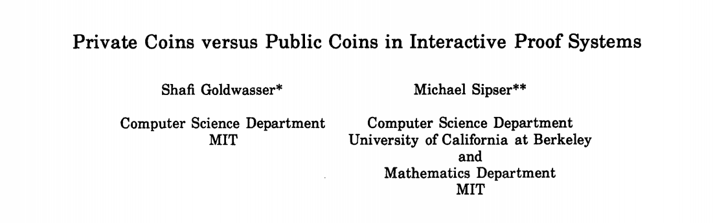

这意味着：反复公开的「随机挑战」威力无穷，它等价于任意的交互式证明系统。但是 `AM[poly]` 和别的计算复杂性类的关系如何，是接下来的研究热点。

三年后，1989 年11月底，距今恰好三十年，年轻的密码学家 Noam Nisan 发出了一封邮件，把自己的临时学术结论发给了几个密码学家，然后他就跑去南美洲度假了。可是他不曾想到，这一个邮件会引爆历史上一场激烈的学术竞赛，M. Blum, S. Kannan, D. Lipton, D. Beaver, J. Feigenbaum, H. Karloff, C. Lund 等等一大群精英开始加入战斗，他们没日没夜地互相讨论，并且竞相发布自己的研究成果，终于在12月26号，刚好一个月，Adi Shamir 证明了下面的结论：

>  `AM[poly] == IP == PSPACE`


它解释了「有效证明」这个概念的计算理论特征，并且解释了「交互式证明系统」这个概念所能涵盖的计算能力。

*注：NP 类 是 PSPACE 类的子集，前者大家比较熟悉，后者关联游戏或者下棋中的制胜策略[8]。*

而 L. Babai 于是写了一篇文章，名为「Email and the unexpected power of interaction」（电子邮件与交互的始料未及的威力）[11]，详细阐述了这一整个月在「邮件交互」中精彩纷呈的学术竞赛，以及关于「交互证明」的来龙去脉。

## 公共参考串 —— 另一种「信任根基」

除了采用「随机预言机」之外，非交互零知识证明系统采用「公共参考串」（Common Reference String），简称「CRS」，完成随机挑战。它是在证明者 Alice 在构造 NIZK 证明之前由一个受信任的第三方产生的随机字符串，CRS 必须由一个受信任的第三方来完成，同时共享给 Alice 和 验证者 Bob。

是的，你没看错，这里又出现了「第三方」！虽然第三方不直接参与证明，但是他要保证随机字符串产生过程的可信。而产生 CRS 的过程也被称为「Trusted Setup」，这是大家又爱又恨的玩意儿。显然，在现实场景中引入第三方会让人头疼。CRS 到底用来作什么？Trusted Setup 的信任何去何从？这部分内容将留给本系列的下一篇。

## 未完待续

非交互式零知识证明 NIZK 的「信任根基」也需要某种形式的随机「挑战」，一种「挑战」形式是交给「随机预言精灵」；另一种「挑战」是通过 Alice 与 Bob 双方共享的随机字符串来实现。两种挑战形式本质上都引入了第三方，并且两者都必须提供可以让「模拟器」利用的「后门」，以使得让模拟器在「理想世界」中具有某种「优势」，而这种优势在「现实世界」中必须失效。

NIZK 散发着无穷魅力，让我不时惊叹，在过去三十多年里，先驱们所探寻到的精妙结论，同时还有如此之多的未知角落，在等待灵感之光的照射。

本系列文章在 Github 上的[项目仓库](https://github.com/sec-bit/learning-zkp/)收到了第一个 Pull Request，来自Jingyu Hu(colortigerhu)，只改了个把字，但那一瞬间，我感受到了生命力。知识交流，思想碰撞，很迷人，不是吗？

> “Everyone we interact with becomes a part of us.”  与我们交往互动的每一个人都是我们自身的一部分。 ― **Jodi Aman**


*致谢：特别感谢丁晟超，刘巍然，陈宇的专业建议和指正，感谢安比实验室小伙伴们(p0n1, even, aphasiayc, Vawheter, yghu, mr) 的修改建议。

*致谢：自Nisan起密码学研究竞赛轶事参考自邓老师的文章[13]。*

### 参考文献

- [1] Schnorr, Claus-Peter. "Efficient signature generation by smart cards." Journal of cryptology 4.3 (1991): 161-174.
- [2] Maxwell, Gregory, Andrew Poelstra, Yannick Seurin, and Pieter Wuille. "Simple schnorr multi-signatures with applications to bitcoin." *Designs, Codes and Cryptography* 87, no. 9 (2019): 2139-2164.
- [3] Fiat, Amos, and Adi Shamir. "How to prove yourself: Practical solutions to identification and signature problems." Conference on the Theory and Application of Cryptographic Techniques. Springer, Berlin, Heidelberg, 1986.
- [4] Pointcheval, David, and Jacques Stern. "Security arguments for digital signatures and blind signatures." *Journal of cryptology* 13.3 (2000): 361-396.
- [5] Paillier, Pascal, and Damien Vergnaud. "Discrete-log-based signatures may not be equivalent to discrete log." *International Conference on the Theory and Application of Cryptology and Information Security*. Springer, Berlin, Heidelberg, 2005.
- [6] Canetti, Ran, Oded Goldreich, and Shai Halevi. "The random oracle methodology, revisited." Journal of the ACM (JACM)51.4 (2004): 557-594.
- [7] László Babai, and Shlomo Moran. "Arthur-Merlin games: a randomized proof system, and a hierarchy of complexity classes." Journal of Computer and System Sciences 36.2 (1988): 254-276.
- [8] Papadimitriou, Christos H. "Games against nature." *Journal of Computer and System Sciences* 31.2 (1985): 288-301.
- [9] Bernhard, David, Olivier Pereira, and Bogdan Warinschi. "How not to prove yourself: Pitfalls of the fiat-shamir heuristic and applications to helios." *International Conference on the Theory and Application of Cryptology and Information Security*. Springer, Berlin, Heidelberg, 2012.
- [10]Lewis, Sarah Jamie, Olivier Pereira, and Vanessa Teague. "Addendum to how not to prove your election outcome: The use of nonadaptive zero knowledge proofs in the ScytlSwissPost Internet voting system, and its implica tions for castasintended verifi cation." *Univ. Melbourne, Parkville, Australia* (2019).
- [11] Babai, László. "E-mail and the unexpected power of interaction." *Proceedings Fifth Annual Structure in Complexity Theory Conference*. IEEE, 1990.
- [12] Shafi Goldwasser, and Yael Tauman . "On the (in) security of the Fiat-Shamir paradigm." *44th Annual IEEE Symposium on Foundations of Computer Science, 2003. Proceedings.*. IEEE, 2003.
- [13] Yi Deng. "零知识证明：一个略显严肃的科普." https://zhuanlan.zhihu.com/p/29491567

  
