# 埋藏「秘密」

> Once exposed, a secret loses all its power.  一旦泄露，秘密就失去了全部威力  ― **Ann Aguirre**

这已经是本系列的第五篇文章了，这一篇继续深入非交互式零知识证明。 本文约 12,000 字。

[系列一：初识「零知识」与「证明」](https://github.com/sec-bit/learning-zkp/blob/master/zkp-intro/1/zkp-back.md)

[系列二：理解「模拟」](https://github.com/sec-bit/learning-zkp/blob/master/zkp-intro/2/zkp-simu.md)

[系列三：寻找「知识」](https://github.com/sec-bit/learning-zkp/blob/master/zkp-intro/3/zkp-pok.md)

[系列四：随机「挑战」](https://github.com/sec-bit/learning-zkp/blob/master/zkp-intro/4/zkp-rom.md)

**提纲**

1. CRS 的前世今生
2. 哈密尔顿环路问题
3. 云中的秘密：Hidden Bits 
4. 升级随机性
5. FLS变换：从 Hidden Bits 到 NIZK
6. 寻找理想的 Trapdoor Permutation
7. NIZK Proof vs. NIZK Argument
8. 没有秘密的世界

追到这里的读者想必已对零知识证明有了一个大概的认识。你是否想过这个问题：零知识证明为何可行？这里请大家思考一下（比如[系列一](https://github.com/sec-bit/learning-zkp/blob/master/zkp-intro/1/zkp-back.md) 中的地图三染色问题的流程） …… （此处停留三分钟）下面两个要素 **似乎** 必不可少：

1. 「交互」：验证者通过多次反复挑战，把证明者作弊概率降低到一个极小的值
2. 「隐藏随机性」：验证者产生让证明者无法预测的随机数进行挑战

然而对于非交互式零知识证明—— NIZK 来说，如何实现上面两点？在 [系列四](https://github.com/sec-bit/learning-zkp/blob/master/zkp-intro/4/zkp-rom.md) 我们介绍了如何采用「随机预言机」来扮演一个虚拟的「第三方」角色，实现虚拟的「交互」与「随机挑战」。本文将深入讲述另一种方法，如何通过一段共享的字符串去除「交互」与「隐藏随机性」。这个字符串必须事先由「第三方」来随机产生，这就是传说中的「公共参考串」（Common Reference String，简称 CRS）。

## CRS 的前世今生

假如我们不借助任何其它手段，限定证明者 Prover 和验证者 Verifier 只能进行「一次交互」来实现「零知识证明」，那么他们只能证明「平凡」问题，也就是计算复杂类 `BPP`（**Bounded-error Probabilistic Polynomial time**），而这个复杂度类大家一般猜想可能等价于 `P`（但还悬而未决，没有被证明！`BPP` 可以理解为 `P` + `Randomness`）。

*注：如果 Prover 与 Verifier 只做一次交互，在这样的 NIZK 系统中，我们很容易能构造一个 Decision Procedure —— Verify(x, Sim(x))，来证明和证伪定理，因此只能证明平凡问题 BPP。*

平凡问题虽然也可以零知识证明，但没有意义！怎么理解呢？因为验证者直接可以在多项式时间内根据「输出」求解出「秘密输入」，虽然验证者能够求解，但是「证明」本身并没有额外为验证者提供更多的「知识」。换句话说，不需要证明者出示证明，验证者就知道命题为真，于是证明过程也是零知识的。

因此，当我们讨论「零知识证明」时，要考虑带「秘密知识」的 `NP` 类问题。大家都知道，`P` 问题是「确定性图灵机」多项式时间内可以求解的复杂类，它的执行路径对于输入 `x`是一个线性的状态转移。而 `NP` 问题是「不确定性图灵机」多项式时间可以求解的问题类。所谓的不确定性图灵机，就是它每次往前走一步是不确定的，有很多个选择，只要任何一个执行路径能到达终止状态，就表示它解决了该问题 `x`。换句话说，它的执行轨迹是一棵树。那么如果我们把不确定性图灵机每一步的路径选择记录下来（这个执行路径的记录叫做 `witness`，也就是我们反复提到的「知识」），那么把`(x, witness)`交给一个确定性图灵机，那么它也能在多项式时间内解决掉 `x` 问题。

再强调一下，「知识」能提高图灵机的解决问题的能力。

`NP` 问题中存在着不想「泄露」给验证者的知识 `witness`，这时，在一个交互式证明系统中，证明者和验证者在「知识」的掌握程度上是不对等的。

为了保证证明过程的「零知识」，我们需要保证：**模拟器与验证者的不对等**。可是，模拟器没有 `witness`啊，怎么能让他们不对等呢？上一篇我们介绍了「随机预言机」，我们通过允许让模拟器可以绑架「随机预言精灵」的方式制造不平等。本篇将讲述如何利用 CRS 来制造不平等。

CRS 是一个在证明之前就已经公开的，并且在证明者与验证者之间共享的，随机字符串。我们怎么来使用 CRS 呢？直觉上，一串双方都「知道」的信息，并不会增加「知识」不对等的情况。

首先大家会想，能不能直接用 CRS 作为随机挑战数呢？可不可以让 CRS 来代替「随机预言精灵」的角色？答案是不行！

为什么？这是因为 CRS 是在证明之前就已经产生了，如果证明者 Prover 提前知道了所有的随机挑战数，那么很显然这个随机挑战也就失去了意义。

*注：请大家回想下「随机预言机」是如何保证证明者无法提前预测「随机挑战数」的？没想明白的你，请重读系列（四）。*

> CRS 的使命就是让「模拟器」与「验证者」不平等。怎么做呢？隐藏一些「秘密」进去。

如果进一步追问，隐藏了「秘密」有什么用呢？当然有用啦，在「理想世界」中，模拟器与抽取器才能很开心地玩耍起来（获取某些超能力） ……

1988年，Manuel Blum，Paul Feldman 和 Silvio Micali 三位先驱发表的论文	「Non-Interactive Zero-Knowledge and Its Applications」（『非交互式零知识证明及其应用』[BFM88]）展示了「交互」与「隐藏随机性」的不必要性。他们给出了一个地图三染色问题的 NIZK 证明系统，在一段共享的随机产生的字符串（即CRS）的帮助下。

不过，……，我不会告诉你这个方案需要共享大概 `n^4` 超长的 CRS，其中 `n`是要证明的「命题」的长度。

 1990 年，Uriel Feige，Dror Lapidot 与 Adi Shamir 三人提出了另一种构造 NP 语言的 NIZK 方案 [FLS90]。与 [BFM88] 不一样的是，这个 NIZK 方案不再基于特定的数论假设，而是基于一个密码学工具 Trapdoor Permutation。在这个方案中，FLS 提出了「隐藏比特」（Hidden Bits）的概念，然后把 Hidden Bits 藏入了 CRS。对于模拟器而言，就可以通过修改 CRS 中的 Hidden Bits 来达到模拟的效果，从而体现出对验证者 Verifier 的优越性。不过，这个方案需要共享更长的 CRS，超过 `k * n^5`，这里 `k` 是安全参数。

此后，Hidden Bits 的思路被很多人采用，值得一提的是，Kilian 与 Petrank 采用了一种更巧妙的方法来使用 Hidden Bits [KP98]（这里空间太小，写不下:），成功地把 CRS 的长度缩减到了 `k * n^2`。后来 J. Groth 继续优化 ，把 CRS 的长度缩小到了大约 `k*n`[Groth10a]。

除了 Hidden Bits，J. Groth，R. Ostrovsky 与 A. Sahai  [GOS06] 使用了同态加密方案 Boneh-Goh-Nissim [BGN05] 或 Boneh-Boyen-Shacham 来实现 NIZK，他们把加密方案的「公钥」当做是 CRS，同时 Prover 加密作为证明，然后利用同态性质来证明另一个 NP-Complete 问题——布尔电路的可满足性问题。这个方案的最大优点，就是 CRS 长度是固定的，因为只是一个密钥而已，长度只有 `k`。对于模拟器而言，它可以通过超能力，拿到这个公钥所对应的陷门，从而能够实现密封任何信息，但得到相同的密文；对于抽取器而言，它可以用超能力拿到公钥对应的私钥，从而能够解密证明得到「知识」。

Jens Groth 在 2010 年基于 KEA（Knowledge of Exponent Assumption） 假设与 Pairing 提出了一种新的 NIZK Arguments 方案[Gorth10b]，这也是后续许许多多 zkSNARKs 方案的起点。这里的 CRS 由一对对的 （`g^x^n, g^⍺x^n`） 构成，被用来实现「知识承诺」。其中 `x` 与 `⍺` 是两个随机数，在产生完 CRS 之后，必须被「遗忘」。有些人把这部分需要遗忘的随机数叫做「Toxic Wastes」，这容易误导读者。他们不仅无毒无害，而且非常有用。他们是被藏入 CRS 的「秘密」，是模拟器的武器。如果模拟器得到了 `x` 与 `⍺`，就能伪造证明，从而保证证明的零知识。而对于抽取器，他能直接通过 KEA 假设内建的抽取函数来抽取知识。

最新的 Sonic 方案[MBK+19]又在 [Groth10b] 的基础上实现了 Updateable CRS。如果任何人担心 CRS 中的秘密已经被泄露了，他就可以在原有 CRS 基础上打一个补丁，继续往里藏一个秘密，这样就能保证 CRS 的安全性。这里的 CRS 还是「Universal 全局」 的，即 CRS 只需要生成一次，就可以应付所有的命题证明。 这个方案后续被最新的 Plonk[GWC19]，Marlin[CHMMVW19] 等方案采用。

接下来，我们就从一个简单的例子开始，理解如何基于 CRS 来构造 NIZK。在这之前，我们需要介绍一个 NP-Complete 问题——哈密尔顿环路问题。

## 哈密尔顿环路问题

想象出一个地图中有若干个城市，城市与城市间可以有公路。

假如给你一副地图，让你找出一条路径，不重复地走遍所有的公路（假设每条公路都是风景美如明信片的 Parkway，或许你想不重复地吃遍每条公路边上的麦当劳，出于某种情怀）。相信你会马上兴奋起来，这不就是小时候学过的「一笔画」么？判断一个地图能否一笔画，这是小学生做的数学题，我们可以计算每个城市连接的公路个数，根据奇偶性分成「奇点」与「偶点」。如果一个地图中存在两个奇点城市，那么你只能从一个奇点城市出发，遍历所有的公路，并且最终到达另一个奇点城市。这条路径就被称为「欧拉路径」（Euler's Path）。

如果一个地图中所有的城市都是偶点，那么你可以从任意一个城市出发，轻松地找出一条路径，不重复地遍历所有的公路，并且回到起点。这个环路被称为「欧拉环路」（Euler's Circuit）。

而如果地图存在超过2个以上的奇点，那么就不存在欧拉回路，比如著名的哥德斯堡七桥问题。

著名的哥德斯堡七桥问题就是这么描述，如果不重复地穿过下面七座桥。

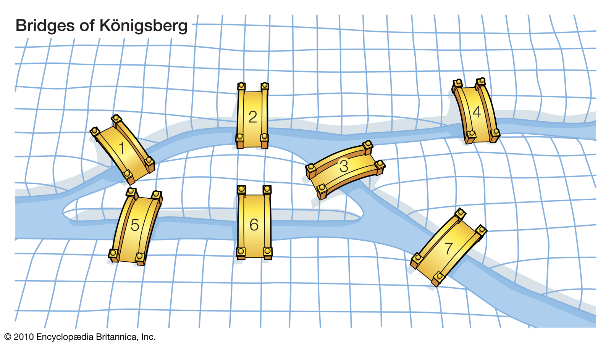

哥德斯堡七桥地图显然存在多个奇点，不存在欧拉路径。如果给定任何一个地图，是否存在一个欧拉环路，这是一个 P 问题，也就是一个计算机可以在 `poly(n)` 多项式时间内寻找。

*注：欧拉环路的寻找算法被称为 Fleury算法。*

而我们要讲的是「哈密尔顿环路问题」描述如下：

是否一个地图存在一个环路，能不重复地穿过每一个城市。

比如下面这张地图：

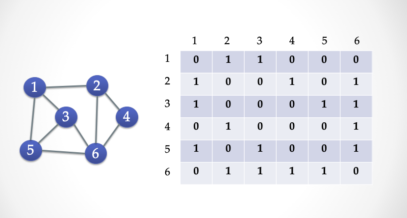

我们用一个矩阵 `V * V ` 的矩阵来表示这个地图，凡是两个城市`（A, B）`有公路相连接，那么就在`(A, B)` 和 `(B, A)`里面填上 `1`，否则填 `0`。这个矩阵被称为「邻接矩阵」，我们可以把这个邻接矩阵拍扁，就变成了一个 `0/1` 比特串。

寻找「哈密尔顿环路」是一个 NP-Complete 问题，也是一个 NP-Hard 问题。换句话说，不存在一个算法使得计算机在 `poly(n)` 多项式时间内找到环路。但是，计算机可以在多项式时间内检验一个路径是否是「哈密尔顿环路」。比如这个地图中就有一个带方向的哈密尔顿环路，我们一眼就能验证这个环路确实穿过了每一个城市。如果一个地图有哈密尔顿环路，那么它的矩阵一定是满足下面的特征：每一行一定有一个`1`，每一列一定也有一个`1`。

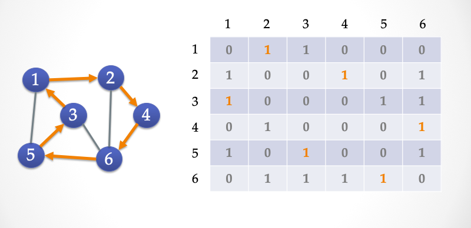

### ZK-HAM 协议

我们下面给出一个三步交互的 `Sigma` 协议，Alice 向 Bob 证明她「知道」上面这个地图 `G` 的哈密尔顿环路。	

- 公共输入：`G` 为一个有 6 个顶点的地图，表示为一个 `6*6` 的邻接矩阵
- 秘密输入：`G`的哈密尔顿环路 `C`（图中橙色的公路）

- 第一步：Alice 随机选择一个「置换」，`Perm(.)`，然后通过这个置换，产生一个新的图 `G'`；然后 Alice 把`G'` 矩阵的每一个单元加密，产生一个新的矩阵发送给 Bob。

【名词解释】：所谓置换，大家可以想象成用 **鼠标** 随意拖动图中的点，但是点和点之间的连线会跟着点一起被拖动，拖动结束之后形成的图，进行重新编号就得到 `G'`，比如上图左侧的两个图。经过置换变换的图前后是 **同构** 的。其中下图中，每一个顶点上角括号中的标号为拖动之前该顶点在上图中的编号。形式化一点可以这么定义：`Perm()是一个 {1, V} 到 {1, V}的双射函数`新图 `G'`的邻接矩阵，`[perm(i), perm(i+1) ]=1` 当且仅当` [i, i+1]=1`，其中 `i` 是顶点编号，`V` 是顶点个数 。

- 第二步：Bob 随机选择 `b in {0, 1}}` 进行挑战。

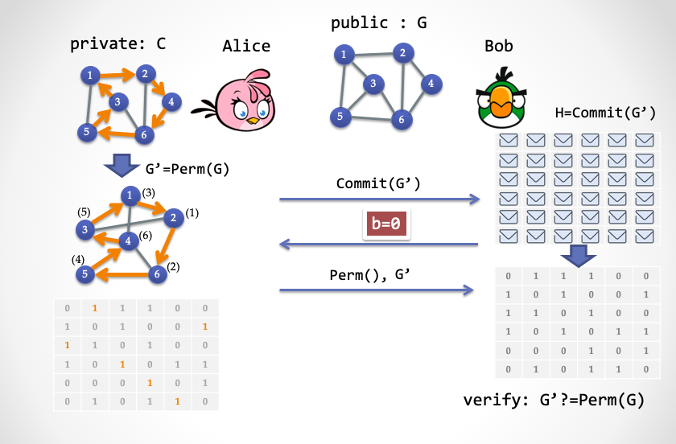

- 第三步情况（1）：Alice 根据 Bob 第二步发送的值：如果 `b=0`，那么 Alice 发送置换函数 `Perm()`，并且揭示完整的图 `G'`。而 Bob 则确认 `G'`是否是原图 `G` 经过置换无误。

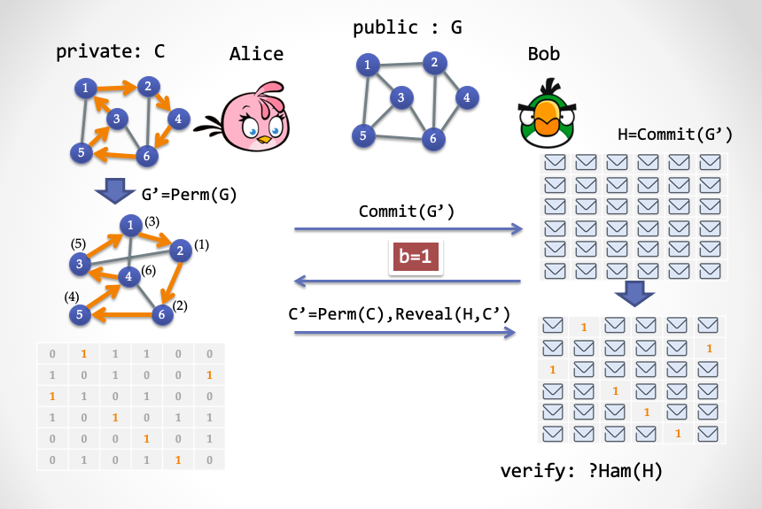

- 第三步情况（2）：如果 Bob 第二步发送的`b=1`，那么 Alice 只揭示 `G'`中的哈密尔顿环路 `C'`即可。而 Bob 需要验证 `C'`是否是一个哈密尔顿环路

回忆一下三步 Sigma 协议，我们再理解下上面看似复杂的动作：

- 第一步：被称为 `Commit`，证明者 Alice 需要把手里的答案进行同态变换，产生一个新答案，然后把每一条边都锁起来，交给 Bob；
- 第二步：Bob 进行随机挑战；
- 第三步：Alice 根据 Bob 的随机挑战，做出两种不同的回应。如果 Bob 挑战 `0`，那么Alice 打开第一步的承诺，表示自己在第一步没有作弊；如果 Bob 挑战 `1`，那么 Alice 只解密暴露出哈密尔顿环路的边（公路），其它边则不需解密。Bob 可以轻易地检查地图上露出来的那些边是否构成了一个不重复地经过所有城市的环路。

如果这个 Sigma 协议只走一遍的话， Alice 作弊的概率是 50%，如果重复 n 遍，Alice 作弊概率会指数级减小。大家可以试着用「模拟器」和「抽取器」的方法来证明这个协议的「零知识」与「可靠性」。

### ZK-HAM 的变形：ZK-HAM-2

接下来把上面的这个三步协议改动一下。大家先考虑下这样一个简单事实：如果一个仅包含环路的子图 `C` 是 图 `G`的子图，`C <= G`那么说明 `G` 包含哈密尔顿环路。

这个事实等价于另一个事实：一个哈密尔顿图 `G` 的补集 `!G` 是环路子图 `C` 的补集 `!C` 的子图。

【名词解释】图的补集：所谓补集就是这样一个新地图，顶点保持不变，旧地图上的边在新地图中不存在，而新地图中的公路在旧地图中不存在，但是两个图重合在一起，就变成了一个完全图（完全图是指任意两个顶点之间都存在一条边）。

用邻接矩阵来理解，就是如果一个图`G`包含一个环路子图`C`，那么`G`矩阵中所有值为 `0` 的单元集合 必然被 `C`矩阵中所有值为`0`的单元集合包含。可以表示为 `!G <= !C`。

根据第二个事实，我们可以定义如下的 Sigma 协议：

- 公共输入：图`G` ，表示为 `6*6` 的邻接矩阵
- 秘密输入：`G`的哈密尔顿环路 `C`（图中橙色的公路）

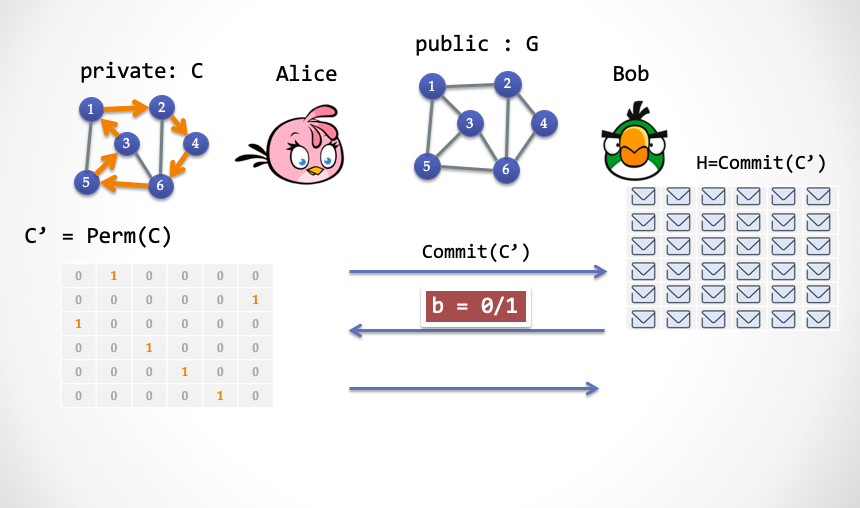

- 第一步：
  - Alice 随机选择一个「置换」，`Perm(.)`，并且通过`C`构造一个哈密尔顿环路子图 `C'=Perm(C)`；
  - 然后 Alice 加密 `C'`的每一个单元，把解密后的结果发送给 Bob。

- 第二步：Bob 随机选择 `b in {0, 1}`进行挑战

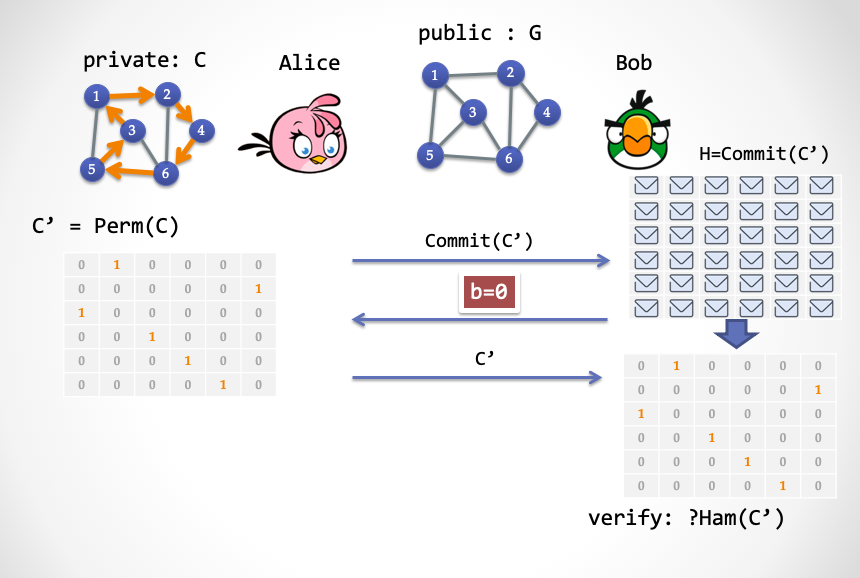

- 第三步情况（1）：如果 `b=0`，Alice 揭示完整的 `C'`，而 Bob 验证这个 `C'` 是否确实是一个哈密尔顿环路子图。

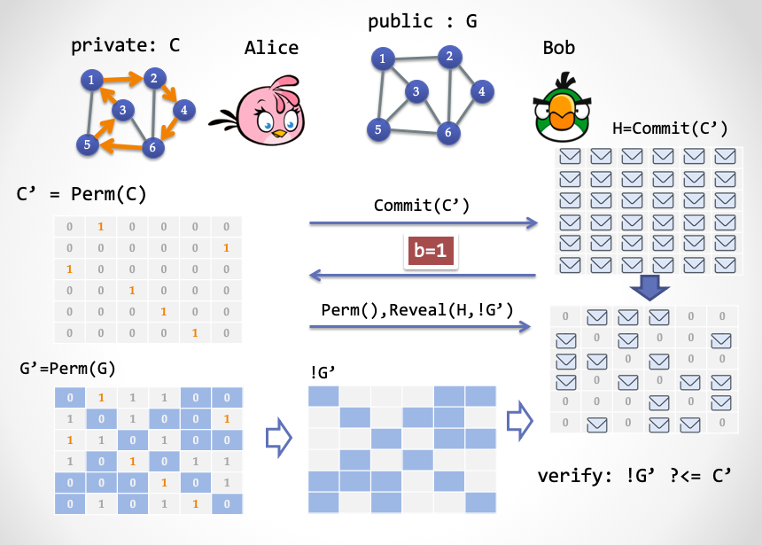

- 第三步情况（2）：如果 `b=1`，Alice 发送 `Perm()`，同时按照 `G'=Perm(G)`中的所有含 `0` 单元所在的位置，揭示 `C'`中所对应的单元；Bob 验证 `C'`所有被揭示单元是否全部为 `0`。

再理解下这三步 Sigma 协议：

- 第一步：证明者 Alice 需要把哈密尔顿子图 `C` 进行置换变换，产生一个新的哈密尔顿子图 `C'`，加密后交给 Bob；
- 第二步：Bob 进行随机挑战，`0` 或者 `1`；
- 第三步：如果 Bob 挑战 `0`，那么 Alice 打开第一步的承诺，展示一个带有唯一环路的图；如果 Bob 挑战 `1`，Alice 则按照 `G'`中的 `0`单元的位置打开承诺，展示承诺中被打开的位置全部为 `0`。

重点来了，大家仔细看看这个新版的 Sigma 协议的第一步。有没有发现什么情况？

**第一步 Alice 发送的内容是与地图`G`无关的！**

同样，第二步 Bob 发送的挑战也是与地图无关的。这样我们可以把第一步发的承诺改成**事先准备好的比特串**，而且我们假设这个比特串由一个可信第三方来产生，这样一来 Bob 就没有必要发送 `b=0` 这个分支，因为可信的第三方是诚实的，他一定是事先准备好一个正确的环路子图。这样，由于 Bob 只需要发送 `1`挑战分支，那么这一步也可以去除。

于是，三步协议变成了一步，我们成功去除了交互，有望实现 NIZK 。

我们接下来把 `ZK-HAM-2` 协议的第一步和第二步推到一个事先准备的字符串中，然后只让 Alice 发送第三步的内容给 Bob。如下图所示：

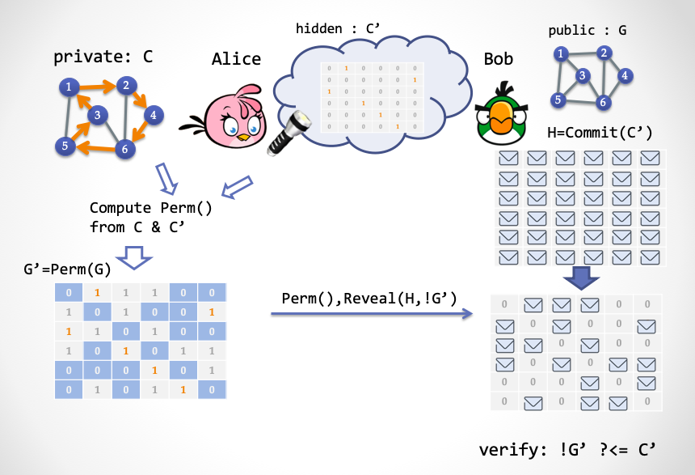

请注意，这里还不算是一个 NIZK 系统，因为这个共享字符串并不能对 Bob 公开，否则 Bob 就能算出环路 `C`。接下来，我们要解释一个新概念：「隐藏比特」（Hidden Bits）[FLS90]。Hidden Bits 是这样一串随机比特，它们对于验证者 Bob 隐藏，但是对于证明者 Alice 公开。然后在证明过程中，Alice 可以选择性地揭示一部分比特展示给 Bob 看。这是构造 NIZK 证明系统的一个利器，下面我们需要再继续深入 ……

## 云中的秘密：Hidden Bits

让我们再次开下脑洞，想象天上有朵云，云后面藏着一串随机产生的比特值，不是 `0` 就是 `1`，然后 Alice （证明者）带着一个「超级眼镜」，于是能够看到云后面所有的随机比特串，但是 Bob （验证者）却看不到。同时 Alice 手里还有一个「超级手电筒」，她可以打开手电筒用激光穿透云层，让 Bob 也能看见其中某个或某些比特。当然，Bob 能看到的比特的选择权完全在 Alice 手中。

云朵中隐藏的比特串就是所谓的 **Hidden Bits**。

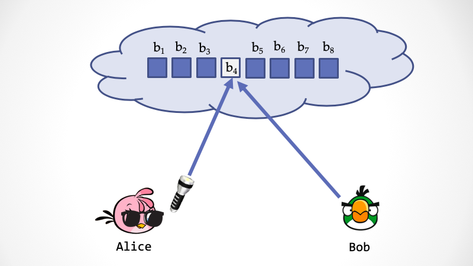

接下来我们要通过 Hidden Bits 来完成一个单步交互，完成 `ZK-HAM-2` 协议的功能。在 `ZK-HAM-2` 中的第一步，Alice 产生一个随机的置换 `Perm()`，然后通过 `G` 中的哈密尔顿环路子图 `C` 产生一个变换后的环路子图 `C'=Perm(C)`。这等价于，事先由任何人产生一个随机的哈密尔顿环路子图 `C'`，然后 Alice 根据 `C` 和 `C'` 计算得出一个相应的 `Perm()`。

假设由某个「第三方」产生了一个随机的环路子图 `C'`，编码成「邻接矩阵」比特串，放到云朵后面。假设 `V` 为顶点（城市）的个数，`E` 为边（公路）的条数。这个邻接矩阵的编码需要一个 `V*V` 长度的比特串，可以解释成一个 `V*V` 的矩阵，其中每一行只包含一个 `1`，每一列也只包含一个 `1`，矩阵的其它单元都为 `0`。

接下来 Alice 如何构造证明呢？这其实很简单：

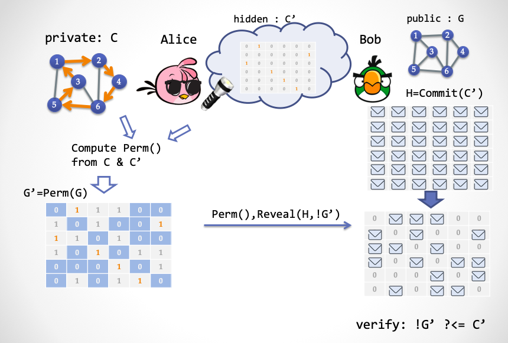

1. Alice 通过「超级眼镜」得到了一个随机的哈密尔顿环路子图 `C'`，然后计算得到一个置换 `Perm()`，使得 `Perm(C)=C'`。

3. Alice 根据 `Perm()` 来计算出一个换后的图 `G'=Perm(G)`
4. Alice 产生证明，由两部分组成：（1）置换`Perm()` （2）`G'`的邻接矩阵中所有值为 `0` 的单元坐标所对应的 `C'`矩阵的值，相当于 Alice 需要用「超级手电筒」给 Bob 揭示的隐藏比特。

那么 Bob 怎么验证这个证明呢？Bob 拿到证明之后，只需要检验两个东西：

1. `Perm()` 是否是一个合法的置换 `V -> V`，比如不能出现两个顶点映射到同一个顶点的情况。
2. 对于 `G` 中的每一条「非边」，经过置换之后，Bob 抬头看天上对应的「隐藏比特」，比特值必须为 `0`

我们再仔细地深入理解下这个非交互协议。先从「完备性」入手：如果 Alice 没有作弊，那么很显然能够通过 Bob 的验证，这里请大家自行检查。

接下来我们分两步简要证明下「可靠性」：首先，因为 Bob 经过验证得知，所有 `G` 置换后的非边集合都已被揭示，且全为 `0`，那么可以得出结论，`!G <= !C`，即`G`的非边集合是环路子图 `C`的非边集合的子集。这等价于，`C <= G`，也就是说 `G` 包含一个哈密尔顿环路。这里请注意，这个可靠性概率是 100%。

然后，设想在一个「理想世界」中，Bob 获得了某种超能力（比如拿到 Alice 的「超级眼镜」），不需要 Alice 的超级手电筒，就能看穿云层，得到所有的隐藏比特 `C'`。然后当 Bob 得到 `Perm()`之后，就能通过 `Perm()` 反算出 `C`，于是 Bob 就相当于变身成了一个「抽取器」（Extractor），在理想世界中，它能把 Alice 要证明的知识给成功抽取出来。

那么怎么证明「零知识」呢？Alice 要具备一个超能力，就是在「理想世界」中，可以偷偷修改云朵中的隐藏比特。接下来就简单了，模拟器 Zlice 可以这么欺骗 Bob：

1. Zlice 把云朵中的隐藏比特全部置为 `0`
2. Zlice 随机产生一个合法的 `Perm()`

大家发现了，关键是，天上隐藏的比特必须是一个可信的字符串，所谓「可信」，就是指它确实应该是一个哈密尔顿环路子图。那么第三方需要可信。

可是，这样一个第三方是不是难以令人满意？Alice 和 Bob 要绝对信任他，不会和对手串谋。如果他和 Alice 串谋，可以把隐藏比特串直接设置为全 `0`；或者他和 Bob 串谋，直接把这个比特串给 Bob 看。这个协议看起来不错，但是很难实用。我们接下来要对这个简单协议进行升级。

## 升级随机性

第一个升级是让隐藏比特串变成一个「一致性均匀分布」的随机的隐藏比特串，是一个看起来相当随机的比特串，而不是一个刻意摆放好的哈密尔顿子图。

完全随机意味着比特串中的 `0` 的个数和 `1`出现的概率大概接近。那么接下来一个难题是如何让随机比特串中能出现一个随机的哈密尔顿环路子图矩阵。方法非常简单粗暴：产生一个足够长的随机串，然后从头扫描，直到找到一个随机的哈密尔顿环路为止。

可是……这个成功概率是不是非常非常小？我们下面给出一个概率没那么小的一种寻找方法。

1. 我们先把比特串按照 `5log(V)` 的长度进行切分，然后如果每一个分片中的所有比特全为 `1`，那么我们把这个片段被视为邻接矩阵中的一个值为 `1` 的单元，否则视为一个值为 `0` 的单元。这样每一个矩阵单元出现 `1` 的概率为 `1/(V^5)`。
2. 我们取连续的 `V^6` 个片段，构成一个 `V^3 * V^3` 的大矩阵。如果大矩阵中包含一个 `V*V`的哈密尔顿环路矩阵，并且其他单元（总共 `V^6 - V^2`个） 都为 `0`。那么我们称这个大矩阵为「有用」。
3. 根据概率计算，出现一个「有用」矩阵的概率为 `1/[V^(3/2)]`。

*注：「有用」矩阵的概率计算过程请参考 Fact 4.10.8, 「Foundations of Cryptography, Vol I」by Oded Goldreich，P304。*

好了，我们需要升级下上一节的协议。因为现在「隐藏比特串」被拆分成了若干个大矩阵，这些大矩阵有些是「有用」的，有些是没用的。

接下来 Alice 要来构造证明了，她先戴上超级眼镜，扫描云朵中的 Hidden Bits，这要分两种情况，

+ Case 1：如果 Alice 遇到了一个没用的大矩阵 `M`，Alice 公开 `M` 的所有单元。

+ Case 2：如果 Alice 遇到了一个「有用」的大矩阵 `M`，这意味着 Alice 得到了一个随机的 哈密尔顿环路 `C'`，然后 Alice 参照上一节的步骤进行证明即可。

那么 Bob 怎么验证这个证明呢？我们还要分情况进行讨论，

+ Case 1：如果 Alice 公开了全部的 `M`，那么 Bob 就检查这个 `M` 是否「无用」。如果 `M` 无用，就认为证明有效；否则拒绝。
+ Case 2：如果 Alice 发送的是形如（`Perm()`，`X`）这样的证明，那么 Bob 按照上一节的验证方法进行验证。

对于这个协议，Bob 已经不再担心第三方是否作弊，故意产生一个全零的比特串，但是 Alice 仍然担心一旦第三方和 Bob 串谋，那么知识就彻底泄露了。

不仅如此，现在的协议还有个很强的限制，Alice 不能在看到隐藏比特之后再选择需要证明的 `G`，否则 Alice 就可以作弊。如果一个证明者选择证明的「命题」与 CRS 无关，那么这个证明者被称为 Non-adaptive Adversary。

## FLS 变换：从 Hidden Bits 到 NIZK

接下来，我们再次升级协议，把「隐藏比特串」中的隐藏特性去除，变成「公共参考串」CRS。这里我们要借助一个密码学工具 —— Trapdoor Permutation，陷门置换。

所谓的陷门置换是指一个置换函数 `F(x)`，`x`是一个集合 `S` 中的元素，然后函数 `F(x)` 把`x` 映射到 `S` 中的另一个元素 `y`。同时 `F(x)` 满足单向性，即通过 `y` 很难反算出 `x`；但是如果谁拥有陷门 `t`，就能实现反向计算`F^(-1)(t,y)=x`。陷门置换还可以匹配一个 Hardcore Predicate，`h(x)=0/1`，它能根据 `S` 集合中的元素产生一个一致性分布的 `0/1`比特。介绍完毕，大家是不是有点晕，没关系，晕一晕就习惯了。总之一句话，陷门置换可以对公共参考串和Hidden Bits 进行相互转换。

先假设有这样的密码学工具，然后我们升级协议。

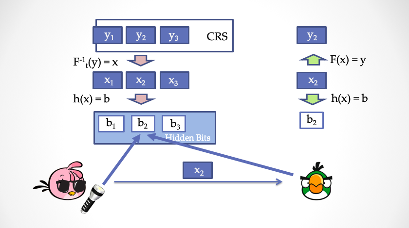

我们把公共参考串看成是一个列表，`y1, y2, y3, ..., yn`，列表中的每一项都是集合 `S` 中的元素。然后通过 Hardcore Predicate 产生 Hidden Bits 中的每一个比特位。但是请注意，这里不能直接通过 `h(y)=b` 来产生 Hidden Bits，因为这样一来 Bob 就能自己算出所有的 Hidden Bits，这违反了上一节的协议。为了保证对 Bob 隐藏，我们需要用公共参考串的原象，也就是 `x1, x2, x3, ..., xn` 来产生 Hidden Bits，`h(x)=b`。Bob 虽然不能自己计算 `b1, b2, b3, ..., bn`，但是一旦得到一个 `x`，他就能检验 `F(x)?=y`来判断是否 `x` 是和公共参考串对应，同时再计算 `h(x)=b` 得到被揭示的 Hidden Bits，`b`。

我们可以换一种不太准确，但是更直观的方式来理解，Alice 相当于自己产生一对公私钥。然后Alice 把公共参考串看成是一段「密文」，由于 Alice 有私钥，于是可以对密文进行解密，得到明文，这些明文，对于 Bob 而言就相当于是 Hidden Bits。当 Alice 要「揭示」Hidden Bits 时，就出示相应的明文片段，并且带上公钥，那么 Bob 就能通过公钥再次「加密」明文，与公共参考串的密文进行比对，确保 Alice 没有在揭示过程作弊。

下面是升级后的协议：

**对于证明者 Alice**：

1. Alice 随机选择一个 Trapdoor Permutation，`(F, h, t)`
2. 根据公共参考串中的每一个 `yi`，利用陷门反向计算出 `xi = F^(-1)(t, yi)`
3. 计算 Hidden Bits，`bi=h(xi)`
4. 根据上一节的协议产生证明。假设 Alice 要揭示的 Hidden bits 的位置集合为 `r1,r2,...,rl`，那么 Alice 向 Bob 发送对应位置的 `x`，分别为 `x_r1, x_r2, x_r3, ... x_rl` ，连同`(F, h)`，和证明一起并发给 Bob。

**对于验证者 Bob**：

1. 检查 `(F, h)` 是否为一个合法的 Trapdoor Permutation。
2. 对 `L` 中的每一个元素 `x_r`，计算出被揭示的 Hidden Bits `bi=h(F(x_r))`，然后按照上一节的协议检查证明。

这个新协议的「完备性」，请大家自行检查。

对于「零知识」，我们需要构造一个「模拟器」Zlice2，它的超能力是修改公共参考串。

1. 模拟器直接调用上一节协议的模拟器 Zlice。得到一个三元组，`(proof, {r}, {b})`
2. 对于每一个公共参考串位置，如果它对应某一个 `r`，模拟器从集合 `S` 中**随机**选择一个 `x_r`，使得 `h(x_r)=b_r`，这里 `b_r`就是 `{b}`中对应 `r` ；然后把 `y_r=F(x_r)` 作为假参考串的一部分。
3. 对于每一个公共参考串位置，如果与 `{r}`无关，那么模拟器随机选一个 `y`即可
4. 模拟器把所有的 `y`拼在一起，得到一个假CRS。

对于「可靠性」，事情变得不那么简单了。因为现在 Alice 有能力挑选 `(F,h,t)`，Alice 可以挑选一个对自己有利，甚至作弊的 `(F, h, t)`，使得她可以控制一次协议运行的 Hidden Bits `{b}`的结果。对于本节升级后的新协议而言，需要重复很多遍，以致于虽然 Alice 可以控制一次协议运行的 Hidden Bits，但是她对其它若干次协议运行的 Hidden Bits 无能为力。换句话说，Alice 无论如何挑选 `(F, h, t)` 都无法完全掌控多次的协议运行。

这个升级变换理论上可以支持任意的 Hidden Bits 模型下的非交互式零知识证明，被称为 FLS Protocol。FLS 变换有很多的好处：首先，这个随机产生的 CRS 可以多次使用，实现所谓的「Multi-Theorem NIZK」；其次，可以实现「Adaptive Soundness」，即 Alice 可以先看到 CRS，然后再选择要证明的内容。最后，这个协议还是「Adaptive Zero-Knowledge」，即 Bob 也可以先看到 CRS，然后再选择要证明的内容给 Alice。

*注：Adaptive Adversary 是比较符合现实世界的安全情况，比如第二类CCA安全。因为 CRS 是公开的，攻击者可以先分析 CRS，再决定如何发起攻击。*

## 寻找理想的 Trapdoor Permutation

陷门置换 Trapdoor Permutation 最早出现在姚期智老师的论文「Theory and Application of Trapdoor Functions」[Yao82]中，是公钥密码学的重要基础。在上一节给出的 FLS 变换中，需要一个理想化的 Trapdoor Permutation，所谓的理想化是指，每一个 n-bit 字符串都能唯一变成另一个 n-bit 字符串，并且不会出现「多对一」的映射关系。Alice 需要随机抽样一个 Index，发给 Bob，然后 Bob 要能检查出这个 Index 所对应的 `F()` 是否是一个「完美」的置换。问题来了，怎么 Bob 怎么能在多项式时间内检查出来呢？如果 Bob 不能检查，那么 Alice 就可以抽样一个不完美的 Permutation（比如一个「多对一」的函数），从而可能作弊，破坏「Soundness」这个性质，Bellare 和 Yung 发表在 1996 年的论文最早注意到了这一点，但是并没有完全解决这个问题[BY96]。

如何找到一个桥梁，能够将 Trapdoor Permutation 合适地抽象出来，同时能够对接到密码学工具的实现上，是一个及其有挑战性的工作。随后各路密码学家（包括 Oded Goldreich） 在这方面研究了很长时间，发表了许许多多的论文 ，各种不同类型的 Trapdoor Permutation 被定义、被研究，但是仍然不能让人满意。直到最近（2018年）一个工作是 Ran Canetti 与 Amit Lichtenberg 提出了 Certifiable Injective Trapdoor Function 这样一个新类型[RL18]，并证明了这种 Trapdoor Permutation 终于能满足 FLS 变换要求。但这是不是故事的结束呢？理论密码学家们估计不会停下探索的脚步。

除了基于 Trapdoor Permutation 的 FLS 变换 ，还有各式各样的解决方案来升级 Hidden Bits Model，比如采用 Invariant Signature[BG90]，或 Verifiable Random Generator [DN00] 来实现 Hidden Bits 的变换，或者弱可验证随机函数 [BGRV09]， 还有一种叫做 publicly-verifiable trapdoor predicates 的方案[CHK03]。

三十年来，密码学家们发明的 NIZK 方案有很多，但 Hidden Bits 方法是目前已知唯一的办法，(1) 基于「一致性分布」的共享 CRS，(2) 实现任意 NP 语言的 NIZK Proofs（Not Arguments!）。

## NIZK Proofs  与 NIZK Arguments

在本文中，我们构造的 NIZK 「证明」系统的可靠性属于「Statistical Soundness」，而零知识则属于「Computational Zero-Knowledge」。这意味着什么呢？这意味着，不管证明者 Alice 的算力有多强大（甚至超多项式），Alice 仍然无法作弊。但是，如果验证者 Bob 拥有超强的计算能力，那么是存在这种可能性：Bob 从证明中抽取到有价值的「知识」。

这又意味着什么？

这意味着，对于 NIZK Proofs 来说，它的长度肯定要比「知识」长，知识即 `NP` 问题中的 `witness`。只要 Bob 算力够强，他就可以把证明解密。对于「抽取器」而言，它也需要在没有交互的情况下抽取 `witness` 。证明最短的 NIZK Proofs 当属 Greg Gentry 等人采用「全同态加密」技术构造的 NIZK 方案了 [GGI+14]，证明长度只是稍稍大于 witness 的长度。

那能不能构造证明尺寸小于 witness 的 NIZK 呢？答案是 YES！

还有一类的 NIZK 系统被称为 NIZK Arguments：它们的可靠性是「Computational Soundness」，零知识属于「Perfect Zero-Knowledge」或者「Statistical Zero-Knowledge」。这说明，Alice 如果算力超强，那么她是有作弊空间的，但是因为现实世界中，我们可以通过加大安全参数（Security Parameters）来极大地降低 Alice 作弊的可能性，但是能实现非常极致的零知识特性。由于弱化了可靠性，那么我们就可以继续压缩证明的尺寸。

*注：在本系列中，我们并不刻意区分「证明」与「论证」这两个词。如果需要指明 Arguments 而非 Proofs，会专门强调。*

假如说我们要公开一个 NIZK 证明到 Github上，假如过了一百年以后，Github 网站还在，而未来计算机的计算能力已经有了质的飞跃，这时候，一个 NIZK Proof 可能会被算力攻破，泄露知识，而 NIZK Argument 则很大可能性上还保持安全性。

现在流行的热词 —— zkSNARK 中的 `AR`正是指代 Argument。

NIZK Argument 可以实现 `O(1)` 常数级长度的证明，即与 `witness` 的长度无关。然而这需要隐藏更多的秘密到 CRS 中。

## 没有秘密的世界

1956 年，哥德尔在一封寄给冯诺依曼的信中提到了一个著名的问题，「P 是否等于 NP」。后来，这个问题被 Clay 研究所列为七个千禧年难题之一，悬赏百万美金。

零知识证明系统正是为了保护 witness 不泄露的前提下，实现 NP 问题的验证。那如果一旦证明了「P == NP」，这会意味着什么？这意味着 witness 不再有多大意义了，反正一个图灵机也可以在多项式时间内找到 witness。零知识证明试图保护的 witness 也变得徒劳无益。

事实上，如果「P == NP」，现有的公钥密码学、对称加密 AES 与 SM4、哈希算法所依赖的难解问题都可能坍塌，我们可能很难保存秘密。不仅如此，

> 如果 P == NP，我们所处的世界将会变得非常不一样。「Creative Leaps」将不再有价值，求解问题与验证问题之间的鸿沟不复存在。每个能欣赏交响乐的人都会成为莫扎特，每个会推理的人都会变成高斯，每个能判断投资好坏的人都会变成巴菲特。从达尔文进化论的观点出发：如果这就是我们存在的宇宙，为什么我们还没有进化得可以充分利用这个好处？—— Scott Aaronson (2006)

对于数学也一样，数学证明的验证过程也是多项式复杂度的，如果「P == NP」，那么也就存在着多项式时间寻找证明的算法（如果证明存在）。这意味着哥德巴赫猜想、黎曼猜想将有可能得到证明，难怪 Lance Fortnow 在博客[For04]里这么说：

> A person who proves P == NP would walk home from the Clay Institute not with one million-dollar check but with seven. 如果谁能证明 P = NP，那么他不会只拿着一张百万美元支票回家，而是七张。  —— Lance Fortnow (2004)

2002年的调查显示，61% 的计算机科学家相信「P != NP」，而十年后，这个比例上升到了 83%[Wil12]。 而我是被 Scott Aaronson 的如下论断说服的：

> 自指论证：如果 P = NP 是事实，那么这个证明会比较容易被发现；但是如果 P != NP，那么这个证明会比较难发现。所以相信 P != NP 看起来会让 **数学现实** 更一致一些。—— Scott Aaronson (2006) 

尽管是如此不情愿，如果我们真的生活在一个没有秘密的世界，那会是什么样子？「环形监狱 Panopticon」是 18 世纪英国哲学家 Jeremy Bentham 提出的一个惊悚概念。囚徒们被中心全天候监控，没有任何隐私可言，而且他们对自己是否处于被监控状态也无从得知。这个无比悲观的论调让人浑身不适，但很多人认为，这可能是两百多年前对未来网络数字时代的一则精准寓言。

从『Billy Budd』，卡夫卡的『The Trial』，到奥威尔的『1984』，到著名黑客 Kevin Mitnick 写的超级大卖书『隐形的艺术』（教你如何在大数据时代保护自己的信息），似乎，危机四伏，风险不断累积，对末日世界的想象给了作家们很好的素材  …… 

偶尔无意中看到了一本有趣的漫画『The Private Eye』，它描述了一个劫后余生的后现代场景：在未来，我们的所有信息数据都存放在云上，然后突然有一天，这个数据云「爆炸」了，不知道是什么原因（可能是谁不小心打开了潘多拉的魔盒，找到了 P == NP 的构造性证明），反正所有的信息，包括每个人最阴暗的过去，都不再成为秘密；所有的数字化的资产都被抹掉，所有的在线知识库永久丢失；每个人的言行、账单、邮件、聊天消息、银行卡密码、中学考卷、GPS位置信息，写了一半的日记、删除的照片、上网记录，这些信息都将暴露给同事、邻居、 朋友、亲人、甚至任何一个好奇的人。

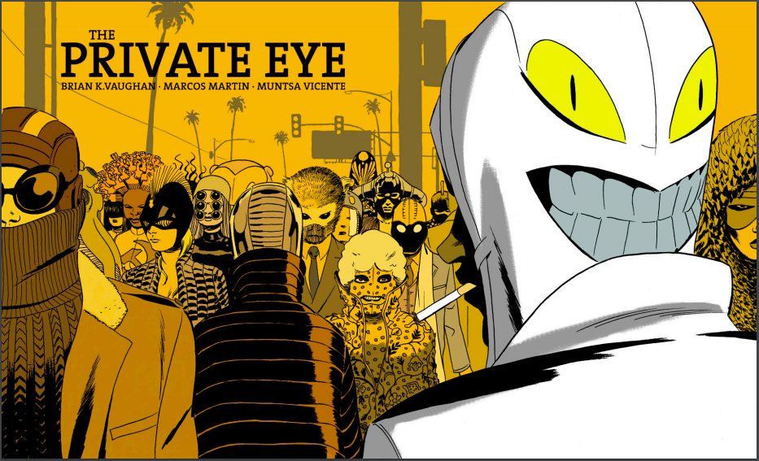

每个人都无地自容，惶惶不可终日，然后逐渐地，大家都选择隐藏自己，人们出门都要戴上面具，以小心翼翼地保护自己的身份，甚至一个人可以选择使用多个身份，国家法律规定任何偷窥行为都将被严惩，获取信息成为了一种至少无上的权力，照相机需要被严格管控，互联网不再存在，人们通讯又回到了电话亭时代 …… 

这会是人类的终极命运么？

## 未完待续

本文开头提到了「隐藏随机性」并不是必要的，我们来回想下 Hidden Bits 模型。这些 Hidden Bits 并没有对 Prover 隐藏，而是敞开了让 Prover 知道，但是由于 Hidden Bits 是一致性分布的， 所以即使让 Prover 知道了，他仍然逃不过随机挑战的威力。而在这种奇特的随机挑战过程中，最关键的要素是「计算困难」。有了「计算困难」，再加上「一致性分布的随机数串」，就是 CRS 关键所在。然而在 zkSNARK 方案中，并没有采用「一致性随机分布」的 CRS，而是一组结构化的随机数。不管怎样，用 CRS 来构建「信任根基」的秘密，就是藏在其中的「秘密」。

这符合直觉，保守「秘密」也是一种信任。因为 Alice 不知道 CRS 中隐藏的秘密后门，所以无法作弊。同样，Bob 不知道 CRS 中的秘密，也就没办法获得「知识」。同样，人与人之间的协作既要建立在公开透明的基础上，也要保守秘密。

> All human beings have three lives: public, private, and secret. 每个人都有三种生活，公开的，私人的，以及秘密的。—— Gabriel García Márqueel 

*致谢：感谢陈宇，丁晟超，张宇鹏，胡红钢，刘蔚然，何德彪等老师的专业建议和指正，感谢安比实验室小伙伴（p0n1, even, valuka, Vawheter, yghu, mr）的修改建议。本文内容不代表他们观点。*

最后附上漫画书的链接：[http://panelsyndicate.com/comics/tpeye](http://panelsyndicate.com/comics/tpeye) 作者甚至把创作过程的邮件和草图都放了出来，大家可以体验一下窥视制作过程的快感。

### 参考文献

+ [Aar06] Aaronson, Scott. *Reasons to believe*, 2006. https://www.scottaaronson.com/blog/?p=122
+ [BFM88] Blum, Manuel, Paul Feldman, and Silvio Micali. "Non-interactive zero-knowledge and its applications." STOC'88. 1988.
+ [BG90] Bellare, Mihir, and Shafi Goldwasser. "New paradigms for digital signatures and message authentication based on non-interactive zero knowledge proofs." *Conference on the Theory and Application of Cryptology*. Springer, New York, NY, 1989.
+ [BGN05] Boneh, Dan, Eu-Jin Goh, and Kobbi Nissim. "Evaluating 2-DNF formulas on ciphertexts." *Theory of Cryptography Conference*. Springer, Berlin, Heidelberg, 2005.
+ [BGRV09] Brakerski, Zvika, Shafi Goldwasser, Guy N. Rothblum, and Vinod Vaikuntanathan. "Weak verifiable random functions." In *Theory of Cryptography Conference*, pp. 558-576. Springer, Berlin, Heidelberg, 2009.
+ [BY96] Bellare, Mihir, and Moti Yung. "Certifying permutations: Noninteractive zero-knowledge based on any trapdoor permutation." *Journal of Cryptology* 9.3 (1996): 149-166.
+ [CHK03] Canetti, Ran, Shai Halevi, and Jonathan Katz. "A forward-secure public-key encryption scheme." *International Conference on the Theory and Applications of Cryptographic Techniques*. Springer, Berlin, Heidelberg, 2003.
+ [CHMMVW19] Chiesa, Alessandro, et al. *Marlin: Preprocessing zksnarks with universal and updatable srs*. Cryptology ePrint Archive, Report 2019/1047, 2019, https://eprint.iacr.org/2019/1047, 2019.
+ [DN00] Dwork, Cynthia, and Moni Naor. "Zaps and their applications." *Proceedings 41st Annual Symposium on Foundations of Computer Science*. IEEE, 2000.
+ [FLS90] Feige, Uriel, Dror Lapidot, and Adi Shamir. "Multiple non-interactive zero knowledge proofs based on a single random string." *Proceedings [1990] 31st Annual Symposium on Foundations of Computer Science*. IEEE, 1990.
+ [For04] Fortnow, Lance. "What if P = NP?". 2004. https://blog.computationalcomplexity.org/2004/05/what-if-p-np.html
+ [For09] Fortnow, Lance. "The status of the P versus NP problem." *Communications of the ACM* 52.9 (2009): 78-86.
+ [Groth10a] Groth, Jens. "Short non-interactive zero-knowledge proofs." *International Conference on the Theory and Application of Cryptology and Information Security*. Springer, Berlin, Heidelberg, 2010.
+ [Groth10b] Groth, Jens. "Short pairing-based non-interactive zero-knowledge arguments." *International Conference on the Theory and Application of Cryptology and Information Security*. Springer, Berlin, Heidelberg, 2010.
+ [GOS06] Groth, Jens, Rafail Ostrovsky, and Amit Sahai. "Perfect non-interactive zero knowledge for NP." *Annual International Conference on the Theory and Applications of Cryptographic Techniques*. Springer, Berlin, Heidelberg, 2006.
+ [GWC19] Gabizon, Ariel, Zachary J. Williamson, and Oana Ciobotaru. *PLONK: Permutations over Lagrange-bases for Oecumenical Noninteractive arguments of Knowledge*. Cryptology ePrint Archive, Report 2019/953, 2019.
+ [KP98] Kilian, Joe, and Erez Petrank. "An efficient noninteractive zero-knowledge proof system for NP with general assumptions." *Journal of Cryptology* 11.1 (1998): 1-27.
+ [MBK+19] Maller, Mary, et al. "Sonic: Zero-Knowledge SNARKs from Linear-Size Universal and Updateable Structured Reference Strings." *IACR Cryptology ePrint Archive* 2019 (2019): 99.
+ [RL18] Ran Canetti and Amit Lichtenberg. "Certifying trapdoor permutations, revisited." *Theory of Cryptography Conference*. Springer, Cham, 2018.
+ [Wil12]Gasarch, William I. "Guest Column: The Third P=? NP Poll." *ACM SIGACT News* 50.1 (2019): 38-59.
+ [Yao82] Yao, Andrew C. "Theory and application of trapdoor functions." *23rd Annual Symposium on Foundations of Computer Science (sfcs 1982)*. IEEE, 1982.

